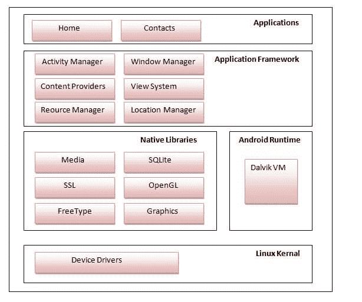

# 安卓架构

> 原文：<https://www.javatpoint.com/android-software-stack>

**安卓架构**或**安卓软件堆栈**分为五个部分:

1.  linux 内核
2.  本地库(中间件)，
3.  安卓运行时
4.  应用框架
5.  应用程序

我们先来看看安卓架构。

## 1) Linux 内核

它是安卓架构的核心，存在于安卓架构的根源。 **Linux 内核**负责设备驱动、电源管理、内存管理、设备管理和资源访问。

* * *

## 2)原生库

在 linux 内核之上，他们的是**原生库**如 WebKit、OpenGL、FreeType、SQLite、Media、C 运行时库(libc)等。

WebKit 库负责浏览器支持，SQLite 负责数据库，FreeType 负责字体支持，Media 负责播放和录制音频和视频格式。

* * *

## 3)安卓运行时

在安卓运行时，有核心库和负责运行安卓应用的 DVM (Dalvik Virtual Machine)。DVM 类似于 JVM，但它是为移动设备优化的。它消耗的内存更少，性能更快。

* * *

## 4)安卓框架

在 Native 库和 android 运行时之上，还有 android 框架。安卓框架包括**安卓 API 的**，如 UI(用户界面)、电话、资源、位置、内容提供商(数据)和包管理器。它为安卓应用开发提供了大量的类和接口。

* * *

## 5)应用

在 android 框架之上，还有应用程序。所有应用程序，如家庭、联系人、设置、游戏、浏览器都使用 android 框架，该框架使用 android 运行时和库。安卓运行时和原生库都在使用 linux 内核。