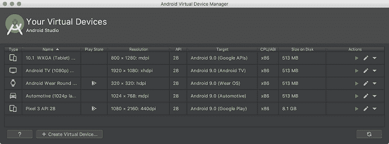
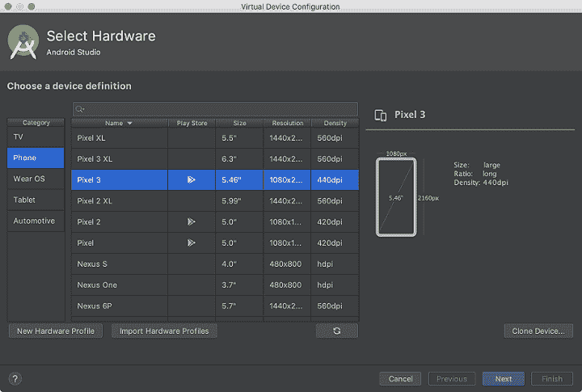
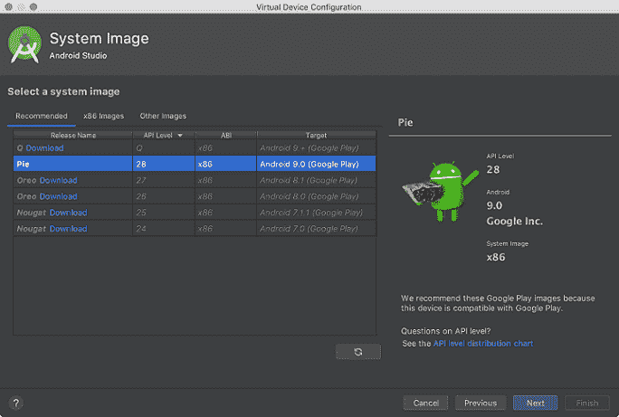
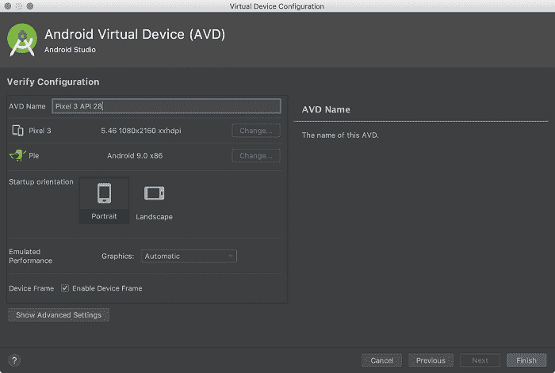
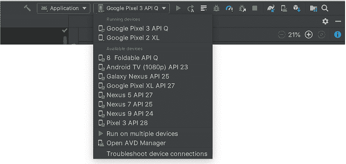

# 安卓模拟器

> 原文：<https://www.javatpoint.com/android-emulator>

**安卓模拟器**是一个**安卓虚拟设备(AVD)**，代表一个特定的安卓设备。我们可以使用安卓模拟器作为目标设备，在我们的电脑上执行和测试我们的安卓应用程序。安卓模拟器几乎提供了真实设备的所有功能。我们可以收到来电和短信。它还会给出设备的位置，并模拟不同的网络速度。安卓模拟器模拟旋转和其他硬件传感器。它可以访问谷歌游戏商店，等等


在模拟器上测试安卓应用程序有时比在真实设备上更快更容易。例如，与通过 USB 连接的真实设备相比，我们可以更快地将数据传输到仿真器。

安卓模拟器为几款安卓手机、穿戴操作系统、平板电脑、安卓电视设备提供了预定义的配置。

## 要求和建议

安卓模拟器对 AndroidStudio 的基本系统要求之外还有额外的要求。这些要求如下:

*   软件开发工具包工具 26.1.1 或更高版本
*   64 位处理器
*   Windows:带 UG(无限制来宾)支持的 CPU
*   HAXM 6.2.1 或更高版本(推荐 HAXM 7.2.0 或更高版本)

## 安装模拟器

安卓模拟器是在安装 AndroidStudio 时安装的。然而，在安装 AndroidStudio 时，模拟器的某些组件可能会安装，也可能不会安装。要安装模拟器组件，请在**软件开发工具包管理器的**软件开发工具包工具**选项卡中选择**安卓模拟器**组件。**

## 在模拟器上运行安卓应用程序

我们可以从 AndroidStudio 项目中运行一个安卓应用程序，或者我们可以运行一个安装在安卓模拟器上的应用程序，就像我们在设备上运行任何应用程序一样。

要启动安卓模拟器并在我们的项目中运行应用程序:

**1。**在**AndroidStudio，**我们需要创建一个安卓虚拟设备(AVD)，模拟器可以用来安装和运行你的应用程序。要创建新的自动增值设备，请执行以下操作

**1.1** 点击**工具>打开自动驾驶仪管理器。**



**1.2** 在自动车辆识别管理器对话框的底部，点击创建**虚拟**设备。然后出现**选择硬件**页面。



**1.3** 选择一个硬件配置文件，然后点击**下一步。**如果我们不呢？如果看不到我们想要的硬件配置文件，那么我们可以创建或导入一个硬件配置文件。出现**系统图像**页面。



**1.4** 选择特定 API 级别的系统映像，然后单击**下一步。**这将打开**验证配置**页面。



**1.5** 根据需要更改 AVD 属性，然后点击**完成。**

**2。**在工具栏中，从下拉菜单中选择我们想要从目标设备运行我们的应用的 AVD。



**3。**点击**运行。**

## 启动模拟器而不首先运行应用程序

要启动模拟器:

1.  打开自动车辆识别管理器。
2.  双击自动电压调节器，或点击**运行**

当模拟器运行时，我们可以运行 AndroidStudio 项目，并选择模拟器作为目标设备。我们还可以拖动一个 APKs 文件安装在模拟器上，然后运行它们。

## 从命令行启动模拟器

安卓软件开发工具包包括安卓设备模拟器。安卓模拟器让你无需使用物理设备就可以开发和测试应用程序。

### 启动模拟器

使用**仿真器**命令，我们将启动一个仿真器。这是运行我们的项目或通过 AVD 管理器启动的替代方案。

以下是启动虚拟设备的基本命令行语法:

```
$ emulator -avd avd_name [ {-option [value]} ... ]

```

或者

```
$ emulator @avd_name [ {-option [value]} ... ]

```

例如，如果我们在苹果电脑上从 AndroidStudio 执行模拟器，默认命令行将如下所示:

```
$ /Users/user_name/Library/Android/sdk/emulator/emulator -avd Nexus_5X_API_23 -netdelay none -netspeed full

```

要显示 AVD 名称列表，请输入以下命令:

```
$ emulator -list-avds

```

## 运行和停止模拟器，并清除数据

从“虚拟设备”页面，我们可以在模拟器上执行以下操作:


*   要运行使用自动增值设备的安卓模拟器，双击自动增值设备，或点击**启动**
*   要停止正在运行的仿真器，右键单击并选择**停止，**或单击菜单▼并选择停止。
*   如果我们想从模拟器中清除数据，并将其恢复到首次定义时的初始状态，那么右键单击一个 AVD 并选择**擦除数据。**或点击菜单▼并选择**擦除数据。**