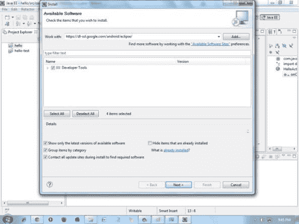

# 如何为 Eclipse IDE 设置安卓

> 原文：<https://www.javatpoint.com/how-to-setup-android-for-eclipse-ide>

在这个页面中，您将了解在 eclipse IDE 上运行 android 应用程序需要哪些软件。在这里，您将能够学习如何为 Eclipse IDE 安装 android SDK 和 ADT 插件。让我们看看**手动为 eclipse** IDE 设置安卓所需的软件列表。

1.  安装 JDK
2.  下载并安装用于开发安卓应用程序的 Eclipse
3.  下载并安装安卓软件开发工具包
4.  为 eclipse 安装 adt 插件
5.  配置 ADT 插件
6.  创建 AVD
7.  创建 hello android 应用程序

* * *

## 1)安装 Java 开发工具包(JDK)

要创建 android 应用程序，如果您使用 Java 语言开发 android 应用程序，必须安装 JDK。[下载 JDK](http://www.oracle.com/technetwork/java/javase/downloads/index.html)

* * *

## 2)下载并安装 Eclipse 集成开发环境

为了使用 eclipse IDE 开发 android 应用程序，您需要安装 eclipse。你可以从这个位置[下载，下载 Eclipse](https://www.eclipse.org/downloads/) 。建议使用 Eclipse 经典版本，但是我们正在为 JavaEE 开发人员使用 Eclipse 集成开发环境。

* * *

## 3)下载并安装安卓软件开发工具包

首先[下载安卓 SDK](https://developer.android.com/sdk/index.html) 。在这个例子中，我们已经为 windows 安装了 android SDK()。exe 版本)。

现在双击 exe 文件，它将被安装。我这里用的是安卓 2.2 版本。

* * *

## 4)下载 eclipse 的 ADT 插件

在 eclipse IDE 中开发安卓应用需要 ADT(安卓开发工具)。它是 Eclipse 集成开发环境的插件，旨在提供集成环境。

要下载 ADT，您需要遵循以下步骤:

1)启动 eclipse IDE，然后选择**帮助** > **安装新软件...**

2)在**工作用**组合框中，写**https://dl-ssl.google.com/android/eclipse/**

3) **选择开发工具旁边的复选框**，点击**下一步**

4)你会看到，这里有一个要下载的工具列表，**点击下一步**

5) **点击完成**

6)安装完成后，重新启动 eclipse IDE

* * *

## 5)配置自动数据转换插件

安装 ADT 插件后，现在告诉 eclipse IDE 你的安卓 SDK 位置。为此:

1.  选择**窗口菜单>偏好设置**
2.  现在从左侧面板选择安卓。在这里，您可能会看到一个对话框，询问您是否想要将统计数据发送到谷歌。点击**继续**。
3.  点击浏览按钮，找到你的软件开发工具包目录，例如我的软件开发工具包位置是 C:\程序文件\安卓\安卓-软件开发工具包。
4.  单击应用按钮，然后单击确定。

* * *

## 6)创建安卓虚拟设备

为了在安卓模拟器中运行安卓应用程序，您需要创建和 AVD。要创建自动车辆识别号，请执行以下操作:

1.  选择**窗口菜单>自动驾驶仪管理器**
2.  点击**新建**按钮，创建 AVD
3.  现在出现一个对话框，写下 AVD 名称，例如 myavd。现在选择目标安卓版本，例如安卓 2.2。
4.  点击**创建 AVD**

* * *

## 7)创建并运行简单的 android 示例

访问下一页，创建第一个安卓应用程序。