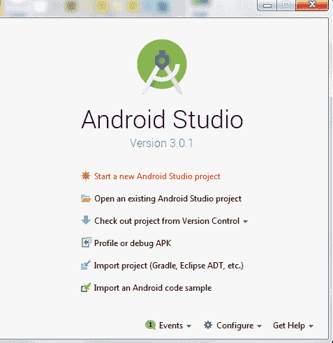
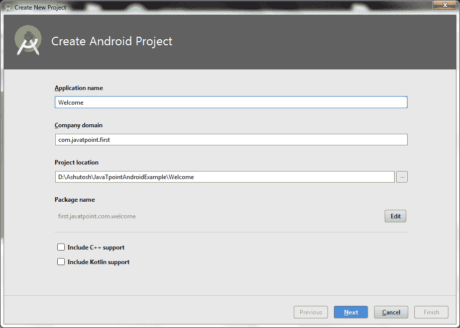
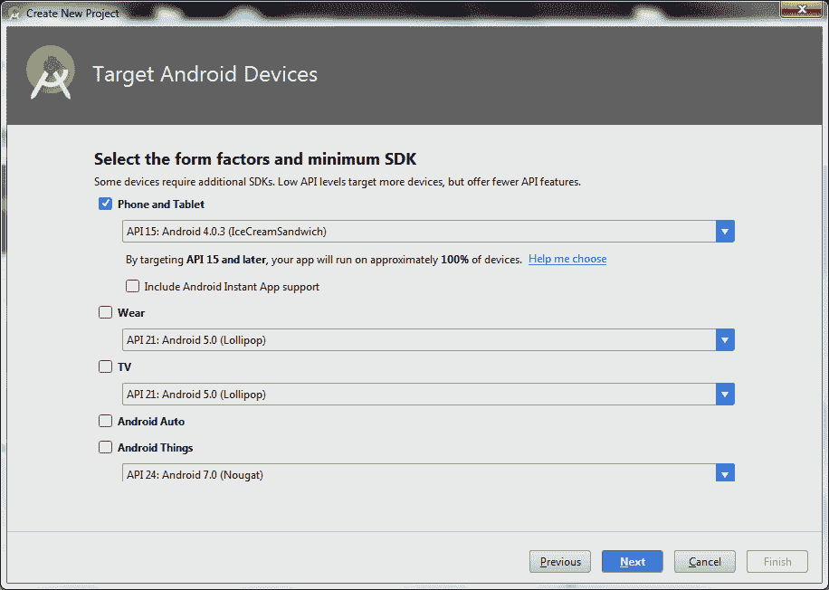
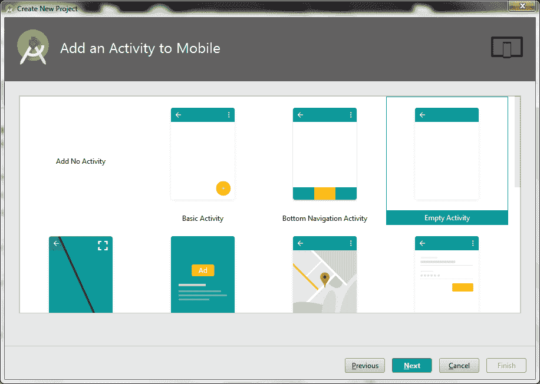
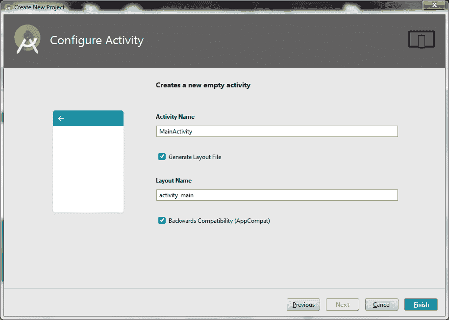
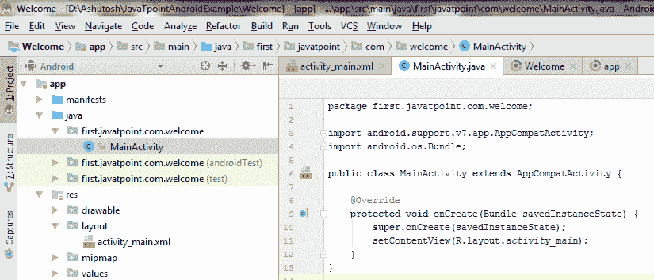
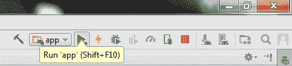
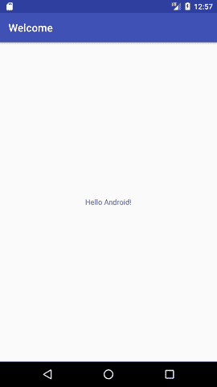

# 如何制作安卓应用

> 原文：<https://www.javatpoint.com/hello-android-example>

在这个页面中，您将知道如何创建简单的 hello android 应用程序。我们正在使用 Eclipse IDE 创建安卓的简单示例。创建这个简单的例子:

1.  创建新的安卓项目
2.  写下信息(可选)
3.  运行安卓应用程序

* * *

### 你好安卓示例

您需要按照上面提到的 3 个步骤来创建 Hello android 应用程序。

### 1)创建新的安卓项目

创建新的 android studio 项目:

1)选择*开始新的安卓工作室项目*



2)提供以下信息:应用程序名称、公司域、项目位置和应用程序的包名称，然后单击下一步。



3)选择应用的 API 级别，点击下一步。



4)选择活动类型(空活动)。



5)提供活动名称，然后单击完成。



完成活动配置后，安卓工作室自动生成活动类和其他所需的配置文件。

现在已经创建了一个安卓项目。您可以探索 android 项目并看到简单的程序，它看起来像这样:



### 2)写下信息

文件:activity_main.xml

Android studio 自动为 activity_main.xml 文件生成代码。你可以根据自己的需要编辑这个文件。

```

}

```

文件:MainActivity.java

```
package first.javatpoint.com.welcome;

import android.support.v7.app.AppCompatActivity;
import android.os.Bundle;

public class MainActivity extends AppCompatActivity {
    @Override
    protected void onCreate(Bundle savedInstanceState) {
        super.onCreate(savedInstanceState);
        setContentView(R.layout.activity_main);
    }
}

```

#### 要了解第一个 android 应用程序，请访问下一页(hello android 示例的内部详细信息)。

* * *

## 3)运行安卓应用程序

要运行安卓应用程序，点击工具栏上的运行图标，或者简单地按下 Shift + F10。



安卓模拟器可能需要 2 到 3 分钟才能启动。所以请耐心等待。启动模拟器后，android studio 安装应用程序并启动活动。你会看到这样的东西:

