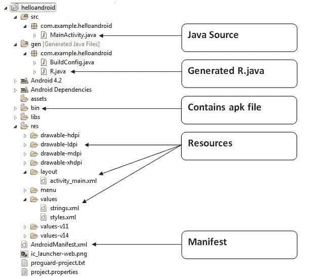

# 你好安卓示例的内部细节

> 原文：<https://www.javatpoint.com/internal-details-of-hello-android-example>

在这里，我们将学习 hello android 示例的内部细节或工作方式。

Android 应用包含不同的组件，如 java 源代码、字符串资源、图像、清单文件、apk 文件等。让我们了解一下安卓应用的项目结构。



* * *

#### Java 源代码

让我们看看由 Eclipse IDE 创建的 java 源文件:

File: MainActivity.java

```
package com.example.helloandroid;
import android.os.Bundle;
import android.app.Activity;
import android.view.Menu;
import android.widget.TextView;
public class MainActivity extends Activity {//(1)
    @Override
    protected void onCreate(Bundle savedInstanceState) {//(2)
        super.onCreate(savedInstanceState);

        setContentView(R.layout.activity_main);//(3)
    }
    @Override
    public boolean onCreateOptionsMenu(Menu menu) {//(4)
        // Inflate the menu; this adds items to the action bar if it is present.
        getMenuInflater().inflate(R.menu.activity_main, menu);
        return true;
    }
}

```

**(1)** **Activity** 是一个 java 类，在屏幕上创建一个默认窗口，我们可以在其中放置不同的组件，如 Button、EditText、TextView、Spinner 等。它就像 Java AWT 的框架。

它为诸如 onCreate、onStop、OnResume 等活动提供了生命周期方法。

**(2)** 第一次创建活动类时调用 **onCreate 方法**。

**(3)****设置内容视图(R.layout.activity_main)** 提供关于我们的布局资源的信息。这里，我们的布局资源是在 activity_main.xml 文件中定义的。

File: activity_main.xml

```
<RelativeLayout xmlns:androclass="http://schemas.android.com/apk/res/android"
    xmlns:tools="http://schemas.android.com/tools"
    android:layout_width="match_parent"
    android:layout_height="match_parent"
    tools:context=".MainActivity" >
    <TextView
        android:layout_width="wrap_content"
        android:layout_height="wrap_content"
        android:layout_centerHorizontal="true"
        android:layout_centerVertical="true"
        android:text="@string/hello_world" />
</RelativeLayout>

```

如您所见，textview 是由框架自动创建的。但是这个字符串的消息是在 strings.xml 文件中定义的。 **@string/hello_world** 提供了关于 textview 消息的信息。hello_world 属性的值在 strings.xml 文件中定义。

File: strings.xml

```
<?xml version="1.0" encoding="utf-8"?>
<resources>
    <string name="app_name">helloandroid</string>
    <string name="hello_world">Hello world!</string>
    <string name="menu_settings">Settings</string>
</resources>

```

您可以从此文件更改 hello_world 属性的值。

* * *

#### 生成的 R.java 文件

它是自动生成的文件，包含 res 目录所有资源的标识。由 aapt(安卓资产打包工具)生成。每当您在 activity_main 上创建任何组件时，都会在 Java 文件中创建一个相应的标识，稍后可以在 Java 源文件中使用。

File: R.java

```
/* AUTO-GENERATED FILE.  DO NOT MODIFY.
 *
 * This class was automatically generated by the
 * aapt tool from the resource data it found.  It
 * should not be modified by hand.
 */
package com.example.helloandroid;
public final class R {
    public static final class attr {
    }
    public static final class drawable {
        public static final int ic_launcher=0x7f020000;
    }
    public static final class id {
        public static final int menu_settings=0x7f070000;
    }
    public static final class layout {
        public static final int activity_main=0x7f030000;
    }
    public static final class menu {
        public static final int activity_main=0x7f060000;
    }
    public static final class string {
        public static final int app_name=0x7f040000;
        public static final int hello_world=0x7f040001;
        public static final int menu_settings=0x7f040002;
    }
    public static final class style {
        /** 
        Base application theme, dependent on API level. This theme is replaced
        by AppBaseTheme from res/values-vXX/styles.xml on newer devices.
            Theme customizations available in newer API levels can go in
            res/values-vXX/styles.xml, while customizations related to
            backward-compatibility can go here.
         Base application theme for API 11+. This theme completely replaces
        AppBaseTheme from res/values/styles.xml on API 11+ devices.
  API 11 theme customizations can go here. 
        Base application theme for API 14+. This theme completely replaces
        AppBaseTheme from BOTH res/values/styles.xml and
        res/values-v11/styles.xml on API 14+ devices.
 API 14 theme customizations can go here. 
         */
        public static final int AppBaseTheme=0x7f050000;
        /**  Application theme. 
 All customizations that are NOT specific to a particular API-level can go here. 
         */
        public static final int AppTheme=0x7f050001;
    }
}

```

* * *

#### APK 档案

框架会自动创建一个 apk 文件。如果你想在手机上运行安卓应用，那就转移安装吧。

* * *

#### 资源

它包含资源文件，包括 activity_main、字符串、样式等。

* * *

#### 清单文件

它包含有关包的信息，包括活动、服务、内容提供商等组件。

有关清单文件的更多信息，请访问这里: [AndroidManifest.xml 文件](AndroidManifest-xml-file-in-android)。