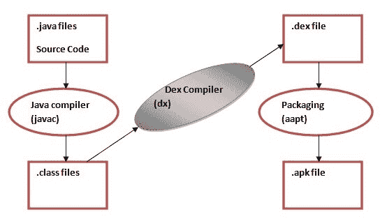

# 达尔维克虚拟机| DVM

> 原文：<https://www.javatpoint.com/dalvik-virtual-machine>

正如我们所知，现代 JVM 是高性能的，并且提供了出色的内存管理。但它也需要针对低功耗手持设备进行优化。

**达尔维克虚拟机(DVM)** 是一款针对移动设备优化的安卓虚拟机。它针对*内存*、*电池寿命*和*性能*优化了虚拟机。

达尔维克是冰岛一个小镇的名字。达尔维克虚拟机是由丹博恩施泰因写的。

Dex 编译器将类文件转换为。在 Dalvik 虚拟机上运行的 dex 文件。多个类文件被转换成一个索引文件。

让我们看看源文件的编译和打包过程:

**javac 工具**将 java 源文件编译成类文件。

**dx 工具**获取应用程序的所有类文件，并生成一个。dex 文件。这是一个特定于平台的工具。

**安卓资产打包工具(aapt)** 处理打包过程。