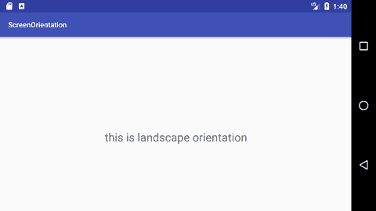

# 安卓屏幕方向示例

> 原文：<https://www.javatpoint.com/android-screen-orientation-example>

**屏幕方向**是活动元素的属性。安卓活动的方向可以是纵向、横向、传感器、非特定等。您需要在 AndroidManifest.xml 文件中定义它。

**语法:**

**示例:**

屏幕方向属性的常见值如下:

| 价值 | 描述 |
| 未指明的 | 这是默认值。在这种情况下，系统选择方向。 |
| 肖像 | 更高而不是更宽 |
| 风景 | 更宽而不是更高 |
| 传感器 | 方向由设备方向传感器决定。 |

## 安卓纵向和横向模式屏幕方向示例

在本例中，我们将创建两个不同屏幕方向的活动。第一个活动(主要活动)将作为“纵向”方向，第二个活动(次要活动)将作为“横向”方向类型。

#### activity_main.xml

File: activity_main.xml

* * *

#### 活动类别

File: MainActivity.java

```
package example.javatpoint.com.screenorientation;

import android.content.Intent;
import android.support.v7.app.AppCompatActivity;
import android.os.Bundle;
import android.view.View;
import android.widget.Button;

public class MainActivity extends AppCompatActivity {

    Button button1;
    @Override
    protected void onCreate(Bundle savedInstanceState) {
        super.onCreate(savedInstanceState);
        setContentView(R.layout.activity_main);

        button1=(Button)findViewById(R.id.button1);
    }
    public void onClick(View v) {
        Intent intent = new Intent(MainActivity.this,SecondActivity.class);
        startActivity(intent);
    }
}

```

#### activity_second.xml

File: activity_second.xml

#### 次导性类

File: SecondActivity.java

```
package example.javatpoint.com.screenorientation;

import android.support.v7.app.AppCompatActivity;
import android.os.Bundle;

public class SecondActivity extends AppCompatActivity {

    @Override
    protected void onCreate(Bundle savedInstanceState) {
        super.onCreate(savedInstanceState);
        setContentView(R.layout.activity_second);

    }
}

```

#### AndroidManifest.xml

File: AndroidManifest.xml

在 AndroidManifest.xml 文件中，在活动中添加 screenOrientation 属性并提供其方向。在本例中，我们为主要活动提供了“纵向”方向，为次要活动提供了“横向”方向。

```
 <application android:allowbackup="true" android:icon="@mipmap/ic_launcher" android:label="@string/app_name" android:roundicon="@mipmap/ic_launcher_round" android:supportsrtl="true" android:theme="@style/AppTheme"><activity android:name="example.javatpoint.com.screenorientation.MainActivity" android:screenorientation="portrait"><intent-filter><category android:name="android.intent.category.LAUNCHER"></category></intent-filter></activity> 
        <activity android:name=".SecondActivity" android:screenorientation="landscape"></activity></application> 

```

* * *

#### 输出:

 