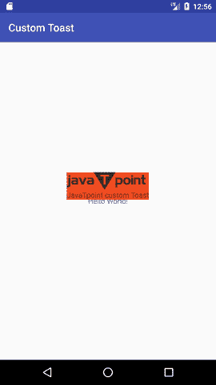
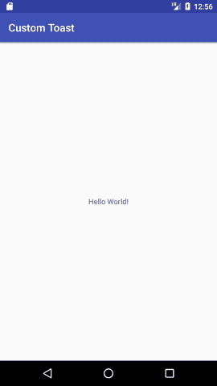

# 安卓自定义吐司示例

> 原文：<https://www.javatpoint.com/android-custom-toast-example>

你可以在安卓系统中创建自定义吐司。因此，您可以在吐司上显示一些图像，如祝贺或损失。这意味着您现在可以定制吐司了。

* * *

#### activity_main.xml

拖动要在主活动中显示的组件。

File: activity_main.xml

* * *

#### customtoast.xml

在布局目录中创建另一个 xml 文件。在这个 xml 文件中，我们有 ImageView 和 TextView。

File: customtoast.xml

```
 <imageview android:id="@+id/custom_toast_image" android:layout_width="wrap_content" android:layout_height="wrap_content" android:contentdescription="Hello world" android:src="@drawable/jtp_logo"></imageview> 

```

* * *

#### 活动类别

现在编写代码来显示自定义吐司。

File: MainActivity.java

```
package example.javatpoint.com.customtoast;

import android.support.v7.app.AppCompatActivity;
import android.os.Bundle;
import android.view.Gravity;
import android.view.LayoutInflater;
import android.view.View;
import android.view.ViewGroup;
import android.widget.Toast;

public class MainActivity extends AppCompatActivity {

    @Override
    protected void onCreate(Bundle savedInstanceState) {
        super.onCreate(savedInstanceState);
        setContentView(R.layout.activity_main);

        //Creating the LayoutInflater instance
        LayoutInflater li = getLayoutInflater();
        //Getting the View object as defined in the customtoast.xml file
        View layout = li.inflate(R.layout.customtoast,(ViewGroup) findViewById(R.id.custom_toast_layout));

        //Creating the Toast object
        Toast toast = new Toast(getApplicationContext());
        toast.setDuration(Toast.LENGTH_SHORT);
        toast.setGravity(Gravity.CENTER_VERTICAL, 0, 0);
        toast.setView(layout);//setting the view of custom toast layout
        toast.show();
    }
}

```

* * *

#### 输出:

 