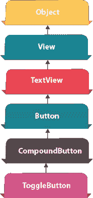
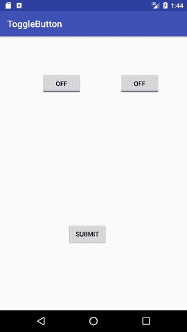
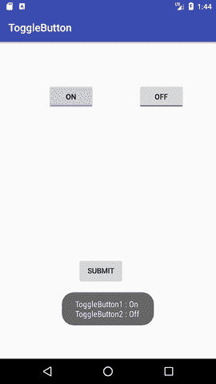

# 安卓 ToggleButton 示例

> 原文：<https://www.javatpoint.com/android-togglebutton-example>



**安卓切换按钮**可用于在按钮上显示选中/未选中(开/关)状态。

如果用户必须在两种状态之间改变设置，这是有益的。可用于开/关音响、Wifi、蓝牙等。

从安卓 4.0 开始，有另一种类型的切换按钮叫做*开关*，提供滑块控制。

安卓 ToggleButton 和 Switch 都是 CompoundButton 类的子类。

## 安卓 ToggleButton 类

ToggleButton 类提供了创建切换按钮的工具。

### ToggleButton 类的 XML 属性

ToggleButton 类的 3 个 XML 属性。

| XML 属性 | 描述 |
| android:disabledAlpha | 禁用时应用于指示器的 alpha。 |
| Android:text ff | 按钮未选中时的文本。 |
| Android:textin | 选中按钮时的文本。 |

### ToggleButton 类的方法

ToggleButton 类广泛使用的方法如下。

| 方法 | 描述 |
| CharSequence getTextOff() | 当按钮未处于选中状态时，返回文本。 |
| CharSequence getTextOn() | 返回按钮处于选中状态时的文本。 |
| void setChecked(布尔型选中) | 更改此按钮的选中状态。 |

* * *

## 安卓 ToggleButton 示例

#### activity_main.xml

拖动布局的两个切换按钮和一个按钮。现在 activity_main.xml 文件将如下所示:

File: activity_main.xml

* * *

#### 活动类别

让我们编写代码来检查哪个切换按钮是开/关。

File: MainActivity.java

```
package example.javatpoint.com.togglebutton;

import android.support.v7.app.AppCompatActivity;
import android.os.Bundle;
import android.view.View;
import android.widget.Button;
import android.widget.Toast;
import android.widget.ToggleButton;

public class MainActivity extends AppCompatActivity {
    private ToggleButton toggleButton1, toggleButton2;
    private Button buttonSubmit;
    @Override
    protected void onCreate(Bundle savedInstanceState) {
        super.onCreate(savedInstanceState);
        setContentView(R.layout.activity_main);

        addListenerOnButtonClick();
    }

    public void addListenerOnButtonClick(){
        //Getting the ToggleButton and Button instance from the layout xml file
        toggleButton1=(ToggleButton)findViewById(R.id.toggleButton);
        toggleButton2=(ToggleButton)findViewById(R.id.toggleButton2);
        buttonSubmit=(Button)findViewById(R.id.button);

        //Performing action on button click
        buttonSubmit.setOnClickListener(new View.OnClickListener(){

            @Override
            public void onClick(View view) {
                StringBuilder result = new StringBuilder();
                result.append("ToggleButton1 : ").append(toggleButton1.getText());
                result.append("\nToggleButton2 : ").append(toggleButton2.getText());
                //Displaying the message in toast
                Toast.makeText(getApplicationContext(), result.toString(),Toast.LENGTH_LONG).show();
            }

        });

    }
}

```

* * *

#### 输出:

 