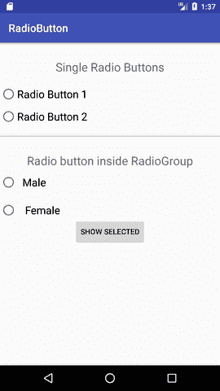
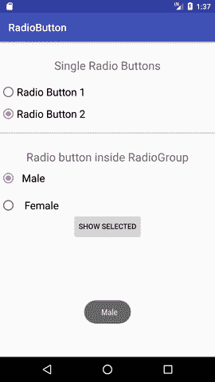

# Android RadioButton

> 原文：<https://www.javatpoint.com/android-radiobutton>

**单选按钮**是选中或未选中的两种状态按钮。如果单个单选按钮未选中，我们可以单击它以选中单选按钮。选中单选按钮后，用户不能将其标记为未选中。

RadioButton 一般与 *RadioGroup* 配合使用。单选按钮组包含多个单选按钮，将一个单选按钮标记为选中会使所有其他单选按钮都不选中。

## 单选按钮示例

在本例中，我们将分别实现单个单选按钮以及**单选组**中的单选按钮。

### activity_main.xml

**文件:activity_main.xml**

```
 <textview android:id="@+id/textView1" android:layout_width="fill_parent" android:layout_height="wrap_content" android:layout_margintop="30dp" android:gravity="center_horizontal" android:textsize="22dp" android:text="Single Radio Buttons"><radiobutton android:id="@+id/radioButton1" android:layout_width="fill_parent" android:layout_height="wrap_content" android:layout_gravity="center_horizontal" android:text="Radio Button 1" android:layout_margintop="20dp" android:textsize="20dp"><radiobutton android:id="@+id/radioButton2" android:layout_width="fill_parent" android:layout_height="wrap_content" android:text="Radio Button 2" android:layout_margintop="10dp" android:textsize="20dp"><view android:layout_width="fill_parent" android:layout_height="1dp" android:layout_margintop="20dp" android:background="#B8B894"><textview android:id="@+id/textView2" android:layout_width="fill_parent" android:layout_height="wrap_content" android:layout_margintop="30dp" android:gravity="center_horizontal" android:textsize="22dp" android:text="Radio button inside RadioGroup"><radiogroup android:layout_width="wrap_content" android:layout_height="wrap_content" android:id="@+id/radioGroup"><radiobutton android:id="@+id/radioMale" android:layout_width="fill_parent" android:layout_height="wrap_content" android:text="  Male" android:layout_margintop="10dp" android:checked="false" android:textsize="20dp"><radiobutton android:id="@+id/radioFemale" android:layout_width="fill_parent" android:layout_height="wrap_content" android:text="   Female" android:layout_margintop="20dp" android:checked="false" android:textsize="20dp"></radiobutton></radiobutton></radiogroup></textview></view></radiobutton></radiobutton></textview> 
```

### 活动类别

**档案:MainActivity.java**

```
package example.javatpoint.com.radiobutton;

import android.support.v7.app.AppCompatActivity;
import android.os.Bundle;
import android.view.View;
import android.widget.Button;
import android.widget.RadioButton;
import android.widget.RadioGroup;
import android.widget.Toast;

public class MainActivity extends AppCompatActivity {
    Button button;
    RadioButton genderradioButton;
    RadioGroup radioGroup;
    @Override
    protected void onCreate(Bundle savedInstanceState) {
        super.onCreate(savedInstanceState);
        setContentView(R.layout.activity_main);
        radioGroup=(RadioGroup)findViewById(R.id.radioGroup);
    }
    public void onclickbuttonMethod(View v){
        int selectedId = radioGroup.getCheckedRadioButtonId();
        genderradioButton = (RadioButton) findViewById(selectedId);
        if(selectedId==-1){
            Toast.makeText(MainActivity.this,"Nothing selected", Toast.LENGTH_SHORT).show();
        }
        else{
            Toast.makeText(MainActivity.this,genderradioButton.getText(), Toast.LENGTH_SHORT).show();
        }

    }
}

```

输出


