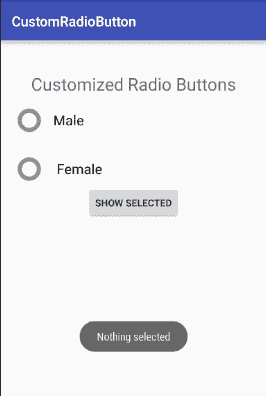
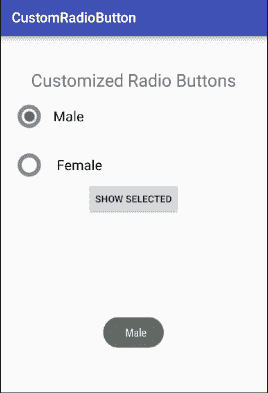

# 安卓自定义单选按钮

> 原文：<https://www.javatpoint.com/android-custom-radiobutton>

除了 android RadioButton 的默认用户界面，我们还可以实现一个自定义的单选按钮。自定义单选按钮使用户界面更具吸引力。

## 自定义单选按钮示例

让我们看一个自定义单选按钮的例子。

### activity_main.xml

**文件:activity_main.xml**

```
<?xml version="1.0" encoding="utf-8"?>
<LinearLayout
    xmlns:android="http://schemas.android.com/apk/res/android"
    xmlns:tools="http://schemas.android.com/tools"
    android:layout_width="match_parent"
    android:layout_height="match_parent"
    android:paddingBottom="@dimen/activity_vertical_margin"
    android:paddingLeft="@dimen/activity_horizontal_margin"
    android:paddingRight="@dimen/activity_horizontal_margin"
    android:paddingTop="@dimen/activity_vertical_margin"
    android:orientation="vertical"
    tools:context="com.example.test.customradiobutton.MainActivity">

    <TextView
        android:id="@+id/tv"
        android:layout_width="fill_parent"
        android:layout_height="wrap_content"
        android:layout_marginTop="30dp"
        android:gravity="center_horizontal"
        android:textSize="25dp"
        android:text="Customized Radio Buttons" />

    <!--   Customized RadioButtons  -->

    <RadioGroup
        android:layout_width="wrap_content"
        android:layout_height="wrap_content"
        android:id="@+id/radioGroup">

        <RadioButton
            android:id="@+id/radioMale"
            android:layout_width="fill_parent"
            android:layout_height="wrap_content"
            android:text="  Male"
            android:layout_marginTop="10dp"
            android:checked="false"
            android:button="@drawable/custom_radio_button"
            android:textSize="20dp" />

        <RadioButton
            android:id="@+id/radioFemale"
            android:layout_width="fill_parent"
            android:layout_height="wrap_content"
            android:text="   Female"
            android:layout_marginTop="20dp"
            android:checked="false"
            android:button="@drawable/custom_radio_button"
            android:textSize="20dp" />
    </RadioGroup>

    <Button
        android:layout_width="wrap_content"
        android:layout_height="wrap_content"
        android:text="Show Selected"
        android:id="@+id/button"
        android:onClick="onclickbuttonMethod"
        android:layout_gravity="center_horizontal" />

</LinearLayout>

```

### custom _ 单选按钮. xml

现在在另一个可绘制的文件(custom_radio_button.xml)中实现一个选择器，并放置两个不同的选中和未选中的按钮图像。

**文件:checkbox.xml**

```
<?xml version="1.0" encoding="utf-8"?>

<selector xmlns:android="http://schemas.android.com/apk/res/android">

    <item android:state_checked="true" android:drawable="@drawable/checkedradiobutton" />
    <item android:state_checked="false" android:drawable="@drawable/unchekedradiobutton" />

</selector>

```

### 活动类别

**档案:MainActivity.java**

```
package com.example.test.customradiobutton;

import android.support.v7.app.AppCompatActivity;
import android.os.Bundle;
import android.view.View;
import android.widget.Button;
import android.widget.RadioButton;
import android.widget.RadioGroup;
import android.widget.Toast;

public class MainActivity extends AppCompatActivity {
    Button button;
    RadioButton genderradioButton;
    RadioGroup radioGroup;
    @Override
    protected void onCreate(Bundle savedInstanceState) {
        super.onCreate(savedInstanceState);
        setContentView(R.layout.activity_main);

        radioGroup=(RadioGroup)findViewById(R.id.radioGroup);
    }

    public void onclickbuttonMethod(View v){
        int selectedId = radioGroup.getCheckedRadioButtonId();
        genderradioButton = (RadioButton) findViewById(selectedId);
        if(selectedId==-1){
            Toast.makeText(MainActivity.this,"Nothing selected", Toast.LENGTH_SHORT).show();
        }
        else{
            Toast.makeText(MainActivity.this,genderradioButton.getText(), Toast.LENGTH_SHORT).show();
        }

    }
}

```

输出


