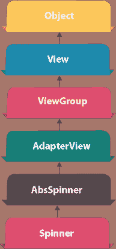
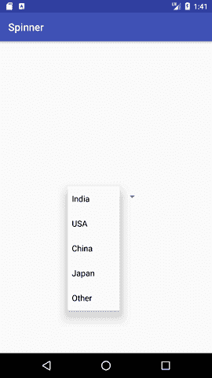
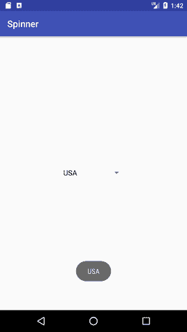

# 安卓旋转器示例

> 原文：<https://www.javatpoint.com/android-spinner-example>



**安卓 Spinner** 就像是 AWT 或者 Swing 的组合框。它可用于向用户显示多个选项，其中用户只能选择一个项目。

安卓微调器就像一个有多个值的下拉菜单，最终用户只能从中选择一个值。

安卓微调器与 AdapterView 相关联。因此，您需要将其中一个适配器类与 spinner 一起使用。

安卓 Spinner 类是 AsbSpinner 类的子类。

## 安卓旋转器示例

在本例中，我们将显示国家列表。需要使用 **ArrayAdapter** 类存储国家列表。

让我们看看 android 中 spinner 的简单例子。

#### activity_main.xml

从面板中拖动微调器，现在 activity_main.xml 文件将如下所示:

File: activity_main.xml

* * *

#### 活动类别

让我们编写代码在微调器上显示项目并执行事件处理。

File: MainActivity.java

```
package example.javatpoint.com.spinner;

import android.support.v7.app.AppCompatActivity;
import android.os.Bundle;
import android.view.View;
import android.widget.AdapterView;
import android.widget.ArrayAdapter;
import android.widget.Spinner;
import android.widget.Toast;

public class MainActivity extends AppCompatActivity implements
        AdapterView.OnItemSelectedListener {
    String[] country = { "India", "USA", "China", "Japan", "Other"};

    @Override
    protected void onCreate(Bundle savedInstanceState) {
        super.onCreate(savedInstanceState);
        setContentView(R.layout.activity_main);
       //Getting the instance of Spinner and applying OnItemSelectedListener on it
        Spinner spin = (Spinner) findViewById(R.id.spinner);
        spin.setOnItemSelectedListener(this);

        //Creating the ArrayAdapter instance having the country list
        ArrayAdapter aa = new ArrayAdapter(this,android.R.layout.simple_spinner_item,country);
        aa.setDropDownViewResource(android.R.layout.simple_spinner_dropdown_item);
        //Setting the ArrayAdapter data on the Spinner
        spin.setAdapter(aa);

    }

    //Performing action onItemSelected and onNothing selected
    @Override
    public void onItemSelected(AdapterView> arg0, View arg1, int position, long id) {
        Toast.makeText(getApplicationContext(),country[position] , Toast.LENGTH_LONG).show();
    }
    @Override
    public void onNothingSelected(AdapterView> arg0) {
        // TODO Auto-generated method stub
    }
}

```

* * *

#### 输出:

  