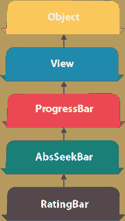
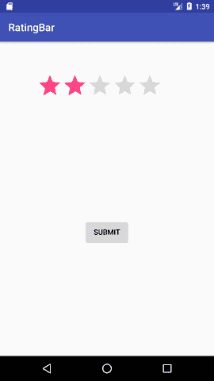
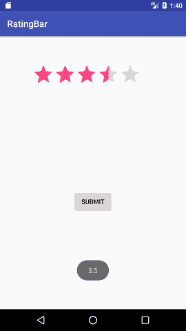

# 安卓评论栏示例

> 原文：<https://www.javatpoint.com/android-rating-bar-example>



**安卓评级栏**可以用来获取用户的评级。评级返回一个浮点数。可能是 2.0、3.5、4.0 等。

安卓评级栏以星级显示评级。安卓 RatingBar 是 AbsSeekBar 类的子类。

安卓 RatingBar 类的 **getRating()** 方法返回评级号。

## 安卓评论栏示例

让我们看看 android 中评级栏的简单例子。

#### activity_main.xml

从面板中拖动评级栏和按钮，现在 activity_main.xml 文件将如下所示:

File: activity_main.xml

```
 <button android:layout_width="wrap_content" android:layout_height="wrap_content" android:text="submit" android:id="@+id/button" app:layout_constraintbottom_tobottomof="parent" app:layout_constraintleft_toleftof="parent" app:layout_constraintright_torightof="parent" app:layout_constrainttop_totopof="parent" app:layout_constraintvertical_bias="0.615"><ratingbar android:id="@+id/ratingBar" android:layout_width="wrap_content" android:layout_height="wrap_content" android:layout_marginleft="72dp" android:layout_margintop="60dp" app:layout_constraintstart_tostartof="parent" app:layout_constrainttop_totopof="parent"></ratingbar></button> 
```

* * *

#### 活动类别

让我们编写代码来显示用户的评分。

File: MainActivity.java

```
package example.javatpoint.com.ratingbar;

import android.support.v7.app.AppCompatActivity;
import android.os.Bundle;
import android.view.View;
import android.widget.Button;
import android.widget.RatingBar;
import android.widget.Toast;

public class MainActivity extends AppCompatActivity {
    RatingBar ratingbar;
    Button button;
    @Override
    protected void onCreate(Bundle savedInstanceState) {
        super.onCreate(savedInstanceState);
        setContentView(R.layout.activity_main);
        addListenerOnButtonClick();
    }
    public void addListenerOnButtonClick(){
        ratingbar=(RatingBar)findViewById(R.id.ratingBar);
        button=(Button)findViewById(R.id.button);
        //Performing action on Button Click
        button.setOnClickListener(new View.OnClickListener(){

            @Override
            public void onClick(View arg0) {
                //Getting the rating and displaying it on the toast
                String rating=String.valueOf(ratingbar.getRating());
                Toast.makeText(getApplicationContext(), rating, Toast.LENGTH_LONG).show();
            }

        });
    }
}

```

* * *

#### 输出:

 