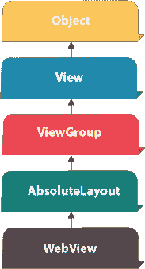
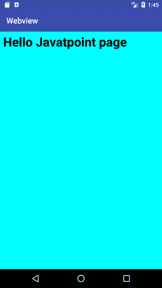

# 安卓网络视图示例

> 原文：<https://www.javatpoint.com/android-webview-example>



**安卓 WebView** 用于在安卓中显示网页。网页可以从相同的应用程序或网址加载。它用于在安卓活动中显示在线内容。

安卓 WebView 使用 webkit 引擎显示网页。

android.webkit.WebView 是 AbsoluteLayout 类的子类。

安卓 WebView 类的 **loadUrl()** 和 **loadData()** 方法用于加载和显示网页。

## 安卓网络视图示例

让我们看看使用网页视图显示 javatpoint.com 网页的简单代码。

```
WebView mywebview = (WebView) findViewById(R.id.webView1);
mywebview.loadUrl("http://www.javatpoint.com/");

```

让我们看看使用网页视图**显示 HTML 网页**的简单代码。在这种情况下，html 文件必须位于资产目录中。

```
WebView mywebview = (WebView) findViewById(R.id.webView1);
mywebview.loadUrl("file:///android_asset/myresource.html");

```

让我们看另一个代码来显示一个字符串的 **HTML 代码。**

```
String data = "<html><body><h1>Hello, Javatpoint!</h1></body></html>";
mywebview.loadData(data, "text/html", "UTF-8");

```

## 完整的安卓网络视图示例

让我们看一个完整的安卓网络视图的例子。

#### activity_main.xml

File: activity_main.xml

添加网页(。html，。jsp)在应用程序中，它们需要放在 assets 文件夹中。资产文件夹被创建为:右键单击应用->新建->文件夹->资产文件夹->主目录，或者简单地在主目录中创建一个资产目录。

#### 活动类别

File: MainActivity.java

```
package example.javatpoint.com.webview;

import android.support.v7.app.AppCompatActivity;
import android.os.Bundle;
import android.webkit.WebView;

public class MainActivity extends AppCompatActivity {

    @Override
    protected void onCreate(Bundle savedInstanceState) {
        super.onCreate(savedInstanceState);
        setContentView(R.layout.activity_main);
        WebView mywebview = (WebView) findViewById(R.id.webView);
        // mywebview.loadUrl("https://www.javatpoint.com/");

        /*String data = "你好，Javatpoint！";
        mywebview.loadData(data, "text/html", "UTF-8"); */

        mywebview.loadUrl("file:///android_asset/myresource.html");
    }
}

```

* * *

输出:

让我们看看如果你加载 HTML 页面的输出。



让我们看看如果你加载 javatpoint.com 网页的输出。

