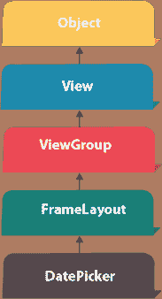
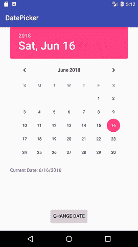
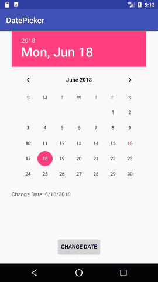

# 安卓日期选择器示例

> 原文：<https://www.javatpoint.com/android-datepicker-example>



安卓日期选择器是一个选择日期的小部件。它允许您按日、月和年选择日期。和 DatePicker 一样，android 也提供了 TimePicker 来选择时间。

android.widget.DatePicker 是 FrameLayout 类的子类。

## 安卓日期选择器示例

让我们看看 android 中 datepicker 小部件的简单例子。

#### activity_main.xml

文件:activity_main.xml

```
 <textview android:id="@+id/textView1" android:layout_width="wrap_content" android:layout_height="wrap_content" android:layout_above="@+id/button1" android:layout_alignparentleft="true" android:layout_alignparentstart="true" android:layout_marginbottom="102dp" android:layout_marginleft="30dp" android:layout_marginstart="30dp" android:text=""><button android:id="@+id/button1" android:layout_width="wrap_content" android:layout_height="wrap_content" android:layout_alignparentbottom="true" android:layout_centerhorizontal="true" android:layout_marginbottom="20dp" android:text="Change Date"><datepicker android:id="@+id/datePicker" android:layout_width="wrap_content" android:layout_height="wrap_content" android:layout_above="@+id/textView1" android:layout_centerhorizontal="true" android:layout_marginbottom="36dp"></datepicker></button></textview> 
```

* * *

#### 活动类别

文件:MainActivity.java

```
package example.javatpoint.com.datepicker;

import android.support.v7.app.AppCompatActivity;
import android.os.Bundle;
import android.view.View;
import android.widget.Button;
import android.widget.DatePicker;
import android.widget.TextView;

public class MainActivity extends AppCompatActivity {
    DatePicker picker;
    Button displayDate;
    TextView textview1;
    @Override
    protected void onCreate(Bundle savedInstanceState) {
        super.onCreate(savedInstanceState);
        setContentView(R.layout.activity_main);

        textview1=(TextView)findViewById(R.id.textView1);
        picker=(DatePicker)findViewById(R.id.datePicker);
        displayDate=(Button)findViewById(R.id.button1);

        textview1.setText("Current Date: "+getCurrentDate());

        displayDate.setOnClickListener(new View.OnClickListener(){
            @Override
            public void onClick(View view) {

                textview1.setText("Change Date: "+getCurrentDate());
            }

        });

    }
    public String getCurrentDate(){
        StringBuilder builder=new StringBuilder();;
        builder.append((picker.getMonth() + 1)+"/");//month is 0 based
        builder.append(picker.getDayOfMonth()+"/");
        builder.append(picker.getYear());
        return builder.toString();
    }
}

```

* * *

#### 输出:

 