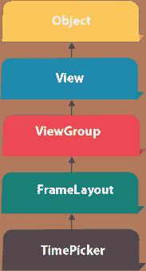
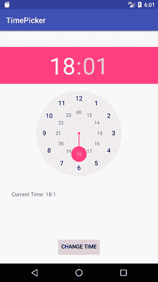
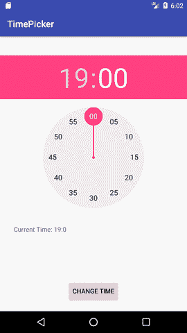

# 安卓时间选择器示例

> 原文：<https://www.javatpoint.com/android-timepicker-example>



**安卓 TimePicker** 小工具用于选择日期。它允许您按小时和分钟选择时间。您不能按秒选择时间。

android.widget.TimePicker 是 FrameLayout 类的子类。

### 安卓时间选择器示例

让我们看一个简单的安卓时间选择器的例子。

#### activity_main.xml

File: activity_main.xml

* * *

#### 活动类别

File: MainActivity.java

```
package example.javatpoint.com.timepicker;

import android.support.v7.app.AppCompatActivity;
import android.os.Bundle;
import android.view.View;
import android.widget.Button;
import android.widget.TextView;
import android.widget.TimePicker;

public class MainActivity extends AppCompatActivity {
    TextView textview1;
    TimePicker timepicker;
    Button changetime;
    @Override
    protected void onCreate(Bundle savedInstanceState) {
        super.onCreate(savedInstanceState);
        setContentView(R.layout.activity_main);

        textview1=(TextView)findViewById(R.id.textView1);
        timepicker=(TimePicker)findViewById(R.id.timePicker);
        //Uncomment the below line of code for 24 hour view
        timepicker.setIs24HourView(true);
        changetime=(Button)findViewById(R.id.button1);

        textview1.setText(getCurrentTime());

        changetime.setOnClickListener(new View.OnClickListener(){
            @Override
            public void onClick(View view) {
                textview1.setText(getCurrentTime());
            }
        });

    }

    public String getCurrentTime(){
        String currentTime="Current Time: "+timepicker.getCurrentHour()+":"+timepicker.getCurrentMinute();
        return currentTime;
    }

}

```

* * *

#### 输出:

 