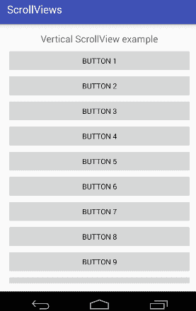
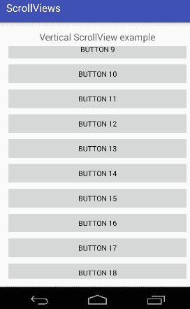

# Android ScrollView(垂直)

> 原文：<https://www.javatpoint.com/android-scrollview-vertical>

**Android . widget . scroll view**类提供了滚动视图的功能。滚动视图用于滚动滚动视图中调色板的子元素。安卓支持垂直滚动视图作为默认滚动视图。垂直滚动视图垂直滚动元素。

安卓使用*水平滚动视图*进行水平滚动视图。

让我们实现一个垂直滚动视图的简单例子。

### activity_main.xml

现在，将 ScrollView 从调色板拖到 activity_main.xml 文件中，并在其中放置一些调色板元素。

**文件:activity_main.xml**

```
<?xml version="1.0" encoding="utf-8"?>
<RelativeLayout xmlns:android="http://schemas.android.com/apk/res/android"
    xmlns:tools="http://schemas.android.com/tools"
    android:layout_width="match_parent"
    android:layout_height="match_parent"
    android:paddingBottom="@dimen/activity_vertical_margin"
    android:paddingLeft="@dimen/activity_horizontal_margin"
    android:paddingRight="@dimen/activity_horizontal_margin"
    android:paddingTop="@dimen/activity_vertical_margin"
    tools:context="com.example.test.scrollviews.MainActivity">

    <TextView
        android:layout_width="wrap_content"
        android:layout_height="wrap_content"
        android:textAppearance="?android:attr/textAppearanceMedium"
        android:text="Vertical ScrollView example"
        android:id="@+id/textView"
        android:layout_gravity="center_horizontal"
        android:layout_centerHorizontal="true"
        android:layout_alignParentTop="true" />

    <ScrollView android:layout_marginTop="30dp"
        android:layout_width="fill_parent"
        android:layout_height="wrap_content"
        android:id="@+id/scrollView">

        <LinearLayout
            android:layout_width="fill_parent"
            android:layout_height="fill_parent"
            android:orientation="vertical" >

            <Button
                android:layout_width="fill_parent"
                android:layout_height="wrap_content"
                android:text="Button 1" />
            <Button
                android:layout_width="fill_parent"
                android:layout_height="wrap_content"
                android:text="Button 2" />
            <Button
                android:layout_width="fill_parent"
                android:layout_height="wrap_content"
                android:text="Button 3" />
            <Button
                android:layout_width="fill_parent"
                android:layout_height="wrap_content"
                android:text="Button 4" />
            <Button
                android:layout_width="fill_parent"
                android:layout_height="wrap_content"
                android:text="Button 5" />
            <Button
                android:layout_width="fill_parent"
                android:layout_height="wrap_content"
                android:text="Button 6" />
            <Button
                android:layout_width="fill_parent"
                android:layout_height="wrap_content"
                android:text="Button 7" />
            <Button
                android:layout_width="fill_parent"
                android:layout_height="wrap_content"
                android:text="Button 8" />
            <Button
                android:layout_width="fill_parent"
                android:layout_height="wrap_content"
                android:text="Button 9" />
            <Button
                android:layout_width="fill_parent"
                android:layout_height="wrap_content"
                android:text="Button 10" />
            <Button
                android:layout_width="fill_parent"
                android:layout_height="wrap_content"
                android:text="Button 11" />
            <Button
                android:layout_width="fill_parent"
                android:layout_height="wrap_content"
                android:text="Button 12" />
            <Button
                android:layout_width="fill_parent"
                android:layout_height="wrap_content"
                android:text="Button 13" />
            <Button
                android:layout_width="fill_parent"
                android:layout_height="wrap_content"
                android:text="Button 14" />
            <Button
                android:layout_width="fill_parent"
                android:layout_height="wrap_content"
                android:text="Button 15" />
            <Button
                android:layout_width="fill_parent"
                android:layout_height="wrap_content"
                android:text="Button 16" />
            <Button
                android:layout_width="fill_parent"
                android:layout_height="wrap_content"
                android:text="Button 17" />
            <Button
                android:layout_width="fill_parent"
                android:layout_height="wrap_content"
                android:text="Button 18" />

            <Button
                android:layout_width="fill_parent"
                android:layout_height="wrap_content"
                android:text="Button 19" />
            <Button
                android:layout_width="fill_parent"
                android:layout_height="wrap_content"
                android:text="Button 20" />

        </LinearLayout>

    </ScrollView>

</RelativeLayout>

```

### 活动类别

在活动类中，我们没有更改任何代码。

**档案:MainActivity.java**

```
package com.example.test.scrollviews;

import android.support.v7.app.AppCompatActivity;
import android.os.Bundle;

public class MainActivity extends AppCompatActivity {

    @Override
    protected void onCreate(Bundle savedInstanceState) {
        super.onCreate(savedInstanceState);
        setContentView(R.layout.activity_main);
    }
}

```

输出


