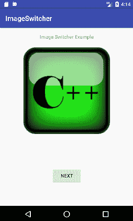

# 安卓图像切换器

> 原文：<https://www.javatpoint.com/android-image-switcher>

安卓图像切换器在图像上提供动画，从一个图像过渡到另一个图像。为了使用图像切换器，我们需要在中实现**图像切换器**组件。xml 文件。

ImageSwitcher 的 *setFactory()* 方法提供了*视图工厂*界面的实现。视图工厂接口实现其未实现的方法，并返回一个图像视图。

### 图像切换器示例

让我们实现一个图像切换器。

在布局文件夹中创建 activity_main.xml 和 content_main.xml 文件。

将一些要切换的图像放在可绘制的文件夹中。

### activity_main.xml

***文件:activity_main.xml***

```
<?xml version="1.0" encoding="utf-8"?>
<android.support.design.widget.CoordinatorLayout xmlns:android="http://schemas.android.com/apk/res/android"
    xmlns:app="http://schemas.android.com/apk/res-auto"
    xmlns:tools="http://schemas.android.com/tools"
    android:layout_width="match_parent"
    android:layout_height="match_parent"
    android:fitsSystemWindows="true"
    tools:context="com.example.test.imageswitcher.MainActivity">

    <android.support.design.widget.AppBarLayout
        android:layout_width="match_parent"
        android:layout_height="wrap_content"
        android:theme="@style/AppTheme.AppBarOverlay">

        <android.support.v7.widget.Toolbar
            android:id="@+id/toolbar"
            android:layout_width="match_parent"
            android:layout_height="?attr/actionBarSize"
            android:background="?attr/colorPrimary"
            app:popupTheme="@style/AppTheme.PopupOverlay" />

    </android.support.design.widget.AppBarLayout>
    <include layout="@layout/content_main" />

</android.support.design.widget.CoordinatorLayout>

```

### content_main.xml

***文件:content_main.xml***

```
<?xml version="1.0" encoding="utf-8"?>
<RelativeLayout xmlns:android="http://schemas.android.com/apk/res/android"
    xmlns:app="http://schemas.android.com/apk/res-auto"
    xmlns:tools="http://schemas.android.com/tools"
    android:layout_width="match_parent"
    android:layout_height="match_parent"
    android:paddingBottom="@dimen/activity_vertical_margin"
    android:paddingLeft="@dimen/activity_horizontal_margin"
    android:paddingRight="@dimen/activity_horizontal_margin"
    android:paddingTop="@dimen/activity_vertical_margin"
    app:layout_behavior="@string/appbar_scrolling_view_behavior"
    tools:context="com.example.test.imageswitcher.MainActivity"
    tools:showIn="@layout/activity_main">

    <TextView
        android:layout_width="wrap_content"
        android:layout_height="wrap_content"
        android:text="Image Switcher Example"

        android:id="@+id/textView"
        android:layout_alignParentTop="true"
        android:layout_centerHorizontal="true" />

    <ImageSwitcher
        android:id="@+id/imageSwitcher"
        android:layout_width="match_parent"
        android:layout_height="250dp"
        android:layout_marginBottom="28dp"
        android:layout_marginTop="40dp" />

    <Button
        android:layout_width="wrap_content"
        android:layout_height="wrap_content"
        android:text="Next"
        android:id="@+id/button"
        android:layout_marginBottom="47dp"
        android:layout_alignParentBottom="true"
        android:layout_centerHorizontal="true" />
</RelativeLayout>

```

### 活动类别

***文件:MainActivity.java***

```
package com.example.test.imageswitcher;

import android.os.Bundle;
import android.support.v7.app.AppCompatActivity;
import android.support.v7.widget.Toolbar;
import android.view.View;
import android.widget.Button;
import android.widget.ImageSwitcher;
import android.widget.ImageView;
import android.widget.ViewSwitcher;

import android.app.ActionBar;
import android.view.animation.Animation;
import android.view.animation.AnimationUtils;

public class MainActivity extends AppCompatActivity {
    ImageSwitcher imageSwitcher;
    Button nextButton;

    int imageSwitcherImages[] = 
      {R.drawable.cpp, R.drawable.c_sarp, R.drawable.jsp, R.drawable.mysql, R.drawable.hadoop};

    int switcherImageLength = imageSwitcherImages.length;
    int counter = -1;

    @Override
    protected void onCreate(Bundle savedInstanceState) {
        super.onCreate(savedInstanceState);
        setContentView(R.layout.activity_main);
        Toolbar toolbar = (Toolbar) findViewById(R.id.toolbar);
        setSupportActionBar(toolbar);

        imageSwitcher = (ImageSwitcher) findViewById(R.id.imageSwitcher);
        nextButton = (Button) findViewById(R.id.button);

        imageSwitcher.setFactory(new ViewSwitcher.ViewFactory() {
            @Override
            public View makeView() {
                ImageView switcherImageView = new ImageView(getApplicationContext());
                switcherImageView.setLayoutParams(new ImageSwitcher.LayoutParams(
                        ActionBar.LayoutParams.FILL_PARENT, ActionBar.LayoutParams.FILL_PARENT
                ));
                switcherImageView.setScaleType(ImageView.ScaleType.FIT_CENTER);
                switcherImageView.setImageResource(R.drawable.hadoop);
                //switcherImageView.setMaxHeight(100);
                return switcherImageView;
            }
        });

        Animation aniOut = AnimationUtils.loadAnimation(this, android.R.anim.slide_out_right);
        Animation aniIn = AnimationUtils.loadAnimation(this, android.R.anim.slide_in_left);

       imageSwitcher.setOutAnimation(aniOut);
       imageSwitcher.setInAnimation(aniIn);

        nextButton.setOnClickListener(new View.OnClickListener() {
            @Override
            public void onClick(View v) {
                counter++;
                if (counter == switcherImageLength){
                    counter = 0;
                    imageSwitcher.setImageResource(imageSwitcherImages[counter]);
                }
                else{
                    imageSwitcher.setImageResource(imageSwitcherImages[counter]);
                }
            }
        });
    }

}

```

输出


