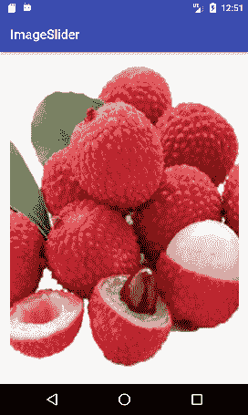
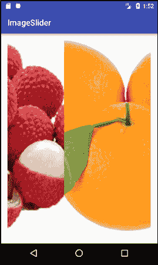

# 安卓图像滑块

> 原文：<https://www.javatpoint.com/android-image-slider>

安卓*图像滑块*将一整块屏幕滑动到另一个屏幕。图像滑块由支持库提供的**视图页面**创建。要实现图像滑块，您需要继承扩展寻呼机适配器的可视寻呼机类。

### 图像滑块示例

让我们看一个安卓图像滑块的例子。

### activity_main.xml

在 activity_main.xml 文件中，我们已经在 RelativeLayout 中包装了 ViewPager。

***文件:activity_main.xml***

```
<?xml version="1.0" encoding="utf-8"?>
<RelativeLayout xmlns:android="http://schemas.android.com/apk/res/android"
    xmlns:tools="http://schemas.android.com/tools"
    android:layout_width="fill_parent"
    android:layout_height="fill_parent"
    android:paddingBottom="@dimen/activity_vertical_margin"
    android:paddingLeft="@dimen/activity_horizontal_margin"
    android:paddingRight="@dimen/activity_horizontal_margin"
    android:paddingTop="@dimen/activity_vertical_margin"
    tools:context="com.example.test.imageslider.MainActivity">

    <android.support.v4.view.ViewPager
        android:id="@+id/viewPage"
        android:layout_width="fill_parent"
        android:layout_height="fill_parent" />

</RelativeLayout>

```

### 活动类别

***文件:MainActivity.java***

```
package com.example.test.imageslider;

import android.support.v4.view.ViewPager;
import android.support.v7.app.AppCompatActivity;
import android.os.Bundle;

public class MainActivity extends AppCompatActivity {

    @Override
    protected void onCreate(Bundle savedInstanceState) {
        super.onCreate(savedInstanceState);
        setContentView(R.layout.activity_main);

        ViewPager mViewPager = (ViewPager) findViewById(R.id.viewPage);
        ImageAdapter adapterView = new ImageAdapter(this);
        mViewPager.setAdapter(adapterView);
    }
}

```

### ImageAdapter 类

现在创建 ImageAdapter 类，它为 android 图像滑块扩展了 PagerAdapter。

将一些要滑动的图像放在可绘制的文件夹中。

***文件:ImageAdapter.java***

```
package com.example.test.imageslider;

import android.content.Context;
import android.support.v4.view.PagerAdapter;
import android.support.v4.view.ViewPager;
import android.view.View;
import android.view.ViewGroup;
import android.widget.ImageView;

public class ImageAdapter extends PagerAdapter{
    Context mContext;

    ImageAdapter(Context context) {
        this.mContext = context;
    }

    @Override
    public boolean isViewFromObject(View view, Object object) {
        return view == ((ImageView) object);
    }

    private int[] sliderImageId = new int[]{
            R.drawable.image1, R.drawable.image2, R.drawable.image3,R.drawable.image4, R.drawable.image5,
    };

    @Override
    public Object instantiateItem(ViewGroup container, int position) {
        ImageView imageView = new ImageView(mContext);
        imageView.setScaleType(ImageView.ScaleType.CENTER_CROP);
        imageView.setImageResource(sliderImageId[position]);
        ((ViewPager) container).addView(imageView, 0);
        return imageView;
    }

    @Override
    public void destroyItem(ViewGroup container, int position, Object object) {
        ((ViewPager) container).removeView((ImageView) object);
    }

    @Override
    public int getCount() {
        return sliderImageId.length;
    }
}

```

我们需要重写 PagerAdapter 类的以下方法。

1.  **isViewFromObject(View，Object):** 此方法检查视图是否与 key 相关联，并由 instantiateItem()返回。
2.  **实例化元素(视图组，int):** 这个方法创建作为参数传递的页面位置。
3.  **删除项目(视图组，int，Object):** 它从容器中删除页面的当前位置。在本例中，我们只需使用 removeView()移除对象。
4.  **getCount():** 返回 ViewPager 中可用视图的数量。

输出


