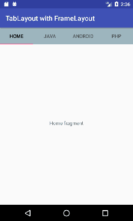
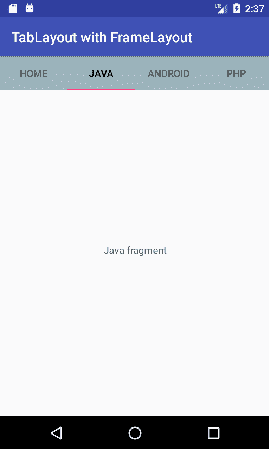

# 带有框架布局的安卓桌面布局

> 原文：<https://www.javatpoint.com/android-tablayout-with-framelayout>

在上一个页面中，我们使用 TabLayout 和 ViewPager 创建了一个滑动选项卡。这里，我们将使用*表格布局*和*框架布局*创建非滑动选项卡。

TabLayout 的项是通过增加安卓支持设计小部件的 *TabItem* 来实现的。

### 使用框架布局的表格布局示例

让我们创建一个使用框架布局和片段的表格布局的例子。

***文件:activity.xml***

使用 TabLayout 和 FrameLayout 视图组件创建一个 activity.xml 文件。

```
<?xml version="1.0" encoding="utf-8"?>
<android.support.constraint.ConstraintLayout xmlns:android="http://schemas.android.com/apk/res/android"
    xmlns:app="http://schemas.android.com/apk/res-auto"
    xmlns:tools="http://schemas.android.com/tools"
    android:layout_width="match_parent"
    android:layout_height="match_parent"
    tools:context="tablayout.example.com.tablayoutwithframelayout.MainActivity">

    <android.support.design.widget.TabLayout
        android:id="@+id/tabLayout"
        android:layout_width="match_parent"
        android:layout_height="wrap_content"
        android:background="#7367">

        <android.support.design.widget.TabItem
            android:layout_width="wrap_content"
            android:layout_height="wrap_content"
            android:text="Home" />

        <android.support.design.widget.TabItem
            android:layout_width="wrap_content"
            android:layout_height="wrap_content"
            android:text="Java" />

        <android.support.design.widget.TabItem
            android:layout_width="wrap_content"
            android:layout_height="wrap_content"
            android:text="Android" />

        <android.support.design.widget.TabItem
            android:layout_width="wrap_content"
            android:layout_height="wrap_content"
            android:text="Php" />
    </android.support.design.widget.TabLayout>

    <FrameLayout
        android:id="@+id/frameLayout"
        android:layout_width="match_parent"
        android:layout_height="455dp"
        app:layout_constraintEnd_toEndOf="parent"
        app:layout_constraintStart_toStartOf="parent"
        app:layout_constraintTop_toBottomOf="@+id/tabLayout">

    </FrameLayout>
</android.support.constraint.ConstraintLayout>

```

***文件:build.gradle***

现在在 build.gradle 文件中给出了 TabLayout 的依赖库。

```
implementation 'com.android.support:design:26.1.0'

```

***文件:MainActivity.java***

```
package tablayout.example.com.tablayoutwithframelayout;

import android.support.design.widget.TabLayout;
import android.support.v4.app.Fragment;
import android.support.v4.app.FragmentManager;
import android.support.v4.app.FragmentTransaction;
import android.support.v7.app.AppCompatActivity;
import android.os.Bundle;
import android.widget.FrameLayout;

public class MainActivity extends AppCompatActivity {
    TabLayout tabLayout;
    FrameLayout frameLayout;
    Fragment fragment = null;
    FragmentManager fragmentManager;
    FragmentTransaction fragmentTransaction;
    @Override
    protected void onCreate(Bundle savedInstanceState) {
        super.onCreate(savedInstanceState);
        setContentView(R.layout.activity_main);

        tabLayout=(TabLayout)findViewById(R.id.tabLayout);
        frameLayout=(FrameLayout)findViewById(R.id.frameLayout);

        fragment = new HomeFragment();
        fragmentManager = getSupportFragmentManager();
        fragmentTransaction = fragmentManager.beginTransaction();
        fragmentTransaction.replace(R.id.frameLayout, fragment);
        fragmentTransaction.setTransition(FragmentTransaction.TRANSIT_FRAGMENT_OPEN);
        fragmentTransaction.commit();

        tabLayout.addOnTabSelectedListener(new TabLayout.OnTabSelectedListener() {
            @Override
            public void onTabSelected(TabLayout.Tab tab) {
               // Fragment fragment = null;
                switch (tab.getPosition()) {
                    case 0:
                        fragment = new HomeFragment();
                        break;
                    case 1:
                        fragment = new JavaFragment();
                        break;
                    case 2:
                        fragment = new AndroidFragment();
                        break;
                    case 3:
                        fragment = new PhpFragment();
                        break;
                }
                FragmentManager fm = getSupportFragmentManager();
                FragmentTransaction ft = fm.beginTransaction();
                ft.replace(R.id.frameLayout, fragment);
                ft.setTransition(FragmentTransaction.TRANSIT_FRAGMENT_OPEN);
                ft.commit();
            }

            @Override
            public void onTabUnselected(TabLayout.Tab tab) {

            }

            @Override
            public void onTabReselected(TabLayout.Tab tab) {

            }
        });

    }
}

```

现在为所有不同的标签创建不同的片段文件。

***文件:HomeFragment.java***

```
package tablayout.example.com.tablayoutwithframelayout;

import android.os.Bundle;
import android.support.v4.app.Fragment;
import android.view.LayoutInflater;
import android.view.View;
import android.view.ViewGroup;

public class HomeFragment extends Fragment {

    public HomeFragment() {
        // Required empty public constructor
    }

    @Override
    public View onCreateView(LayoutInflater inflater, ViewGroup container,
                             Bundle savedInstanceState) {
        // Inflate the layout for this fragment
        return inflater.inflate(R.layout.fragment_home, container, false);
    }

}

```

***文件:fragment_home.xml***

```
<FrameLayout xmlns:android="http://schemas.android.com/apk/res/android"
    xmlns:tools="http://schemas.android.com/tools"
    android:layout_width="match_parent"
    android:layout_height="match_parent"
    tools:context="tablayout.example.com.tablayoutwithframelayout.HomeFragment">

    <!-- TODO: Update blank fragment layout -->
    <TextView
        android:layout_width="match_parent"
        android:layout_height="match_parent"
        android:gravity="center"
        android:text="@string/home_fragment" />

</FrameLayout>

```

***文件:JavaFragment.java***

```
package tablayout.example.com.tablayoutwithframelayout;

import android.os.Bundle;
import android.support.v4.app.Fragment;
import android.view.LayoutInflater;
import android.view.View;
import android.view.ViewGroup;

public class JavaFragment extends Fragment {

    public JavaFragment() {
        // Required empty public constructor
    }

    @Override
    public View onCreateView(LayoutInflater inflater, ViewGroup container,
                             Bundle savedInstanceState) {
        // Inflate the layout for this fragment
        return inflater.inflate(R.layout.fragment_java, container, false);
    }

}

```

***文件:fragment_java.xml***

```
<FrameLayout xmlns:android="http://schemas.android.com/apk/res/android"
    xmlns:tools="http://schemas.android.com/tools"
    android:layout_width="match_parent"
    android:layout_height="match_parent"
    tools:context="tablayout.example.com.tablayoutwithframelayout.JavaFragment">

    <!-- TODO: Update blank fragment layout -->
    <TextView
        android:layout_width="match_parent"
        android:layout_height="match_parent"
        android:gravity="center"
        android:text="@string/java_fragment" />

</FrameLayout>

```

***文件:AndroidFragment.java***

```
package tablayout.example.com.tablayoutwithframelayout;

import android.os.Bundle;
import android.support.v4.app.Fragment;
import android.view.LayoutInflater;
import android.view.View;
import android.view.ViewGroup;

public class AndroidFragment extends Fragment {

    public AndroidFragment() {
        // Required empty public constructor
    }

    @Override
    public View onCreateView(LayoutInflater inflater, ViewGroup container,
                             Bundle savedInstanceState) {
        // Inflate the layout for this fragment
        return inflater.inflate(R.layout.fragment_android, container, false);
    }

}

```

***文件:fragment_android.xml***

```
<FrameLayout xmlns:android="http://schemas.android.com/apk/res/android"
    xmlns:tools="http://schemas.android.com/tools"
    android:layout_width="match_parent"
    android:layout_height="match_parent"
    tools:context="tablayout.example.com.tablayoutwithframelayout.AndroidFragment">

    <!-- TODO: Update blank fragment layout -->
    <TextView
        android:layout_width="match_parent"
        android:layout_height="match_parent"
        android:gravity="center"
        android:text="@string/android_fragment" />

</FrameLayout>

```

***文件:PhpFragment.java***

```
package tablayout.example.com.tablayoutwithframelayout;

import android.os.Bundle;
import android.support.v4.app.Fragment;
import android.view.LayoutInflater;
import android.view.View;
import android.view.ViewGroup;

public class PhpFragment extends Fragment {

    public PhpFragment() {
        // Required empty public constructor
    }

    @Override
    public View onCreateView(LayoutInflater inflater, ViewGroup container,
                             Bundle savedInstanceState) {
        // Inflate the layout for this fragment
        return inflater.inflate(R.layout.fragment_php, container, false);
    }

}

```

***文件:fragment_php.xml***

```
<FrameLayout xmlns:android="http://schemas.android.com/apk/res/android"
    xmlns:tools="http://schemas.android.com/tools"
    android:layout_width="match_parent"
    android:layout_height="match_parent"
    tools:context="tablayout.example.com.tablayoutwithframelayout.PhpFragment">

    <!-- TODO: Update blank fragment layout -->
    <TextView
        android:layout_width="match_parent"
        android:layout_height="match_parent"
        android:gravity="center"
        android:text="@string/php_fragment" />

</FrameLayout>

```

***文件:***

```
<resources>
    <string name="app_name">TabLayout with FrameLayout</string>

    <!-- TODO: Remove or change this placeholder text -->
    <string name="home_fragment">Home fragment</string>
    <string name="java_fragment">Java fragment</string>
    <string name="android_fragment">Android fragment</string>
    <string name="php_fragment">Php fragment</string>
</resources>

```

输出


