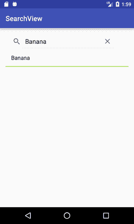

# 安卓 SearchView

> 吴奇珍:t0【https://www . javatppoint . com/Android-search view】

安卓**搜索视图**提供用户界面来搜索通过搜索提供商提交的查询。搜索视图小部件可以在工具栏/动作栏上或布局内实现。

默认情况下，SearchView 是可折叠的，并使用 SearchView 类的*seticonifiedbydfault(true)*方法设置为图标化。为了使搜索字段可见，搜索视图使用了 seticonifiedbydfault(false)方法。

### 搜索视图的方法

1.  **public boolean onQueryTextSubmit(字符串查询):**通过 SearchView 编辑器搜索提交内容的查询。这取决于具体情况。
2.  **public boolean onQueryTextChange(String new text):**它通过 SearchView 编辑器在文本更改时搜索查询。

### 搜索视图示例

让我们看看布局上的搜索视图的例子，在列表视图中搜索数据。

### activity_main.xml

在包含 ScrollView 和 ListView 的布局文件夹中创建 activity_main.xml 文件。

***文件:activity_main.xml***

```
<?xml version="1.0" encoding="utf-8"?>
<RelativeLayout xmlns:android="http://schemas.android.com/apk/res/android"
    xmlns:tools="http://schemas.android.com/tools"
    android:layout_width="match_parent"
    android:layout_height="match_parent"
    android:paddingBottom="@dimen/activity_vertical_margin"
    android:paddingLeft="@dimen/activity_horizontal_margin"
    android:paddingRight="@dimen/activity_horizontal_margin"
    android:paddingTop="@dimen/activity_vertical_margin"
    tools:context="com.example.test.searchview.MainActivity">

    <ListView
        android:layout_width="match_parent"
        android:layout_height="match_parent"
        android:id="@+id/lv1"
        android:divider="#ad5"
        android:dividerHeight="2dp"
        android:layout_below="@+id/searchView"/>

    <SearchView
        android:id="@+id/searchView"
        android:layout_width="wrap_content"
        android:layout_height="wrap_content"
        android:queryHint="Search Here"
        android:iconifiedByDefault="false"
        android:layout_alignParentTop="true"
   />

</RelativeLayout>

```

### 活动类别

***文件:MainActivity.java***

```
package com.example.test.searchview;

import android.support.v7.app.AppCompatActivity;
import android.os.Bundle;
import android.widget.ArrayAdapter;
import android.widget.Filter;
import android.widget.ListView;
import android.widget.SearchView;
import android.widget.Toast;

import java.util.ArrayList;

public class MainActivity extends AppCompatActivity {
    SearchView searchView;
    ListView listView;
    ArrayList list;
    ArrayAdapter <string>adapter;
    @Override
    protected void onCreate(Bundle savedInstanceState) {
        super.onCreate(savedInstanceState);
        setContentView(R.layout.activity_main);

        searchView = (SearchView) findViewById(R.id.searchView);
        listView = (ListView) findViewById(R.id.lv1);

        list = new ArrayList<>();
        list.add("Apple");
        list.add("Banana");
        list.add("Pineapple");
        list.add("Orange");
        list.add("Lychee");
        list.add("Gavava");
        list.add("Peech");
        list.add("Melon");
        list.add("Watermelon");
        list.add("Papaya");

        adapter = new ArrayAdapter<string>(this, android.R.layout.simple_list_item_1,list);
        listView.setAdapter(adapter);

        searchView.setOnQueryTextListener(new SearchView.OnQueryTextListener() {
            @Override
            public boolean onQueryTextSubmit(String query) {

                if(list.contains(query)){
                    adapter.getFilter().filter(query);
                }else{
                    Toast.makeText(MainActivity.this, "No Match found",Toast.LENGTH_LONG).show();
                }
                return false;
            }

            @Override
            public boolean onQueryTextChange(String newText) {
            //    adapter.getFilter().filter(newText);
                return false;
            }
        });
    }
}</string></string> 
```

输出


 