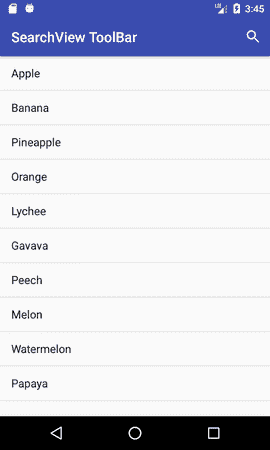
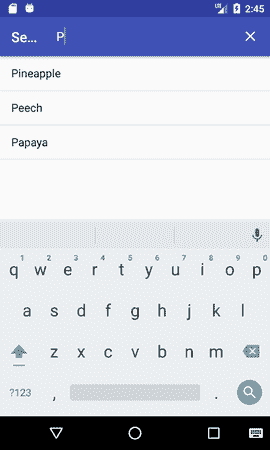

# 工具栏上的 Android SearchView

> 原文：<https://www.javatpoint.com/android-searchview-on-toolbar>

由于我们已经在活动布局上实现了搜索视图小部件，它也可以在工具栏/动作栏上实现。为了实现工具栏上的搜索视图，我们需要创建菜单选项，并在上面放置搜索视图小部件。

### 工具栏上的搜索视图示例(操作栏)

让我们看看工具栏上的搜索视图和在列表视图中搜索数据的例子。

### 本示例的目录结构


### activity_main.xml

在包含 ListView 的布局文件夹中创建 activity_main.xml 文件。

***文件:activity_main.xml***

```
<?xml version="1.0" encoding="utf-8"?>
<android.support.constraint.ConstraintLayout xmlns:android="http://schemas.android.com/apk/res/android"
    xmlns:app="http://schemas.android.com/apk/res-auto"
    xmlns:tools="http://schemas.android.com/tools"
    android:layout_width="match_parent"
    android:layout_height="match_parent"
    tools:context="searchview.toolbar.com.searchviewtoolbar.MainActivity">

    <ListView
        android:id="@+id/listView"
        android:layout_width="match_parent"
        android:layout_height="fill_parent"
        />

</android.support.constraint.ConstraintLayout>

```

### menu.xml

在菜单文件夹中创建一个 menu.xml 文件，并放置以下代码。这段代码将 SearchView 小部件放在 ToolBar 上。

***文件:***

```
<?xml version="1.0" encoding="utf-8"?>
<menu xmlns:app="http://schemas.android.com/apk/res-auto"
xmlns:android="http://schemas.android.com/apk/res/android">

<item
    android:id="@+id/app_bar_search"
    android:icon="@drawable/ic_search_black_24dp"
    android:title="Search"
    app:showAsAction="ifRoom|withText"
    app:actionViewClass="android.widget.SearchView"/>
</menu>

```

### 活动类别

***文件:MainActivity.java***

```
package searchview.toolbar.com.searchviewtoolbar;

import android.support.v4.view.MenuItemCompat;
import android.support.v7.app.AppCompatActivity;
import android.os.Bundle;
import android.view.Menu;
import android.view.MenuInflater;
import android.view.MenuItem;
import android.widget.ArrayAdapter;
import android.widget.ListView;
import android.widget.SearchView;
import android.widget.Toast;

import java.util.ArrayList;

public class MainActivity extends AppCompatActivity {

    ListView listView;
    ArrayList<String> list;
    ArrayAdapter<String > adapter;
    @Override
    protected void onCreate(Bundle savedInstanceState) {
        super.onCreate(savedInstanceState);
        setContentView(R.layout.activity_main);

        listView = (ListView) findViewById(R.id.listView);

        list = new ArrayList<>();
        list.add("Apple");
        list.add("Banana");
        list.add("Pineapple");
        list.add("Orange");
        list.add("Lychee");
        list.add("Gavava");
        list.add("Peech");
        list.add("Melon");
        list.add("Watermelon");
        list.add("Papaya");

        adapter = new ArrayAdapter<String>(this, android.R.layout.simple_list_item_1,list);
        listView.setAdapter(adapter);
    }

    @Override
    public boolean onCreateOptionsMenu(Menu menu) {
        MenuInflater inflater = getMenuInflater();
        inflater.inflate(R.menu.menu, menu);
        MenuItem searchViewItem = menu.findItem(R.id.app_bar_search);
        final SearchView searchView = (SearchView) MenuItemCompat.getActionView(searchViewItem);
        searchView.setOnQueryTextListener(new SearchView.OnQueryTextListener() {
            @Override
            public boolean onQueryTextSubmit(String query) {
                searchView.clearFocus();
             /*   if(list.contains(query)){
                    adapter.getFilter().filter(query);
                }else{
                    Toast.makeText(MainActivity.this, "No Match found",Toast.LENGTH_LONG).show();
                }*/
                return false;

            }

            @Override
            public boolean onQueryTextChange(String newText) {
                adapter.getFilter().filter(newText);
                return false;
            }
        });
        return super.onCreateOptionsMenu(menu);
    }
}

```

输出



