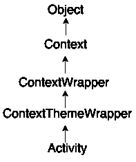
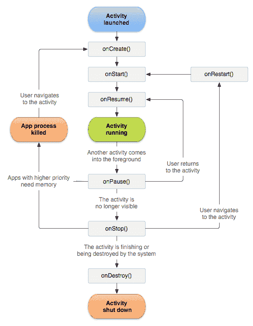
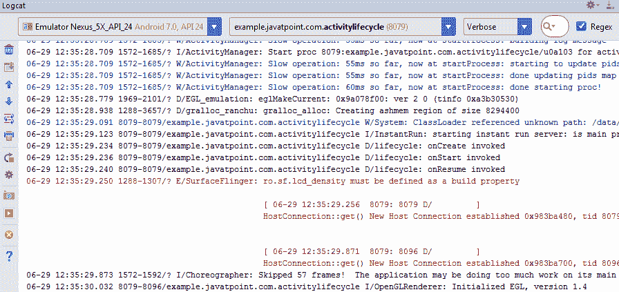
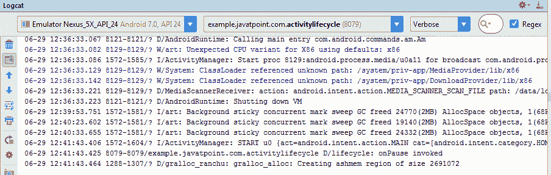
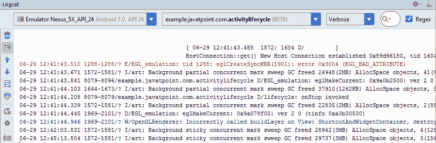
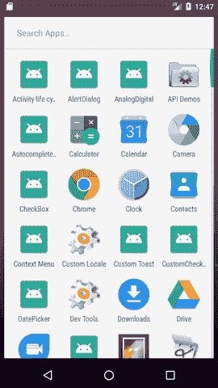
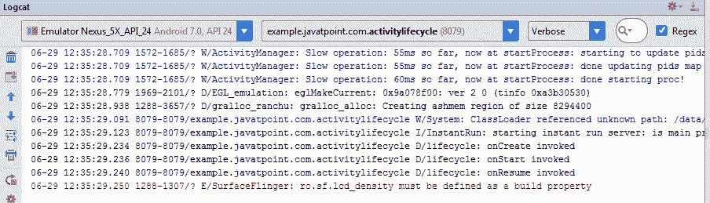
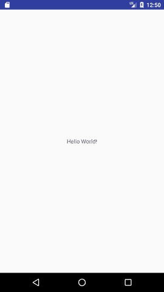
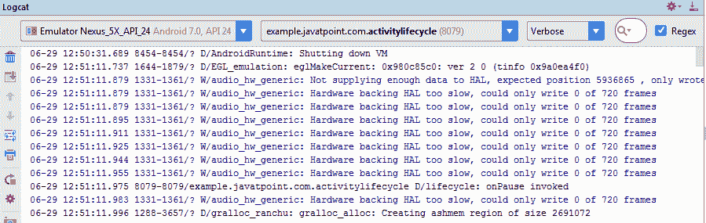
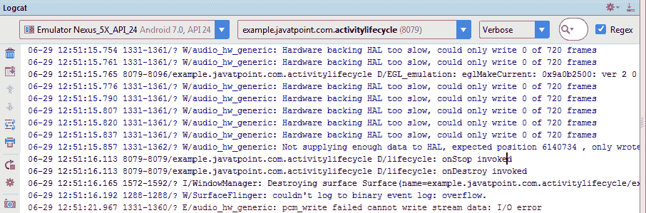

# 安卓活动生命周期

> 原文：<https://www.javatpoint.com/android-life-cycle-of-activity>



**安卓活动生命周期**由 android.app.Activity 类的 7 种方法控制。安卓活动是上下文包装类的子类。

一个活动就是安卓的单屏。它就像 Java 的窗口或框架。

借助活动，您可以将所有用户界面组件或小部件放在一个屏幕上。

活动的 7 生命周期方法描述了活动在不同状态下的行为。

## 安卓活动生命周期方法

让我们看看安卓活动的 7 种生命周期方法。

| 方法 | 描述 |
| **创造** | 首次创建活动时调用。 |
| **开启** | 当活动对用户可见时调用。 |
| 汇总 | 当活动将开始与用户交互时调用。 |
| 因为 | 当用户看不到活动时调用。 |
| **on top** | 当活动对用户不再可见时调用。 |
| **onRestart** | 在活动停止后，开始前调用。 |
| **where stroy** | 在活动被破坏之前调用。 |

File: activity_main.xml

### 安卓活动生命周期示例

它提供了关于活动的生命周期方法的调用的细节。在这个例子中，我们在日志表上显示内容。

File: MainActivity.java

```
package example.javatpoint.com.activitylifecycle;

import android.app.Activity;
import android.os.Bundle;
import android.util.Log;

public class MainActivity extends Activity {

    @Override
    protected void onCreate(Bundle savedInstanceState) {
        super.onCreate(savedInstanceState);
        setContentView(R.layout.activity_main);
        Log.d("lifecycle","onCreate invoked");
    }
    @Override
    protected void onStart() {
        super.onStart();
        Log.d("lifecycle","onStart invoked");
    }
    @Override
    protected void onResume() {
        super.onResume();
        Log.d("lifecycle","onResume invoked");
    }
    @Override
    protected void onPause() {
        super.onPause();
        Log.d("lifecycle","onPause invoked");
    }
    @Override
    protected void onStop() {
        super.onStop();
        Log.d("lifecycle","onStop invoked");
    }
    @Override
    protected void onRestart() {
        super.onRestart();
        Log.d("lifecycle","onRestart invoked");
    }
    @Override
    protected void onDestroy() {
        super.onDestroy();
        Log.d("lifecycle","onDestroy invoked");
    }
}

```

#### 输出:

您不会在模拟器或设备上看到任何输出。你需要打开日志。


现在请看日志:onCreate、onStart 和 onResume 方法被调用。



现在点击主页按钮。您将看到调用了一个方法。



过一会儿，您将看到 onStop 方法被调用。



现在在模拟器上看到。它在家里。现在点击中心按钮再次启动应用程序。


现在点击 lifecycleactivity 图标。



现在在日志上看到:onRestart、onStart 和 onResume 方法被调用。



如果看到模拟器，应用程序将再次启动。



现在点击后退按钮。现在，您将看到调用了一个原因方法。



过一会儿，您将会看到 onStop 和 on story 方法被调用。



#### onCreate()和 onDestroy()方法在整个活动生命周期中只调用一次。