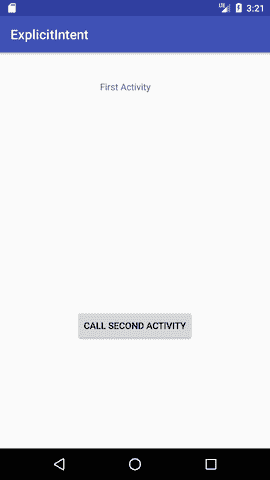
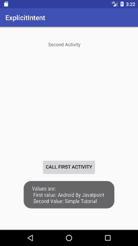

# 安卓明确意图示例

> 原文：<https://www.javatpoint.com/android-explicit-intent-example>

**Android 明确意图**指定要从活动中调用的组件。换句话说，我们可以通过明确的意图来调用 android 中的另一个活动。

我们还可以使用显式意图将信息从一个活动传递到另一个活动。

在这里，我们将看到一个从一个活动调用另一个活动的例子，反之亦然。

### 安卓从另一个活动示例调用一个活动

让我们看看 android 显式示例的简单示例，它从一个活动调用另一个活动，反之亦然。

#### activity_main.xml

File: activity_main.xml

#### 练习一节课

File: MainActivityOne.java

```
package example.javatpoint.com.explicitintent;

import android.content.Intent;
import android.support.v7.app.AppCompatActivity;
import android.os.Bundle;
import android.view.View;

public class FirstActivity extends AppCompatActivity {

    @Override
    protected void onCreate(Bundle savedInstanceState) {
        super.onCreate(savedInstanceState);
        setContentView(R.layout.activity_first);
    }
    public void callSecondActivity(View view){
        Intent i = new Intent(getApplicationContext(), SecondActivity.class);
        i.putExtra("Value1", "Android By Javatpoint");
        i.putExtra("Value2", "Simple Tutorial");
        // Set the request code to any code you like, you can identify the
        // callback via this code
        startActivity(i);
    }

}

```

#### activitytwo_main.xml

File: activitytwo_main.xml

#### 练习两个班级

File: MainActivityTwo.java

```
package example.javatpoint.com.explicitintent;

import android.content.Intent;
import android.support.v7.app.AppCompatActivity;
import android.os.Bundle;
import android.view.View;
import android.widget.Toast;

public class SecondActivity extends AppCompatActivity {

    @Override
    protected void onCreate(Bundle savedInstanceState) {
        super.onCreate(savedInstanceState);
        setContentView(R.layout.activity_second);
        Bundle extras = getIntent().getExtras();
        String value1 = extras.getString("Value1");
        String value2 = extras.getString("Value2");
        Toast.makeText(getApplicationContext(),"Values are:\n First value: "+value1+
                "\n Second Value: "+value2, Toast.LENGTH_LONG).show();
    }
    public void callFirstActivity(View view){
        Intent i = new Intent(getApplicationContext(), FirstActivity.class);
        startActivity(i);
    }

}

```

* * *

#### 输出:

  