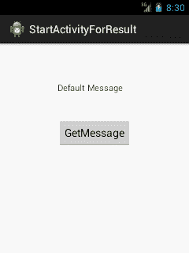
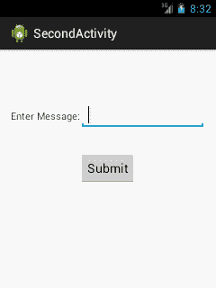
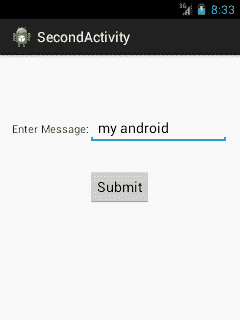
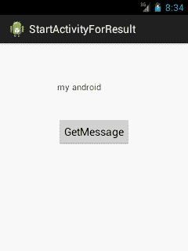

# 安卓开始活动结果示例

> 原文：<https://www.javatpoint.com/android-startactivityforresult-example>

借助 android startActivityForResult()方法，我们可以从另一个活动中获得结果。

借助 android startActivityForResult()方法，我们可以将信息从一个活动发送到另一个活动，反之亦然。Android**startActivityForResult**方法需要第二个活动(要调用的活动)的结果。

在这种情况下，我们需要覆盖第二个活动返回结果时自动调用的 **onActivityResult** 方法。

## 方法签名

startActivityForResult()方法有两种变体。

```
public void startActivityForResult (Intent intent, int requestCode)
public void startActivityForResult (Intent intent, int requestCode, Bundle options)

```

## 安卓开始活动结果示例

让我们看看 android startActivityForResult 方法的简单例子。

#### activity_main.xml

从面板中拖动一个 textview 和一个按钮，现在 xml 文件将如下所示。

File: activity_main.xml

```
<RelativeLayout xmlns:androclass="http://schemas.android.com/apk/res/android"
    xmlns:tools="http://schemas.android.com/tools"
    android:layout_width="match_parent"
    android:layout_height="match_parent"
    android:paddingBottom="@dimen/activity_vertical_margin"
    android:paddingLeft="@dimen/activity_horizontal_margin"
    android:paddingRight="@dimen/activity_horizontal_margin"
    android:paddingTop="@dimen/activity_vertical_margin"
    tools:context=".MainActivity" >
    <TextView
        android:id="@+id/textView1"
        android:layout_width="wrap_content"
        android:layout_height="wrap_content"
        android:layout_alignLeft="@+id/button1"
        android:layout_alignParentTop="true"
        android:layout_marginTop="48dp"
        android:text="Default Message" />
    <Button
        android:id="@+id/button1"
        android:layout_width="wrap_content"
        android:layout_height="wrap_content"
        android:layout_below="@+id/textView1"
        android:layout_centerHorizontal="true"
        android:layout_marginTop="42dp"
        android:text="GetMessage" />
</RelativeLayout>

```

#### second_main.xml

这个 xml 文件是在您创建另一个活动时自动创建的。**要创建新活动，右键单击 src 内的包- >新建- >其他- >安卓活动。**

现在从面板中拖动一个编辑文本、一个文本视图和一个按钮，现在 xml 文件将如下所示:

File: second_main.xml

```
<RelativeLayout xmlns:androclass="http://schemas.android.com/apk/res/android"
    xmlns:tools="http://schemas.android.com/tools"
    android:layout_width="match_parent"
    android:layout_height="match_parent"
    android:paddingBottom="@dimen/activity_vertical_margin"
    android:paddingLeft="@dimen/activity_horizontal_margin"
    android:paddingRight="@dimen/activity_horizontal_margin"
    android:paddingTop="@dimen/activity_vertical_margin"
    tools:context=".SecondActivity" >
    <EditText
        android:id="@+id/editText1"
        android:layout_width="wrap_content"
        android:layout_height="wrap_content"
        android:layout_alignParentTop="true"
        android:layout_marginTop="61dp"
        android:layout_toRightOf="@+id/textView1"
        android:ems="10" />
    <TextView
        android:id="@+id/textView1"
        android:layout_width="wrap_content"
        android:layout_height="wrap_content"
        android:layout_alignBaseline="@+id/editText1"
        android:layout_alignBottom="@+id/editText1"
        android:layout_alignParentLeft="true"
        android:text="Enter Message:" />
    <Button
        android:id="@+id/button1"
        android:layout_width="wrap_content"
        android:layout_height="wrap_content"
        android:layout_below="@+id/editText1"
        android:layout_centerHorizontal="true"
        android:layout_marginTop="34dp"
        android:text="Submit" />
</RelativeLayout>

```

* * *

#### 活动类别

现在，让我们编写调用另一个活动的代码，并从该活动中获得结果。

File: MainActivity.java

```
package com.javatpoint.startactivityforresult;
import android.os.Bundle;
import android.app.Activity;
import android.content.Intent;
import android.view.Menu;
import android.view.View;
import android.view.View.OnClickListener;
import android.widget.Button;
import android.widget.TextView;
public class MainActivity extends Activity {
	TextView textView1;
	Button button1;
    @Override
    protected void onCreate(Bundle savedInstanceState) {
        super.onCreate(savedInstanceState);
        setContentView(R.layout.activity_main);
        textView1=(TextView)findViewById(R.id.textView1);
        button1=(Button)findViewById(R.id.button1);
        button1.setOnClickListener(new OnClickListener() {
			@Override
			public void onClick(View arg0) {
				Intent intent=new Intent(MainActivity.this,SecondActivity.class);
	            startActivityForResult(intent, 2);// Activity is started with requestCode 2
			}
		});
    }
 // Call Back method  to get the Message form other Activity
    @Override
       protected void onActivityResult(int requestCode, int resultCode, Intent data)
       {
                 super.onActivityResult(requestCode, resultCode, data);
                  // check if the request code is same as what is passed  here it is 2
                   if(requestCode==2)
                         {
                            String message=data.getStringExtra("MESSAGE"); 
                            textView1.setText(message);
                         }
     }
    @Override
    public boolean onCreateOptionsMenu(Menu menu) {
        // Inflate the menu; this adds items to the action bar if it is present.
        getMenuInflater().inflate(R.menu.main, menu);
        return true;
    }
}

```

#### 次导性类

让我们编写显示第二个活动布局文件内容的代码。

File: SecondActivity.java

```
package com.javatpoint.startactivityforresult;
import android.os.Bundle;
import android.app.Activity;
import android.content.Intent;
import android.view.Menu;
import android.view.View;
import android.view.View.OnClickListener;
import android.widget.Button;
import android.widget.EditText;
import android.widget.TextView;
public class SecondActivity extends Activity {
	EditText editText1;
	Button button1;
	@Override
	protected void onCreate(Bundle savedInstanceState) {
		super.onCreate(savedInstanceState);
		setContentView(R.layout.activity_second);
		editText1=(EditText)findViewById(R.id.editText1);
	        button1=(Button)findViewById(R.id.button1);
	        button1.setOnClickListener(new OnClickListener() {
				@Override
				public void onClick(View arg0) {
					String message=editText1.getText().toString();
			        Intent intent=new Intent();
			        intent.putExtra("MESSAGE",message);
			        setResult(2,intent);
			        finish();//finishing activity
				}
			});
	}
	@Override
	public boolean onCreateOptionsMenu(Menu menu) {
		// Inflate the menu; this adds items to the action bar if it is present.
		getMenuInflater().inflate(R.menu.second, menu);
		return true;
	}
}

```

* * *

[download this android example](https://static.javatpoint.com/src/android/StartActivityForResult.zip)

* * *

#### 输出:

 

 