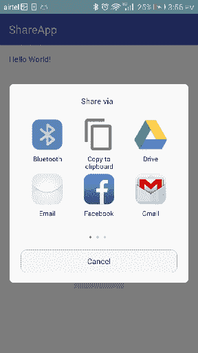

# 安卓共享应用数据(动作 _ 发送)

> 原文：<https://www.javatpoint.com/android-share-app-data>

Android 使用 **android.content.Intent** 类的 **ACTION_SEND** 事件将数据从一个活动发送到另一个活动，以及从当前活动发送到应用程序外部。意图类需要指定要共享的数据及其类型。

最常见的是，动作发送动作发送内置浏览器应用程序的网址。共享数据时，意图调用 *createChooser()* 方法，该方法获取意图对象并指定选择器对话框的标题。**意图.创建选择器()**方法允许显示选择器。

### 动作发送示例

在这个例子中，我们将共享纯文本，这是一个浏览器的网址。

**activity_main.xml**

**文件:activity_main.xml**

```
<?xml version="1.0" encoding="utf-8"?>
<RelativeLayout xmlns:android="http://schemas.android.com/apk/res/android"
    xmlns:tools="http://schemas.android.com/tools"
    android:layout_width="match_parent"
    android:layout_height="match_parent"
    android:paddingBottom="@dimen/activity_vertical_margin"
    android:paddingLeft="@dimen/activity_horizontal_margin"
    android:paddingRight="@dimen/activity_horizontal_margin"
    android:paddingTop="@dimen/activity_vertical_margin"
    tools:context="com.example.test.shareapp.MainActivity">

    <TextView
        android:layout_width="wrap_content"
        android:layout_height="wrap_content"
        android:text="Hello World!"
        android:id="@+id/textView" />

    <Button
        android:layout_width="wrap_content"
        android:layout_height="wrap_content"
        android:text="Share App"
        android:id="@+id/button"
        android:layout_marginBottom="95dp"
        android:layout_alignParentBottom="true"
        android:layout_centerHorizontal="true" />

</RelativeLayout>

```

### 活动类别

**档案:MainActivity.java**

```
package com.example.test.shareapp;

import android.content.Intent;
import android.support.v7.app.AppCompatActivity;
import android.os.Bundle;
import android.view.View;
import android.widget.Button;

public class MainActivity extends AppCompatActivity {
Button sharebutton;
    @Override
    protected void onCreate(Bundle savedInstanceState) {
        super.onCreate(savedInstanceState);
        setContentView(R.layout.activity_main);

        sharebutton=(Button)findViewById(R.id.button);
        sharebutton.setOnClickListener(new View.OnClickListener() {
            @Override
            public void onClick(View v) {
                Intent shareIntent =   new Intent(android.content.Intent.ACTION_SEND);
                shareIntent.setType("text/plain");
                shareIntent.putExtra(Intent.EXTRA_SUBJECT,"Insert Subject here");
                String app_url = " https://play.google.com/store/apps/details?id=my.example.javatpoint";
                shareIntent.putExtra(android.content.Intent.EXTRA_TEXT,app_url);
                startActivity(Intent.createChooser(shareIntent, "Share via"));
            }
        });
    }
}

```

输出


