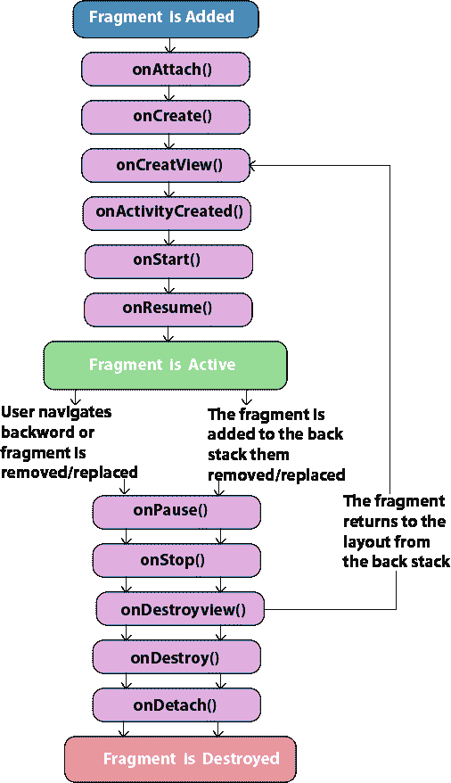
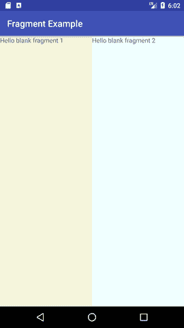

# 安卓片段

> 原文：<https://www.javatpoint.com/android-fragments>

**安卓碎片**是活动的一部分，也叫子活动。一个活动中可以有多个片段。片段代表一个活动中的多个屏幕。

Android 片段生命周期受活动生命周期影响，因为片段包含在活动中。

每个片段都有自己的生命周期方法，这些方法受活动生命周期的影响，因为片段嵌入在活动中。

**片段管理器**类负责片段对象之间的交互。

## 安卓碎片生命周期

安卓碎片的生命周期就像活动生命周期。碎片有 12 种生命周期方法。



## 安卓碎片生命周期方法

| 号码 | 方法 | 描述 |
| 1) | 活动 | 当它与活动关联时，它只被调用一次。 |
| 2) | onCreate(捆绑) | 它用于初始化片段。 |
| 3) | oncreateview(layout inflate、ViewGroup、Bundle) | 创建并返回视图层次结构。 |
| 4) | 活动创建(捆绑) | 它在 onCreate()方法完成后被调用。 |
| 5) | onViewStateRestored(捆绑包) | 它向片段提供了片段视图层次结构的所有保存状态都已恢复的信息。 |
| 6) | onStart（） | 使片段可见。 |
| 7) | onResume（） | 使片段具有交互性。 |
| 8) | onpause() | 当片段不再交互时调用。 |
| 9) | onStop() | 当片段不再可见时调用。 |
| 10) | onDestroyView() | 允许片段清理资源。 |
| 11) | onDestroy() | 允许片段对片段状态进行最终清理。 |
| 12) | 底部() | 就在片段不再与其活动相关联之前调用它。 |

## 安卓片段示例

让我们来看看安卓片段的简单例子。

#### activity_main.xml

File: activity_main.xml

```
 <fragment android:id="@+id/fragment1" android:name="example.javatpoint.com.fragmentexample.Fragment1" android:layout_width="0px" android:layout_height="match_parent" android:layout_weight="1"><fragment android:id="@+id/fragment2" android:name="example.javatpoint.com.fragmentexample.Fragment2" android:layout_width="0px" android:layout_height="match_parent" android:layout_weight="1"></fragment></fragment> 

```

File: fragment_fragment1.xmlFile: fragment_fragment2.xml

* * *

#### 主要活动类

File: MainActivity.java

```
package example.javatpoint.com.fragmentexample;

import android.support.v7.app.AppCompatActivity;
import android.os.Bundle;

public class MainActivity extends AppCompatActivity {

    @Override
    protected void onCreate(Bundle savedInstanceState) {
        super.onCreate(savedInstanceState);
        setContentView(R.layout.activity_main);
    }
}

```

* * *

File: Fragment1.java

```
package example.javatpoint.com.fragmentexample;
import android.os.Bundle;
import android.support.v4.app.Fragment;
import android.view.LayoutInflater;
import android.view.View;
import android.view.ViewGroup;

public class Fragment1 extends Fragment {

    @Override
    public void onCreate(Bundle savedInstanceState) {
        super.onCreate(savedInstanceState);
    }

    @Override
    public View onCreateView(LayoutInflater inflater, ViewGroup container,
                             Bundle savedInstanceState) {
        // Inflate the layout for this fragment
        return inflater.inflate(R.layout.fragment_fragment1, container, false);
    }
 }

```

* * *

File: Fragment2.java

```
package example.javatpoint.com.fragmentexample;

import android.os.Bundle;
import android.support.v4.app.Fragment;
import android.view.LayoutInflater;
import android.view.View;
import android.view.ViewGroup;

public class Fragment2 extends Fragment {

    @Override
    public void onCreate(Bundle savedInstanceState) {
        super.onCreate(savedInstanceState);
    }

    @Override
    public View onCreateView(LayoutInflater inflater, ViewGroup container,
                             Bundle savedInstanceState) {
        // Inflate the layout for this fragment
        return inflater.inflate(R.layout.fragment_fragment2, container, false);
    }

}

```

* * *

#### 输出:

