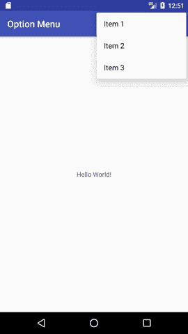
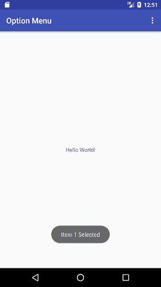
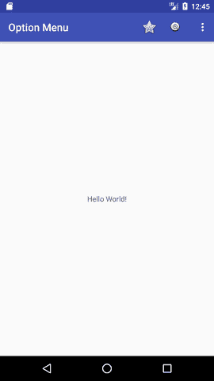
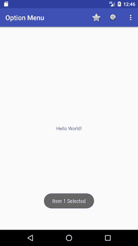

# 安卓选项菜单示例

> 原文：<https://www.javatpoint.com/android-option-menu-example>

**安卓选项菜单**是安卓的主菜单。它们可以用于设置、搜索、删除项目等。

在这里，我们将看到两个选项菜单的例子。首先是简单的选项菜单，其次是带有图像的选项菜单。

在这里，我们通过调用**菜单**类的**充气()**方法来充气菜单。要对菜单项执行事件处理，您需要覆盖活动类的**方法。**

### 安卓选项菜单示例

让我们看看如何在安卓系统中创建菜单。让我们看看包含三个菜单项的简单选项菜单示例。

#### activity_main.xml

这个文件中只有一个 textview。

File: activity_main.xml

```
 <android.support.design.widget.appbarlayout android:layout_width="match_parent" android:layout_height="wrap_content" android:theme="@style/AppTheme.AppBarOverlay"></android.support.design.widget.appbarlayout> 

```

File: context_main.xml

#### menu_main.xml

它包含如下所示的三个项目。它在 res/menu 目录中自动创建。

File: menu_main.xml

* * *

#### 活动类别

这个类显示 menu.xml 文件的内容，并在单击菜单项时执行事件处理。

File: MainActivity.java

```
package example.javatpoint.com.optionmenu;

import android.os.Bundle;
import android.support.v7.app.AppCompatActivity;
import android.support.v7.widget.Toolbar;
import android.view.Menu;
import android.view.MenuItem;
import android.widget.Toast;

public class MainActivity extends AppCompatActivity {

    @Override
    protected void onCreate(Bundle savedInstanceState) {
        super.onCreate(savedInstanceState);
        setContentView(R.layout.activity_main);
        Toolbar toolbar = (Toolbar) findViewById(R.id.toolbar);
        setSupportActionBar(toolbar);
    }

    @Override
    public boolean onCreateOptionsMenu(Menu menu) {
        // Inflate the menu; this adds items to the action bar if it is present.
        getMenuInflater().inflate(R.menu.menu_main, menu);
        return true;
    }

    @Override
    public boolean onOptionsItemSelected(MenuItem item) {
       int id = item.getItemId();
        switch (id){
            case R.id.item1:
                Toast.makeText(getApplicationContext(),"Item 1 Selected",Toast.LENGTH_LONG).show();
                return true;
            case R.id.item2:
                Toast.makeText(getApplicationContext(),"Item 2 Selected",Toast.LENGTH_LONG).show();
                return true;
            case R.id.item3:
                Toast.makeText(getApplicationContext(),"Item 3 Selected",Toast.LENGTH_LONG).show();
                return true;
            default:
                return super.onOptionsItemSelected(item);
        }
    }
}

```

* * *

#### 输出:

不点击菜单按钮输出。


点击菜单按钮后输出。

* * *



点击第二个菜单项后输出。

* * *



### 带图标的选项菜单

您需要在 res/drawable 目录中有图标图像。android:icon 元素用于显示选项菜单上的图标。您可以在 strings.xml 文件中写入字符串信息。但是我们已经把它写在了 menu_main.xml 文件中。

File: menu_main.xml 