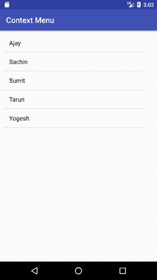
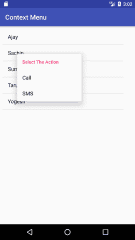
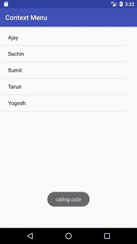

# 安卓上下文菜单示例

> 原文：<https://www.javatpoint.com/android-context-menu-example>

当用户长按元素时，安卓上下文菜单出现。它也被称为浮动菜单。

在对所选内容执行操作时，它会影响所选内容。

它不支持项目快捷方式和图标。

## 安卓上下文菜单示例

让我们看看 android 中上下文菜单的简单例子。

#### activity_main.xml

从列表中拖动一个 listview，现在 xml 文件将如下所示:

File: activity_main.xml

* * *

#### main_menu.xml

在菜单目录中为菜单项创建单独的 menu_main.xml 文件。

#### 活动类别

让我们编写代码来显示 listview 的上下文菜单。

File: MainActivity.java

```
package example.javatpoint.com.contextmenu;

import android.support.v7.app.AppCompatActivity;
import android.os.Bundle;
import android.view.ContextMenu;
import android.view.MenuInflater;
import android.view.MenuItem;
import android.view.View;
import android.widget.ArrayAdapter;
import android.widget.ListView;
import android.widget.Toast;

public class MainActivity extends AppCompatActivity {
    ListView listView;
    String contacts[]={"Ajay","Sachin","Sumit","Tarun","Yogesh"};
    @Override
    protected void onCreate(Bundle savedInstanceState) {
        super.onCreate(savedInstanceState);
        setContentView(R.layout.activity_main);
        listView=(ListView)findViewById(R.id.listView);
        ArrayAdapter adapter=new ArrayAdapter<string>(this,android.R.layout.simple_list_item_1,contacts);
        listView.setAdapter(adapter);
        // Register the ListView  for Context menu
        registerForContextMenu(listView);
    }
    @Override
    public void onCreateContextMenu(ContextMenu menu, View v, ContextMenu.ContextMenuInfo menuInfo)
    {
        super.onCreateContextMenu(menu, v, menuInfo);
        MenuInflater inflater = getMenuInflater();
        inflater.inflate(R.menu.menu_main, menu);
        menu.setHeaderTitle("Select The Action");
    }
    @Override
    public boolean onContextItemSelected(MenuItem item){
        if(item.getItemId()==R.id.call){
            Toast.makeText(getApplicationContext(),"calling code",Toast.LENGTH_LONG).show();
        }
        else if(item.getItemId()==R.id.sms){
            Toast.makeText(getApplicationContext(),"sending sms code",Toast.LENGTH_LONG).show();
        }else{
            return false;
        }
        return true;
    }
}</string> 
```

* * *

* * *

#### 输出:



* * *

长按 listview 后输出。



* * *

点击上下文菜单后输出。

