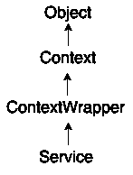
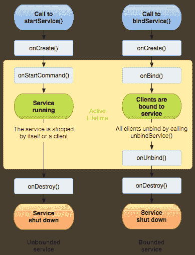
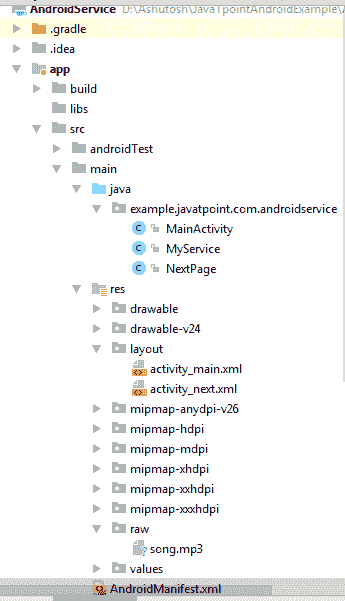
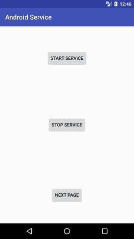
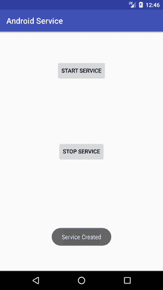
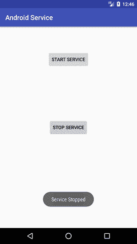
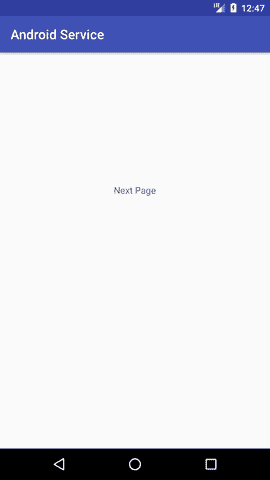

# 安卓服务教程

> 原文：<https://www.javatpoint.com/android-service-tutorial>



**安卓服务**是*用来在后台*进行播放音乐、处理网络交易、与内容提供商互动等操作的组件。它没有任何 UI(用户界面)。

即使应用程序被销毁，服务也可以在后台无限期运行。

此外，服务可以被一个组件绑定，以执行交互性和进程间通信(IPC)。

android.app.Service 是 ContextWrapper 类的子类。

#### 注意:Android 服务不是一个线程或单独的进程。

## 安卓服务的生命周期

服务可以有两种形式。服务的生命周期可以遵循两种不同的路径:启动或绑定。

1.  出发
2.  束缚

#### 1)启动服务

当组件(如活动)调用 **startService()** 方法时，服务就启动了，现在它无限期地在后台运行。通过**停止服务()**方法停止。服务可以通过调用 **stopSelf()** 方法来停止自身。

#### 2)绑定服务

当另一个组件(例如客户端)调用 **bindService()** 方法时，服务被绑定。客户端可以通过调用**解除绑定服务()**方法解除绑定服务。

在所有客户端解除服务绑定之前，无法停止服务。



#### 通过背景音乐示例了解启动和绑定服务

假设，我想在后台播放音乐，那么调用 startService()方法。但是我想得到正在播放的当前歌曲的信息，我会绑定提供当前歌曲信息的服务。

* * *

## 安卓服务示例

让我们看看 android 中在后台播放音频的服务的例子。即使您切换到另一个活动，音频也不会停止。要停止音频，您需要停止服务。



#### activity_main.xml

从面板中拖动 3 个按钮，现在 activity_main.xml 将如下所示:

File: activity_main.xml

* * *

#### activity_next.xml

它是下一个活动的布局文件。

File: activity_next.xml

它只包含一个显示消息“下一页”的文本视图

* * *

#### 服务级别

现在通过继承服务类并重写其回调方法来创建服务实现类。

File: MyService.java

```
package example.javatpoint.com.androidservice;

import android.app.Service;
import android.content.Intent;
import android.media.MediaPlayer;
import android.os.IBinder;
import android.support.annotation.Nullable;
import android.widget.Toast;

public class MyService extends Service {
    MediaPlayer myPlayer;
    @Nullable
    @Override
    public IBinder onBind(Intent intent) {
        return null;
    }
    @Override
    public void onCreate() {
        Toast.makeText(this, "Service Created", Toast.LENGTH_LONG).show();

        myPlayer = MediaPlayer.create(this, R.raw.sun);
        myPlayer.setLooping(false); // Set looping
    }
    @Override
    public void onStart(Intent intent, int startid) {
        Toast.makeText(this, "Service Started", Toast.LENGTH_LONG).show();
        myPlayer.start();
    }
    @Override
    public void onDestroy() {
        Toast.makeText(this, "Service Stopped", Toast.LENGTH_LONG).show();
        myPlayer.stop();
    }
}

```

* * *

#### 活动类别

现在创建 MainActivity 类来执行事件处理。这里，我们正在编写启动和停止服务的代码。此外，在按钮下一步调用第二个活动。

File: MainActivity.java

```
package example.javatpoint.com.androidservice;

import android.content.Intent;
import android.support.v7.app.AppCompatActivity;
import android.os.Bundle;
import android.view.View;
import android.widget.Button;

public class MainActivity extends AppCompatActivity implements View.OnClickListener{
    Button buttonStart, buttonStop,buttonNext;
    @Override
    protected void onCreate(Bundle savedInstanceState) {
        super.onCreate(savedInstanceState);
        setContentView(R.layout.activity_main);

        buttonStart = findViewById(R.id.buttonStart);
        buttonStop = findViewById(R.id.buttonStop);
        buttonNext =  findViewById(R.id.buttonNext);

        buttonStart.setOnClickListener(this);
        buttonStop.setOnClickListener(this);
        buttonNext.setOnClickListener(this);

    }
    public void onClick(View src) {
        switch (src.getId()) {
            case R.id.buttonStart:

                startService(new Intent(this, MyService.class));
                break;
            case R.id.buttonStop:
                stopService(new Intent(this, MyService.class));
                break;
            case R.id.buttonNext:
                Intent intent=new Intent(this,NextPage.class);
                startActivity(intent);
                break;
        }
    }
}

```

* * *

#### 下一页类

现在，创建另一个活动。

File: NextPage.java

```
package example.javatpoint.com.androidservice;

import android.support.v7.app.AppCompatActivity;
import android.os.Bundle;

public class NextPage extends AppCompatActivity {

    @Override
    protected void onCreate(Bundle savedInstanceState) {
        super.onCreate(savedInstanceState);
        setContentView(R.layout.activity_next);
    }
}

```

* * *

#### 在 AndroidManifest.xml 文件中声明服务

最后，在清单文件中声明服务。

File: AndroidManifest.xml

让我们看看完整的 AndroidManifest.xml 文件

```
 <application android:allowbackup="true" android:icon="@mipmap/ic_launcher" android:label="@string/app_name" android:roundicon="@mipmap/ic_launcher_round" android:supportsrtl="true" android:theme="@style/AppTheme"><activity android:name=".MainActivity"><intent-filter><category android:name="android.intent.category.LAUNCHER"></category></intent-filter></activity></application> 

```

#### 输出:

 
 