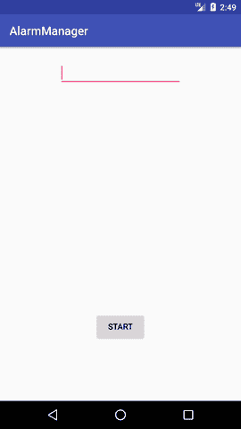
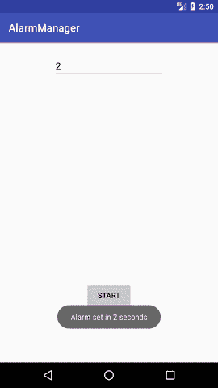
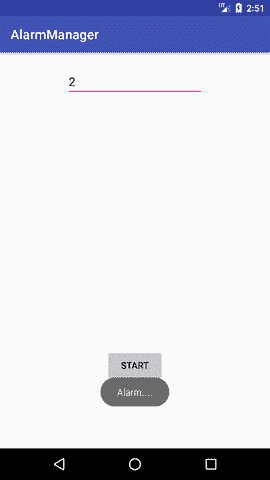

# Android 警报管理器

> 吴奇珍:t0]https://www . javatppoint . com/Android-alarm manager

安卓报警管理器允许您访问系统报警。

借助安卓系统中的**安卓报警管理器**，你可以*安排你的应用程序在未来某个特定的时间*运行。不管你的手机是否在运行，它都能正常工作。

安卓报警管理器有一个中央处理器唤醒锁*保证在处理广播之前不会让手机*休眠。

## 安卓警报管理器示例

让我们看一个简单的 AlarmManager 示例，它在用户提供的特定时间后运行。

#### activity_main.xml

您只需要拖动一个 edittext 和一个按钮，如下所示。

File: activity_main.xml

* * *

#### 活动类别

当用户点击按钮时，活动类启动报警服务。

File: MainActivity.java

```
package example.javatpoint.com.alarmmanager;

import android.app.AlarmManager;
import android.app.PendingIntent;
import android.content.Intent;
import android.support.v7.app.AppCompatActivity;
import android.os.Bundle;
import android.view.View;
import android.widget.Button;
import android.widget.EditText;
import android.widget.Toast;

public class MainActivity extends AppCompatActivity {
    Button start;
    @Override
    protected void onCreate(Bundle savedInstanceState) {
        super.onCreate(savedInstanceState);
        setContentView(R.layout.activity_main);
        start= findViewById(R.id.button);

        start.setOnClickListener(new View.OnClickListener() {
            @Override
            public void onClick(View view) {
                startAlert();
            }
        });
    }

    public void startAlert(){
        EditText text = findViewById(R.id.time);
        int i = Integer.parseInt(text.getText().toString());
        Intent intent = new Intent(this, MyBroadcastReceiver.class);
        PendingIntent pendingIntent = PendingIntent.getBroadcast(
                this.getApplicationContext(), 234324243, intent, 0);
        AlarmManager alarmManager = (AlarmManager) getSystemService(ALARM_SERVICE);
        alarmManager.set(AlarmManager.RTC_WAKEUP, System.currentTimeMillis()
                + (i * 1000), pendingIntent);
        Toast.makeText(this, "Alarm set in " + i + " seconds",Toast.LENGTH_LONG).show();
    }
}

```

让我们创建一个 BroadcastReceiver 类来启动警报。

File: MyBroadcastReceiver.java

```
package example.javatpoint.com.alarmmanager;

import android.content.BroadcastReceiver;
import android.content.Context;
import android.content.Intent;
import android.media.MediaPlayer;
import android.widget.Toast;

public class MyBroadcastReceiver extends BroadcastReceiver {
    MediaPlayer mp;
    @Override
    public void onReceive(Context context, Intent intent) {
        mp=MediaPlayer.create(context, R.raw.alarm);
        mp.start();
        Toast.makeText(context, "Alarm....", Toast.LENGTH_LONG).show();
    }
}

```

* * *

File: AndroidManifest.xml

您需要在 AndroidManifest.xml 文件中提供一个接收者条目。

```
        <receiver android:name="MyBroadcastReceiver" >
        </receiver>

```

让我们看看 AndroidManifest.xml 文件的完整代码。

```
 <application android:allowbackup="true" android:icon="@mipmap/ic_launcher" android:label="@string/app_name" android:roundicon="@mipmap/ic_launcher_round" android:supportsrtl="true" android:theme="@style/AppTheme"><activity android:name=".MainActivity"><intent-filter><category android:name="android.intent.category.LAUNCHER"></category></intent-filter></activity></application> 

```

#### 输出:

  