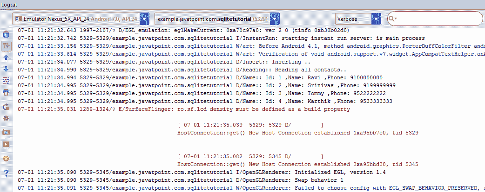
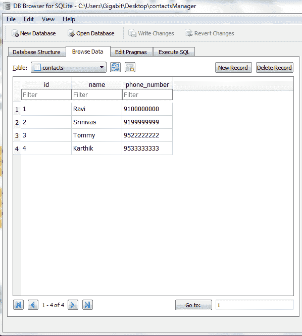

# Android SQLite 教程

> 原文：<https://www.javatpoint.com/android-sqlite-tutorial>

**SQLite** 是一个**开源关系数据库**，即用于在安卓设备上执行数据库操作，如存储、操作或从数据库中检索持久数据。

默认情况下，它嵌入在安卓系统中。因此，不需要执行任何数据库设置或管理任务。

在这里，我们将看到 sqlite 存储和获取数据的例子。数据显示在日志中。要在微调器或 listview 上显示数据，请移至下一页。

**SQLiteOpenHelper** 类提供了使用 SQLite 数据库的功能。

* * *

## SQLiteOpenHelper class

Android . database . SQLite . sqliteopenhelper 类用于数据库创建和版本管理。要执行任何数据库操作，必须提供 SQLiteOpenHelper 类的 **onCreate()** 和 **onUpgrade()** 方法的实现。

#### SQLiteOpenHelper 类的构造函数

SQLiteOpenHelper 类有两个构造函数。

| 构造器 | 描述 |
| **SQLiteOpenHelper(上下文上下文，字符串名称，SQLiteDatabase。CursorFactory 工厂，int 版本)** | 创建用于创建、打开和管理数据库的对象。 |
| **SQLiteOpenHelper(上下文上下文，字符串名称，SQLiteDatabase。CursorFactory 工厂，int 版本，databaserrorhandler error handler)** | 创建用于创建、打开和管理数据库的对象。它指定了错误处理程序。 |

#### SQLiteOpenHelper 类的方法

SQLiteOpenHelper 类中有很多方法。其中一些如下:

| 方法 | 描述 |
| **公共抽象 void Oncreate(SQliteDatabaSe db)** | 第一次创建数据库时只调用一次。 |
| **public abstract void onUpgrade(sqliteddatabase db，int oldVersion，int newVersion)** | 当数据库需要升级时调用。 |
| **公共同步作废关闭()** | 关闭数据库对象。 |
| **公共 void on down grade(SQliteDatabaSe db，int oldVersion，int newVersion)** | 当数据库需要降级时调用。 |

* * *

## SQLiteDatabase 类

它包含对 sqlite 数据库执行的方法，如创建、更新、删除、选择等。

#### SQLiteDatabase 类的方法

SQLiteDatabase 类中有很多方法。其中一些如下:

| 方法 | 描述 |
| **void execSQL(String sql)** | 执行 sql 查询而不是 select 查询。 |
| **长插入(字符串表，字符串 nullColumnHack，ContentValues 值)** | 在数据库中插入一条记录。该表指定了表名，nullColumnHack 不允许完全为空值。如果第二个参数为 null，那么如果值为空，android 将存储 null 值。第三个参数指定要存储的值。 |
| **int update(字符串表，内容值值，字符串 where 子句，字符串[] whereArgs)** | 更新一行。 |
| **光标查询(字符串表，字符串[]列，字符串选择，字符串[]选择选项，字符串分组依据，字符串具有，字符串排序依据)** | 返回结果集上的光标。 |

* * *

### 安卓 SQLite 数据库示例

让我们看看 android sqlite 数据库的简单例子。

File: Contact.java

```
package example.javatpoint.com.sqlitetutorial;

public class Contact {
    int _id;
    String _name;
    String _phone_number;
    public Contact(){   }
    public Contact(int id, String name, String _phone_number){
        this._id = id;
        this._name = name;
        this._phone_number = _phone_number;
    }

    public Contact(String name, String _phone_number){
        this._name = name;
        this._phone_number = _phone_number;
    }
    public int getID(){
        return this._id;
    }

    public void setID(int id){
        this._id = id;
    }

    public String getName(){
        return this._name;
    }

    public void setName(String name){
        this._name = name;
    }

    public String getPhoneNumber(){
        return this._phone_number;
    }

    public void setPhoneNumber(String phone_number){
        this._phone_number = phone_number;
    }
}

```

File: DatabaseHandler.java

现在，让我们创建数据库处理程序类，它扩展了 SQLiteOpenHelper 类并提供了其方法的实现。

```
package example.javatpoint.com.sqlitetutorial;

import android.content.ContentValues;
import android.content.Context;
import android.database.Cursor;
import android.database.sqlite.SQLiteDatabase;
import android.database.sqlite.SQLiteOpenHelper;
import java.util.ArrayList;
import java.util.List;

public class DatabaseHandler extends SQLiteOpenHelper {
    private static final int DATABASE_VERSION = 1;
    private static final String DATABASE_NAME = "contactsManager";
    private static final String TABLE_CONTACTS = "contacts";
    private static final String KEY_ID = "id";
    private static final String KEY_NAME = "name";
    private static final String KEY_PH_NO = "phone_number";

    public DatabaseHandler(Context context) {
        super(context, DATABASE_NAME, null, DATABASE_VERSION);
        //3rd argument to be passed is CursorFactory instance
    }

    // Creating Tables
    @Override
    public void onCreate(SQLiteDatabase db) {
        String CREATE_CONTACTS_TABLE = "CREATE TABLE " + TABLE_CONTACTS + "("
                + KEY_ID + " INTEGER PRIMARY KEY," + KEY_NAME + " TEXT,"
                + KEY_PH_NO + " TEXT" + ")";
        db.execSQL(CREATE_CONTACTS_TABLE);
    }

    // Upgrading database
    @Override
    public void onUpgrade(SQLiteDatabase db, int oldVersion, int newVersion) {
        // Drop older table if existed
        db.execSQL("DROP TABLE IF EXISTS " + TABLE_CONTACTS);

        // Create tables again
        onCreate(db);
    }

    // code to add the new contact
    void addContact(Contact contact) {
        SQLiteDatabase db = this.getWritableDatabase();

        ContentValues values = new ContentValues();
        values.put(KEY_NAME, contact.getName()); // Contact Name
        values.put(KEY_PH_NO, contact.getPhoneNumber()); // Contact Phone

        // Inserting Row
        db.insert(TABLE_CONTACTS, null, values);
        //2nd argument is String containing nullColumnHack
        db.close(); // Closing database connection
    }

    // code to get the single contact
    Contact getContact(int id) {
        SQLiteDatabase db = this.getReadableDatabase();

        Cursor cursor = db.query(TABLE_CONTACTS, new String[] { KEY_ID,
                        KEY_NAME, KEY_PH_NO }, KEY_ID + "=?",
                new String[] { String.valueOf(id) }, null, null, null, null);
        if (cursor != null)
            cursor.moveToFirst();

        Contact contact = new Contact(Integer.parseInt(cursor.getString(0)),
                cursor.getString(1), cursor.getString(2));
        // return contact
        return contact;
    }

    // code to get all contacts in a list view
    public List getAllContacts() {
        List <contact>contactList = new ArrayList<contact>();
        // Select All Query
        String selectQuery = "SELECT  * FROM " + TABLE_CONTACTS;

        SQLiteDatabase db = this.getWritableDatabase();
        Cursor cursor = db.rawQuery(selectQuery, null);

        // looping through all rows and adding to list
        if (cursor.moveToFirst()) {
            do {
                Contact contact = new Contact();
                contact.setID(Integer.parseInt(cursor.getString(0)));
                contact.setName(cursor.getString(1));
                contact.setPhoneNumber(cursor.getString(2));
                // Adding contact to list
                contactList.add(contact);
            } while (cursor.moveToNext());
        }

        // return contact list
        return contactList;
    }

    // code to update the single contact
    public int updateContact(Contact contact) {
        SQLiteDatabase db = this.getWritableDatabase();

        ContentValues values = new ContentValues();
        values.put(KEY_NAME, contact.getName());
        values.put(KEY_PH_NO, contact.getPhoneNumber());

        // updating row
        return db.update(TABLE_CONTACTS, values, KEY_ID + " = ?",
                new String[] { String.valueOf(contact.getID()) });
    }

    // Deleting single contact
    public void deleteContact(Contact contact) {
        SQLiteDatabase db = this.getWritableDatabase();
        db.delete(TABLE_CONTACTS, KEY_ID + " = ?",
                new String[] { String.valueOf(contact.getID()) });
        db.close();
    }

    // Getting contacts Count
    public int getContactsCount() {
        String countQuery = "SELECT  * FROM " + TABLE_CONTACTS;
        SQLiteDatabase db = this.getReadableDatabase();
        Cursor cursor = db.rawQuery(countQuery, null);
        cursor.close();

        // return count
        return cursor.getCount();
    }

}</contact></contact> 
```

File: MainActivity.java

```
package example.javatpoint.com.sqlitetutorial;

import android.support.v7.app.AppCompatActivity;
import android.os.Bundle;
import android.util.Log;
import java.util.List;

public class MainActivity extends AppCompatActivity {

    @Override
    protected void onCreate(Bundle savedInstanceState) {
        super.onCreate(savedInstanceState);
        setContentView(R.layout.activity_main);
        DatabaseHandler db = new DatabaseHandler(this);

        // Inserting Contacts
        Log.d("Insert: ", "Inserting ..");
        db.addContact(new Contact("Ravi", "9100000000"));
        db.addContact(new Contact("Srinivas", "9199999999"));
        db.addContact(new Contact("Tommy", "9522222222"));
        db.addContact(new Contact("Karthik", "9533333333"));

        // Reading all contacts
        Log.d("Reading: ", "Reading all contacts..");
        List contacts = db.getAllContacts();

        for (Contact cn : contacts) {
            String log = "Id: " + cn.getID() + " ,Name: " + cn.getName() + " ,Phone: " +
                    cn.getPhoneNumber();
            // Writing Contacts to log
            Log.d("Name: ", log);
        }
    }
} 
```

#### 输出:



## 如何在 android studio 中查看 sqlite 中存储的数据？

按照以下步骤查看 android sqlite 中存储的数据库及其数据:

*   打开文件资源管理器。
*   转到数据目录中的数据目录。
*   搜索您的应用程序包名称。
*   在您的应用程序包中，转到您可以找到您的数据库的数据库。
*   将您的数据库(联系人管理器)保存在您喜欢的任何地方。
*   下载任何 SQLite 浏览器插件或工具(在我的例子中是 SqLite 的数据库浏览器)。
*   为 SQLite 启动数据库浏览器并打开您的数据库(联系人管理器)。
*   转到浏览数据->选择您的表格(联系人)，您将看到存储的数据。

