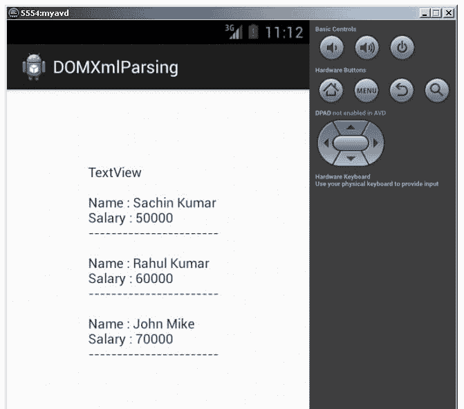

# 基于 DOM 解析器的安卓 XML 解析

> 原文：<https://www.javatpoint.com/android-xml-parsing-using-dom-parser>

我们也可以用 dom 解析器解析 xml 文档。它可以用来创建和解析 xml 文件。

### DOM 解析器相对于 SAX 的优势

它可以用来创建和解析 xml 文件，但是 SAX 解析器只能用来解析 xml 文件。

### DOM 解析器相对于 SAX 的缺点

它比 SAX 消耗更多的内存。

* * *

### 安卓 DOM Xml 解析示例

#### activity_main.xml

从面板中拖动一个 textview。现在 activity_main.xml 文件将如下所示:

File: activity_main.xml

```
<RelativeLayout xmlns:androclass="http://schemas.android.com/apk/res/android"
    xmlns:tools="http://schemas.android.com/tools"
    android:layout_width="match_parent"
    android:layout_height="match_parent"
    tools:context=".MainActivity" >

    <TextView
        android:id="@+id/textView1"
        android:layout_width="wrap_content"
        android:layout_height="wrap_content"
        android:layout_alignParentLeft="true"
        android:layout_alignParentTop="true"
        android:layout_marginLeft="75dp"
        android:layout_marginTop="46dp"
        android:text="TextView" />

</RelativeLayout>

```

* * *

#### 文件

在项目的资产目录中创建一个名为 file.xml 的 xml 文件。

File: file.xml

```

<?xml version="1.0"?>
<records>
<employee>
<name>Sachin Kumar</name>
<salary>50000</salary>
</employee>
<employee>
<name>Rahul Kumar</name>
<salary>60000</salary>
</employee>
<employee>
<name>John Mike</name>
<salary>70000</salary>
</employee>
</records>

```

* * *

#### 活动类别

让我们编写代码来使用 dom 解析器解析 xml。

File: MainActivity.java

```
package com.javatpoint.domxmlparsing;
import java.io.InputStream;

import javax.xml.parsers.DocumentBuilder;
import javax.xml.parsers.DocumentBuilderFactory;
import org.w3c.dom.Document;
import org.w3c.dom.Element;
import org.w3c.dom.Node;
import org.w3c.dom.NodeList;
import android.app.Activity;
import android.os.Bundle;
import android.widget.TextView;

public class MainActivity extends Activity {
TextView tv1;

@Override
public void onCreate(Bundle savedInstanceState) {
super.onCreate(savedInstanceState);
setContentView(R.layout.activity_main);
tv1=(TextView)findViewById(R.id.textView1);
try {
InputStream is = getAssets().open("file.xml");

DocumentBuilderFactory dbFactory = DocumentBuilderFactory.newInstance();
DocumentBuilder dBuilder = dbFactory.newDocumentBuilder();
Document doc = dBuilder.parse(is);

Element element=doc.getDocumentElement();
element.normalize();

NodeList nList = doc.getElementsByTagName("employee");
for (int i=0; i<nList.getLength(); i++) {

Node node = nList.item(i);
if (node.getNodeType() == Node.ELEMENT_NODE) {
Element element2 = (Element) node;
tv1.setText(tv1.getText()+"\nName : " + getValue("name", element2)+"\n");
tv1.setText(tv1.getText()+"Salary : " + getValue("salary", element2)+"\n");
tv1.setText(tv1.getText()+"-----------------------");
}
}//end of for loop

} catch (Exception e) {e.printStackTrace();}

}
private static String getValue(String tag, Element element) {
NodeList nodeList = element.getElementsByTagName(tag).item(0).getChildNodes();
Node node = (Node) nodeList.item(0);
return node.getNodeValue();
}

}

```

* * *

[download this example](https://static.javatpoint.com/src/android/DOMXmlParsing.zip)

* * *

#### 输出:

