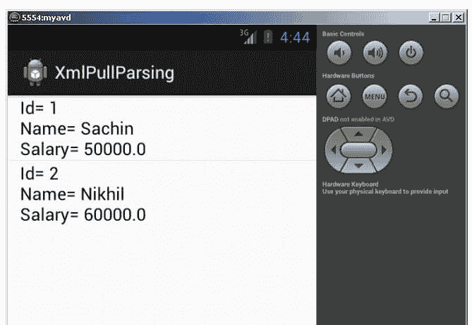

# 安卓 XMLPullParser 教程

> 原文：<https://www.javatpoint.com/android-XMLPullParser-tutorial>

安卓推荐使用 xmlPullParser 来解析 XML 文件，而不是 SAX 和 DOM，因为它速度快。

**org . xmlpull . v1 . XmlPullParser**接口提供了使用 XMLPullParser 解析 XML 文档的功能。

### XmlPullParser 的事件

XMLPullParser 的 **next()方法**将光标指针移动到下一个事件。通常，我们使用在 XMLPullParser 接口中定义的四个常量(作为事件工作)。

**开始标记**:读取了一个 XML 开始标记。

**文本**:文本内容已读；可以使用 getText()方法检索文本内容。

**结束标签**:读取了结束标签。

**END_DOCUMENT** :无更多事件可用

* * *

### 安卓 XMLPullParser 示例

#### activity_main.xml

从面板中拖动一个列表视图。现在 activity_main.xml 文件将如下所示:

File: activity_main.xml

```
<RelativeLayout xmlns:android="http://schemas.android.com/apk/res/android"
    xmlns:tools="http://schemas.android.com/tools"
    android:layout_width="match_parent"
    android:layout_height="match_parent"
    tools:context=".MainActivity" >

    <ListView
        android:id="@+id/listView1"
        android:layout_width="match_parent"
        android:layout_height="wrap_content" >

    </ListView>

</RelativeLayout>

```

* * *

#### 文件

在项目的资产目录中创建一个名为 employees.xml 的 xml 文件。

File: employees.xml

```

<?xml version="1.0" encoding="UTF-8"?>
<employees>
    <employee>
        <id>1</id>
        <name>Sachin</name>
        <salary>50000</salary>      
    </employee>
    <employee>
        <id>2</id>
        <name>Nikhil</name>
        <salary>60000</salary>  
    </employee>

</employees>

```

* * *

#### 员工类别

现在创建对应于 xml 文件的雇员类。

File: Employee.java

```
package com.example.xmlpullparsing;
public class Employee {
	 private int id;
	 private String name;
	 private float salary;
    	public int getId() {
		return id;
	}
	public void setId(int id) {
		this.id = id;
	}
	public String getName() {
		return name;
	}
	public void setName(String name) {
		this.name = name;
	}
	public float getSalary() {
		return salary;
	}
	public void setSalary(float salary) {
		this.salary = salary;
	}

	@Override
    public String toString() {
        return " Id= "+id + "\n Name= " + name + "\n Salary= " + salary;
    }
}

```

* * *

#### XMLPullParserHandler 类

现在编写代码，使用 xmlPullParser 解析 XML 文件。在这里，我们返回列表中的所有员工。

File: XMLPullParserHandler.java

```
package com.example.xmlpullparsing;
import java.io.IOException;
import java.io.InputStream;
import java.util.ArrayList;
import java.util.List;
import org.xmlpull.v1.XmlPullParser;
import org.xmlpull.v1.XmlPullParserException;
import org.xmlpull.v1.XmlPullParserFactory;

public class XmlPullParserHandler {
    private List<Employee> employees= new ArrayList<Employee>();
    private Employee employee;
    private String text;

    public List<Employee> getEmployees() {
        return employees;
    }

    public List<Employee> parse(InputStream is) {
           try {
            XmlPullParserFactory factory = XmlPullParserFactory.newInstance();
            factory.setNamespaceAware(true);
            XmlPullParser  parser = factory.newPullParser();

            parser.setInput(is, null);

            int eventType = parser.getEventType();
            while (eventType != XmlPullParser.END_DOCUMENT) {
                String tagname = parser.getName();
                switch (eventType) {
                case XmlPullParser.START_TAG:
                    if (tagname.equalsIgnoreCase("employee")) {
                        // create a new instance of employee
                        employee = new Employee();
                    }
                    break;

                case XmlPullParser.TEXT:
                    text = parser.getText();
                    break;

                case XmlPullParser.END_TAG:
                    if (tagname.equalsIgnoreCase("employee")) {
                        // add employee object to list
                        employees.add(employee);
                    }else if (tagname.equalsIgnoreCase("id")) {
                        employee.setId(Integer.parseInt(text));
                    }  else if (tagname.equalsIgnoreCase("name")) {
                        employee.setName(text);
                    } else if (tagname.equalsIgnoreCase("salary")) {
                        employee.setSalary(Float.parseFloat(text));
                    } 
                    break;

                default:
                    break;
                }
                eventType = parser.next();
            }

        } catch (XmlPullParserException e) {e.printStackTrace();} 
        catch (IOException e) {e.printStackTrace();}

        return employees;
    }
}

```

* * *

#### 主要活动类

现在，编写代码在列表视图中显示列表数据。

File: MainActivity.java

```
package com.example.xmlpullparsing;

import java.io.IOException;
import java.io.InputStream;
import java.util.List;

import android.os.Bundle;
import android.app.Activity;
import android.view.Menu;
import android.widget.ArrayAdapter;
import android.widget.ListView;

public class MainActivity extends Activity {

    @Override
    protected void onCreate(Bundle savedInstanceState) {
        super.onCreate(savedInstanceState);
        setContentView(R.layout.activity_main);

       ListView listView = (ListView) findViewById(R.id.listView1);

        List<Employee> employees = null;
        try {
            XmlPullParserHandler parser = new XmlPullParserHandler();
            InputStream is=getAssets().open("employees.xml");
            employees = parser.parse(is);

            ArrayAdapter<Employee> adapter =new ArrayAdapter<Employee>
	(this,android.R.layout.simple_list_item_1, employees);
            listView.setAdapter(adapter);

        } catch (IOException e) {e.printStackTrace();}

    }

    @Override
    public boolean onCreateOptionsMenu(Menu menu) {
        // Inflate the menu; this adds items to the action bar if it is present.
        getMenuInflater().inflate(R.menu.activity_main, menu);
        return true;
    }

}

```

* * *

[download this example](https://static.javatpoint.com/src/android/XmlPullParsing.zip)

* * *

#### 输出:

