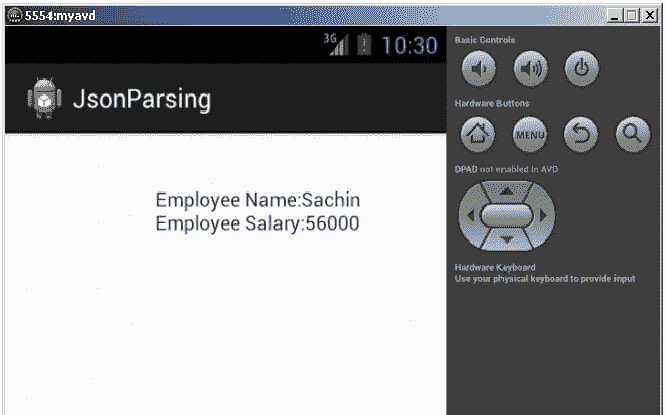
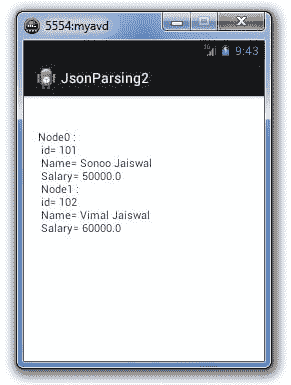

# 安卓 JSON 解析器教程

> 原文：<https://www.javatpoint.com/android-json-parsing-tutorial>

**JSON** (Javascript 对象符号)是一种编程语言。它是最小的，文本的，是 JavaScript 的一个子集。它是 XML 的替代。

Android 提供了解析 JSON 对象和数组的支持。

### JSON 相对于 XML 的优势

1)对于 AJAX 应用程序，JSON 比 xml 更快更容易。

2)与 XML 不同，它更短，读写更快。

3)使用数组。

* * *

### 对象

JSON 对象包含像 map 这样的键/值对。键是字符串，值是 JSON 类型。键和值用逗号分隔。{(大括号)表示 json 对象。

```
{
    "employee": {
        "name":       "sachin", 
        "salary":      56000, 
        "married":    true
    }
}

```

### json 数组

[(方括号)表示 json 数组。

```
["Sunday", "Monday", "Tuesday", "Wednesday", "Thursday", "Friday", "Saturday"]

```

让我们再举一个 json 数组的例子。

```
{ "Employee" :
    [
     {"id":"101","name":"Sonoo Jaiswal","salary":"50000"},
     {"id":"102","name":"Vimal Jaiswal","salary":"60000"}
    ] 
}

```

### 安卓 JSON 解析示例

#### activity_main.xml

从面板中拖动一个 textview。现在 activity_main.xml 文件将如下所示:

File: activity_main.xml

```
<RelativeLayout xmlns:androclass="http://schemas.android.com/apk/res/android"
    xmlns:tools="http://schemas.android.com/tools"
    android:layout_width="match_parent"
    android:layout_height="match_parent"
    tools:context=".MainActivity" >

    <TextView
        android:id="@+id/textView1"
        android:layout_width="wrap_content"
        android:layout_height="wrap_content"
        android:layout_alignParentLeft="true"
        android:layout_alignParentTop="true"
        android:layout_marginLeft="75dp"
        android:layout_marginTop="46dp"
        android:text="TextView" />

</RelativeLayout>

```

* * *

#### 活动类别

让我们编写代码来使用 dom 解析器解析 xml。

File: MainActivity.java

```
package com.javatpoint.jsonparsing;

import org.json.JSONException;
import org.json.JSONObject;
import android.app.Activity;
import android.os.Bundle;
import android.widget.TextView;

public class MainActivity extends Activity {
public static final String JSON_STRING="{\"employee\":{\"name\":\"Sachin\",\"salary\":56000}}";

@Override
public void onCreate(Bundle savedInstanceState) {
super.onCreate(savedInstanceState);
setContentView(R.layout.activity_main);

TextView textView1=(TextView)findViewById(R.id.textView1);

try{
JSONObject emp=(new JSONObject(JSON_STRING)).getJSONObject("employee");
String empname=emp.getString("name");
int empsalary=emp.getInt("salary");

String str="Employee Name:"+empname+"\n"+"Employee Salary:"+empsalary;
textView1.setText(str);

}catch (Exception e) {e.printStackTrace();}

}

}

```

* * *

[download this example](https://static.javatpoint.com/src/android/JsonParsing.zip)

* * *

#### 输出:



### 安卓系统中解析 JSONArray

借助 JSONArray 类，您可以解析包含 JSON 对象的 JSONArray。让我们看看解析 json 数组的简单例子。

File: MainActivity.java

```
package com.example.jsonparsing2;

import org.json.JSONArray;
import org.json.JSONException;
import org.json.JSONObject;
import android.app.Activity;
import android.os.Bundle;
import android.widget.TextView;

public class MainActivity extends Activity {
   @Override
    protected void onCreate(Bundle savedInstanceState) {
         super.onCreate(savedInstanceState);
        setContentView(R.layout.activity_main);

        TextView output = (TextView) findViewById(R.id.textView1);

        String strJson="{ \"Employee\" :[{\"id\":\"101\",\"name\":\"Sonoo Jaiswal\",\"salary\":\"50000\"},{\"id\":\"102\",\"name\":\"Vimal Jaiswal\",\"salary\":\"60000\"}] }";

               String data = "";
               try {
                     // Create the root JSONObject from the JSON string.
            	   JSONObject  jsonRootObject = new JSONObject(strJson);

            	   //Get the instance of JSONArray that contains JSONObjects
                    JSONArray jsonArray = jsonRootObject.optJSONArray("Employee");

                    //Iterate the jsonArray and print the info of JSONObjects
                    for(int i=0; i < jsonArray.length(); i++){
                        JSONObject jsonObject = jsonArray.getJSONObject(i);

                        int id = Integer.parseInt(jsonObject.optString("id").toString());
                        String name = jsonObject.optString("name").toString();
                        float salary = Float.parseFloat(jsonObject.optString("salary").toString());

                        data += "Node"+i+" : \n id= "+ id +" \n Name= "+ name +" \n Salary= "+ salary +" \n ";
                      }
                    output.setText(data);
                 } catch (JSONException e) {e.printStackTrace();}
      }
}

```

* * *

[download this example](https://static.javatpoint.com/src/android/JsonParsing2.zip)

* * *

#### 输出:

