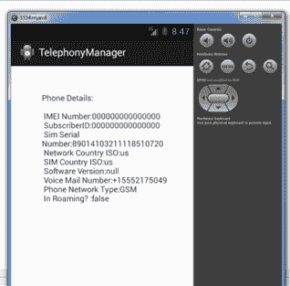

# 安卓电话管理员教程

> 原文：<https://www.javatpoint.com/android-telephony-manager-tutorial>

Android . telephonymanager 类提供有关电话服务的信息，如用户 id、sim 序列号、电话网络类型等。此外，您可以确定电话状态等。

### 安卓电话管理员示例

让我们看一下打印电话服务信息的 TelephonyManager 的简单例子。

#### activity_main.xml

从面板中拖动一个 textview，现在 xml 文件看起来像这样。

File: activity_main.xml

```
<RelativeLayout xmlns:androclass="http://schemas.android.com/apk/res/android"
    xmlns:tools="http://schemas.android.com/tools"
    android:layout_width="match_parent"
    android:layout_height="match_parent"
    android:paddingBottom="@dimen/activity_vertical_margin"
    android:paddingLeft="@dimen/activity_horizontal_margin"
    android:paddingRight="@dimen/activity_horizontal_margin"
    android:paddingTop="@dimen/activity_vertical_margin"
    tools:context=".MainActivity" >

    <TextView
        android:id="@+id/textView1"
        android:layout_width="wrap_content"
        android:layout_height="wrap_content"
        android:layout_alignParentLeft="true"
        android:layout_alignParentTop="true"
        android:layout_marginLeft="38dp"
        android:layout_marginTop="30dp"
        android:text="Phone Details:" />

</RelativeLayout>

```

* * *

#### 活动类别

现在，编写代码来显示关于电话服务的信息。

File: MainActivity.java

```
package com.javatpoint.telephonymanager;

import android.os.Bundle;
import android.app.Activity;
import android.content.Context;
import android.telephony.TelephonyManager;
import android.view.Menu;
import android.widget.TextView;

public class MainActivity extends Activity {
   TextView textView1;
    @Override
    protected void onCreate(Bundle savedInstanceState) {
        super.onCreate(savedInstanceState);
        setContentView(R.layout.activity_main);

        textView1=(TextView)findViewById(R.id.textView1);

        //Get the instance of TelephonyManager
        TelephonyManager  tm=(TelephonyManager)getSystemService(Context.TELEPHONY_SERVICE);

        //Calling the methods of TelephonyManager the returns the information
        String IMEINumber=tm.getDeviceId();
        String subscriberID=tm.getDeviceId();
        String SIMSerialNumber=tm.getSimSerialNumber();
        String networkCountryISO=tm.getNetworkCountryIso();
        String SIMCountryISO=tm.getSimCountryIso();
        String softwareVersion=tm.getDeviceSoftwareVersion();
        String voiceMailNumber=tm.getVoiceMailNumber();

        //Get the phone type
        String strphoneType="";

        int phoneType=tm.getPhoneType();

        switch (phoneType) 
        {
                case (TelephonyManager.PHONE_TYPE_CDMA):
                           strphoneType="CDMA";
                               break;
                case (TelephonyManager.PHONE_TYPE_GSM): 
                           strphoneType="GSM";              
                               break;
                case (TelephonyManager.PHONE_TYPE_NONE):
                			strphoneType="NONE";              
                                break;
         }

        //getting information if phone is in roaming
        boolean isRoaming=tm.isNetworkRoaming();

        String info="Phone Details:\n";
        info+="\n IMEI Number:"+IMEINumber;
        info+="\n SubscriberID:"+subscriberID;
        info+="\n Sim Serial Number:"+SIMSerialNumber;
        info+="\n Network Country ISO:"+networkCountryISO;
        info+="\n SIM Country ISO:"+SIMCountryISO;
        info+="\n Software Version:"+softwareVersion;
        info+="\n Voice Mail Number:"+voiceMailNumber;
        info+="\n Phone Network Type:"+strphoneType;
        info+="\n In Roaming? :"+isRoaming;

        textView1.setText(info);//displaying the information in the textView
    }

}

```

* * *

#### AndroidManifest.xml

您需要在 AndroidManifest.xml 文件中提供 **READ_PHONE_STATE** 权限。

File: AndroidManifest.xml

```
<?xml version="1.0" encoding="utf-8"?>
<manifest xmlns:androclass="http://schemas.android.com/apk/res/android"
    package="com.javatpoint.telephonymanager"
    android:versionCode="1"
    android:versionName="1.0" >

    <uses-sdk
        android:minSdkVersion="8"
        android:targetSdkVersion="17" />

    <uses-permission android:name="android.permission.READ_PHONE_STATE"/> 

    <application
        android:allowBackup="true"
        android:icon="@drawable/ic_launcher"
        android:label="@string/app_name"
        android:theme="@style/AppTheme" >
        <activity
            android:name="com.javatpoint.telephonymanager.MainActivity"
            android:label="@string/app_name" >
            <intent-filter>
                <action android:name="android.intent.action.MAIN" />

                <category android:name="android.intent.category.LAUNCHER" />
            </intent-filter>
        </activity>
    </application>

</manifest>

```

* * *

[download this android example](https://static.javatpoint.com/src/android/TelephonyManager.zip)

* * *

#### 输出:

