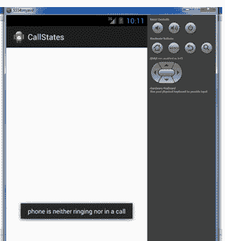
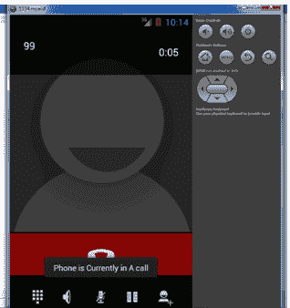

# 安卓呼叫状态示例

> 原文：<https://www.javatpoint.com/android-call-state-example>

我们也可以使用 **TelephonyManager** 类获取通话状态的信息。为此，我们需要通过传递 PhonStateListener 实例来调用 TelephonyManager 类的监听方法。

必须实现**电话状态列表器**接口才能获得呼叫状态。它提供了一个 onCallStateChanged()方法。

### 安卓呼叫状态示例

让我们看看这个例子，我们正在确定电话是否在响，电话是否在通话中，或者电话既没有响也没有在通话中。

#### activity_main.xml

在这个例子中，我们在这个文件中没有任何组件..

* * *

#### 活动类别

让我们编写代码来了解调用状态。

File: MainActivity.java

```
package com.javatpoint.callstates;

import android.os.Bundle;
import android.app.Activity;
import android.content.Context;
import android.telephony.PhoneStateListener;
import android.telephony.TelephonyManager;
import android.view.Menu;
import android.widget.Toast;

public class MainActivity extends Activity {

    @Override
    protected void onCreate(Bundle savedInstanceState) {
        super.onCreate(savedInstanceState);
        setContentView(R.layout.activity_main);

        TelephonyManager telephonyManager =
                      (TelephonyManager)getSystemService(Context.TELEPHONY_SERVICE);

        PhoneStateListener callStateListener = new PhoneStateListener() {
        public void onCallStateChanged(int state, String incomingNumber) 
        {
              if(state==TelephonyManager.CALL_STATE_RINGING){
                        Toast.makeText(getApplicationContext(),"Phone Is Riging",
                                                                         Toast.LENGTH_LONG).show();
              }
                if(state==TelephonyManager.CALL_STATE_OFFHOOK){
                    Toast.makeText(getApplicationContext(),"Phone is Currently in A call", 
                                                                                  Toast.LENGTH_LONG).show();
                }

                if(state==TelephonyManager.CALL_STATE_IDLE){
                    Toast.makeText(getApplicationContext(),"phone is neither ringing nor in a call",
                                                                                                 Toast.LENGTH_LONG).show();
                }
        }
        };
        telephonyManager.listen(callStateListener,PhoneStateListener.LISTEN_CALL_STATE);

    }

    @Override
    public boolean onCreateOptionsMenu(Menu menu) {
        // Inflate the menu; this adds items to the action bar if it is present.
        getMenuInflater().inflate(R.menu.main, menu);
        return true;
    }

}

```

* * *

#### AndroidManifest.xml

您需要在 AndroidManifest.xml 文件中提供 **READ_PHONE_STATE** 权限。

File: AndroidManifest.xml

```
<?xml version="1.0" encoding="utf-8"?>
<manifest xmlns:androclass="http://schemas.android.com/apk/res/android"
    package="com.javatpoint.callstates"
    android:versionCode="1"
    android:versionName="1.0" >

    <uses-sdk
        android:minSdkVersion="8"
        android:targetSdkVersion="17" />

       <uses-permission android:name="android.permission.READ_PHONE_STATE" />

    <application
        android:allowBackup="true"
        android:icon="@drawable/ic_launcher"
        android:label="@string/app_name"
        android:theme="@style/AppTheme" >
        <activity
            android:name="com.javatpoint.callstates.MainActivity"
            android:label="@string/app_name" >
            <intent-filter>
                <action android:name="android.intent.action.MAIN" />

                <category android:name="android.intent.category.LAUNCHER" />
            </intent-filter>
        </activity>
    </application>

</manifest>

```

* * *

* * *

[download this android example](https://static.javatpoint.com/src/android/CallState.zip)

* * *

##### 输出:

 