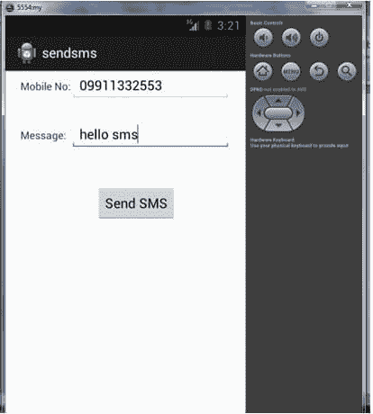
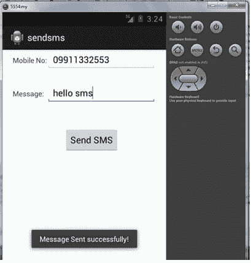

# 如何在安卓系统中发送短信

> 原文：<https://www.javatpoint.com/how-to-send-sms-in-android>

我们可以通过意向在安卓系统发送短信。你只需要写 4 行代码就可以在安卓系统中发送短信。

```
//Getting intent and PendingIntent instance
Intent intent=new Intent(getApplicationContext(),MainActivity.class);
PendingIntent pi=PendingIntent.getActivity(getApplicationContext(), 0, intent,0);

//Get the SmsManager instance and call the sendTextMessage method to send message				
SmsManager sms=SmsManager.getDefault();
sms.sendTextMessage("8802177690", null, "hello javatpoint", pi,null);

```

* * *

### 安卓系统发送短信示例

#### activity_main.xml

将 2 个 edittexts、2 个 textviews 和 1 个按钮从面板中拖出来，现在 activity_main.xml 文件将如下所示:

File: activity_main.xml

```
<RelativeLayout xmlns:androclass="http://schemas.android.com/apk/res/android"
    xmlns:tools="http://schemas.android.com/tools"
    android:layout_width="match_parent"
    android:layout_height="match_parent"
    tools:context=".MainActivity" >

    <EditText
        android:id="@+id/editText1"
        android:layout_width="wrap_content"
        android:layout_height="wrap_content"
        android:layout_alignParentRight="true"
        android:layout_alignParentTop="true"
        android:layout_marginRight="20dp"
        android:ems="10" />

    <EditText
        android:id="@+id/editText2"
        android:layout_width="wrap_content"
        android:layout_height="wrap_content"
        android:layout_alignLeft="@+id/editText1"
        android:layout_below="@+id/editText1"
        android:layout_marginTop="26dp"
        android:ems="10"
        android:inputType="textMultiLine" />

    <TextView
        android:id="@+id/textView1"
        android:layout_width="wrap_content"
        android:layout_height="wrap_content"
        android:layout_alignBaseline="@+id/editText1"
        android:layout_alignBottom="@+id/editText1"
        android:layout_toLeftOf="@+id/editText1"
        android:text="Mobile No:" />

    <TextView
        android:id="@+id/textView2"
        android:layout_width="wrap_content"
        android:layout_height="wrap_content"
        android:layout_alignBaseline="@+id/editText2"
        android:layout_alignBottom="@+id/editText2"
        android:layout_alignLeft="@+id/textView1"
        android:text="Message:" />

    <Button
        android:id="@+id/button1"
        android:layout_width="wrap_content"
        android:layout_height="wrap_content"
        android:layout_alignLeft="@+id/editText2"
        android:layout_below="@+id/editText2"
        android:layout_marginLeft="34dp"
        android:layout_marginTop="48dp"
        android:text="Send SMS" />

</RelativeLayout>

```

* * *

#### 在 Android-Manifest.xml 文件中写入权限代码

您需要写发送短信权限，如下所示:

```
<uses-permission android:name="android.permission.SEND_SMS"/>

```

File: Android-Manifest.xml

```
<?xml version="1.0" encoding="utf-8"?>
<manifest 
xmlns:androclass="http://schemas.android.com/apk/res/android"
    package="com.example.sendsms"
    android:versionCode="1"
    android:versionName="1.0" >

    <uses-sdk
        android:minSdkVersion="8"
        android:targetSdkVersion="16" />

    <uses-permission android:name="android.permission.SEND_SMS"/>

    <uses-permission android:name="android.permission.RECEIVE_SMS"/>

    <application
        android:allowBackup="true"
        android:icon="@drawable/ic_launcher"
        android:label="@string/app_name"
        android:theme="@style/AppTheme" >
        <activity
            android:name="com.example.sendsms.MainActivity"
            android:label="@string/app_name" >
            <intent-filter>
                <action android:name="android.intent.action.MAIN" />

                <category android:name="android.intent.category.LAUNCHER" />
            </intent-filter>
        </activity>
    </application>

</manifest>

```

* * *

#### 活动类别

让我们编写代码，通过意图打电话。

File: MainActivity.java

```
package com.example.sendsms;

import android.os.Bundle;
import android.app.Activity;
import android.app.PendingIntent;
import android.content.Intent;
import android.telephony.SmsManager;
import android.view.Menu;
import android.view.View;
import android.view.View.OnClickListener;
import android.widget.Button;
import android.widget.EditText;
import android.widget.Toast;

public class MainActivity extends Activity {

	EditText mobileno,message;
	Button sendsms;
    @Override
    protected void onCreate(Bundle savedInstanceState) {
        super.onCreate(savedInstanceState);
        setContentView(R.layout.activity_main);

        mobileno=(EditText)findViewById(R.id.editText1);
        message=(EditText)findViewById(R.id.editText2);
        sendsms=(Button)findViewById(R.id.button1);

	//Performing action on button click
        sendsms.setOnClickListener(new OnClickListener() {

			@Override
			public void onClick(View arg0) {
				String no=mobileno.getText().toString();
				String msg=message.getText().toString();

				//Getting intent and PendingIntent instance
				Intent intent=new Intent(getApplicationContext(),MainActivity.class);
				PendingIntent pi=PendingIntent.getActivity(getApplicationContext(), 0, intent,0);

				//Get the SmsManager instance and call the sendTextMessage method to send message
				SmsManager sms=SmsManager.getDefault();
				sms.sendTextMessage(no, null, msg, pi,null);

				Toast.makeText(getApplicationContext(), "Message Sent successfully!",
					Toast.LENGTH_LONG).show();
			}
		});
    }

    @Override
    public boolean onCreateOptionsMenu(Menu menu) {
        // Inflate the menu; this adds items to the action bar if it is present.
        getMenuInflater().inflate(R.menu.activity_main, menu);
        return true;
    }

}

```

* * *

[download this example](https://static.javatpoint.com/src/android/sendsms.zip)

* * *

#### 在真实设备(如手机)上安装并运行 apk 文件以发送短信。

* * *

#### 输出:



