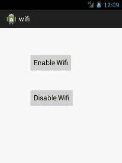

# 安卓无线例子

> 原文：<https://www.javatpoint.com/android-wifi-example>

**Android . net . wifi . wifi manager**类可用于管理 wifi 连接。它可用于添加网络、禁用网络、扫描接入点、断开连接等。

### 安卓 wifi 示例启用和禁用 wifi

让我们看看 wifi 启用和禁用 wifi 服务的简单示例。

#### activity_main.xml

File: activity_main.xml

```
<RelativeLayout xmlns:androclass="http://schemas.android.com/apk/res/android"
    xmlns:tools="http://schemas.android.com/tools"
    android:layout_width="match_parent"
    android:layout_height="match_parent"
    tools:context=".MainActivity" >

    <Button
        android:id="@+id/button1"
        android:layout_width="wrap_content"
        android:layout_height="wrap_content"
        android:layout_alignParentLeft="true"
        android:layout_alignParentTop="true"
        android:layout_marginLeft="76dp"
        android:layout_marginTop="67dp"
        android:text="Enable Wifi" />

    <Button
        android:id="@+id/button2"
        android:layout_width="wrap_content"
        android:layout_height="wrap_content"
        android:layout_alignLeft="@+id/button1"
        android:layout_below="@+id/button1"
        android:layout_marginTop="44dp"
        android:text="Disable Wifi" />

</RelativeLayout>

```

* * *

#### 活动类别

File: MainActivity.java

```
package com.example.wifi;

import android.net.wifi.WifiManager;
import android.os.Bundle;
import android.app.Activity;
import android.content.Context;
import android.view.Menu;
import android.view.View;
import android.view.View.OnClickListener;
import android.widget.Button;

public class MainActivity extends Activity {
	Button enableButton,disableButton;
	@Override
	protected void onCreate(Bundle savedInstanceState) {
		super.onCreate(savedInstanceState);
		setContentView(R.layout.activity_main);

		enableButton=(Button)findViewById(R.id.button1);
		disableButton=(Button)findViewById(R.id.button2);

		enableButton.setOnClickListener(new OnClickListener(){
			public void onClick(View v){
				WifiManager wifi = (WifiManager) getSystemService(Context.WIFI_SERVICE);
				wifi.setWifiEnabled(true);
			}
		});
		disableButton.setOnClickListener(new OnClickListener(){
			public void onClick(View v){
				WifiManager wifi = (WifiManager) getSystemService(Context.WIFI_SERVICE);
				wifi.setWifiEnabled(false);
			}
		});
	}

	@Override
	public boolean onCreateOptionsMenu(Menu menu) {
		// Inflate the menu; this adds items to the action bar if it is present.
		getMenuInflater().inflate(R.menu.activity_main, menu);
		return true;
	}

}

```

#### 在 AndroidManifest.xml 中添加权限

您需要在 AndroidManifest.xml 文件中添加以下权限。

```
<uses-permission android:name="android.permission.ACCESS_WIFI_STATE" />
<uses-permission android:name="android.permission.INTERNET" />
<uses-permission android:name="android.permission.CHANGE_WIFI_STATE"/>

```

* * *

[download this android example](https://static.javatpoint.com/src/android/wifi.zip)

* * *

#### 输出:

