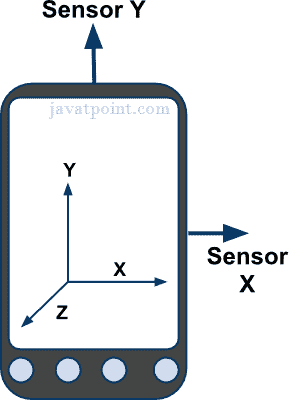
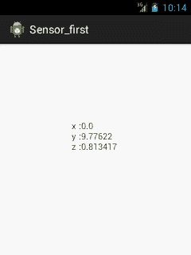

# 安卓传感器教程

> 原文：<https://www.javatpoint.com/android-sensor-tutorial>

**传感器**可用于监测三维设备运动或设备环境的变化。

Android 提供了传感器 api，可以与不同类型的传感器一起工作。



* * *

## 传感器的类型

安卓支持三种类型的传感器:

#### 1)运动传感器

这些用于测量沿三个轴的加速力和旋转力。

#### 2)位置传感器

这些用于测量设备的物理位置。

#### 3)环境传感器

这些用于测量环境变化，如温度、湿度等。

* * *

## 安卓传感器应用编程接口

安卓传感器 api 提供了很多类和接口。传感器 api 的重要类别和接口如下:

#### 1) SensorManager 类

Android . hardware . sensormanager 类提供了方法:

*   要获取传感器实例，
*   要访问和列出传感器，
*   注册和注销传感器监听器等。

您可以通过调用方法 getSystemService()并在其中传递 SENSOR_SERVICE 常量来获取 SensorManager 的实例。

```
SensorManager sm = (SensorManager)getSystemService(SENSOR_SERVICE);

```

#### 2)传感器等级

**android.hardware.Sensor** 类提供了获取传感器名称、传感器类型、传感器分辨率、传感器类型等信息的方法。

#### 3)传感器风类

它的实例由系统创建。它提供关于传感器的信息。

#### 4)传感器接口

它提供了两种回调方法，用于在传感器值(x、y 和 z)发生变化或传感器精度发生变化时获取信息。

| 公开和抽象的方法 | 描述 |
| **传感器传感器精度变化时的空隙** | 当传感器精度改变时，它被调用。 |
| **void onSensorChanged(SensorEvent 事件)** | 当传感器值改变时，它被调用。 |

* * *

### 安卓简单传感器应用示例

让我们看看两个传感器的例子。

1.  打印 x、y 和 z 轴值的传感器示例。在这里，我们将看到。
2.  设备洗牌时改变背景颜色的传感器示例。点击[更改活动传感器背景颜色示例](android-sensor-example)

#### activity_main.xml

该文件中只有一个 textview。

File: activity_main.xml

```
<RelativeLayout xmlns:androclass="http://schemas.android.com/apk/res/android"
    xmlns:tools="http://schemas.android.com/tools"
    android:layout_width="match_parent"
    android:layout_height="match_parent"
    tools:context=".MainActivity" >

    <TextView
        android:id="@+id/textView1"
        android:layout_width="wrap_content"
        android:layout_height="wrap_content"
        android:layout_alignParentLeft="true"
        android:layout_alignParentTop="true"
        android:layout_marginLeft="92dp"
        android:layout_marginTop="114dp"
        android:text="TextView" />

</RelativeLayout>

```

* * *

#### 活动类别

让我们编写打印 x 轴、y 轴和 z 轴值的代码。

File: MainActivity.java

```
package com.example.sensorsimple;
import android.app.Activity;
import android.os.Bundle;
import android.widget.TextView;
import android.widget.Toast;
import android.hardware.SensorManager;
import android.hardware.SensorEventListener;
import android.hardware.SensorEvent;
import android.hardware.Sensor;
import java.util.List;
public class MainActivity extends Activity {
	SensorManager sm = null;
	TextView textView1 = null;
	List list;

	SensorEventListener sel = new SensorEventListener(){
		public void onAccuracyChanged(Sensor sensor, int accuracy) {}
		public void onSensorChanged(SensorEvent event) {
			float[] values = event.values;
			textView1.setText("x: "+values[0]+"\ny: "+values[1]+"\nz: "+values[2]);
		}
	};

    @Override
    public void onCreate(Bundle savedInstanceState) {
        super.onCreate(savedInstanceState);
        setContentView(R.layout.activity_main);

        /* Get a SensorManager instance */
        sm = (SensorManager)getSystemService(SENSOR_SERVICE);

        textView1 = (TextView)findViewById(R.id.textView1);

        list = sm.getSensorList(Sensor.TYPE_ACCELEROMETER);
        if(list.size()>0){
        	sm.registerListener(sel, (Sensor) list.get(0), SensorManager.SENSOR_DELAY_NORMAL);
        }else{
        	Toast.makeText(getBaseContext(), "Error: No Accelerometer.", Toast.LENGTH_LONG).show();
        }
    }

	@Override
	protected void onStop() {
		if(list.size()>0){
		  sm.unregisterListener(sel);
		}
		super.onStop();
	}
}

```

* * *

[download this android example](https://static.javatpoint.com/src/android/sensorsimple.zip)

* * *

#### 输出:



### 下一步是什么？

Click for [changing background color of activity sensor example](android-sensor-example)