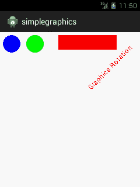

# 安卓简单图形示例

> 原文：<https://www.javatpoint.com/android-simple-graphics-example>

**android.graphics.Canvas** 可以用来在 android 中绘制图形。它提供了绘制椭圆、矩形、图片、文本、线条等的方法。

**android.graphics.Paint** 类与画布一起用于绘制对象。它保存着颜色和风格的信息。

在这个例子中，我们将在安卓系统中显示 2D 图形。

#### activity_main.xml

File: activity_main.xml

```
<RelativeLayout xmlns:androclass="http://schemas.android.com/apk/res/android"
    xmlns:tools="http://schemas.android.com/tools"
    android:layout_width="match_parent"
    android:layout_height="match_parent"
    android:paddingBottom="@dimen/activity_vertical_margin"
    android:paddingLeft="@dimen/activity_horizontal_margin"
    android:paddingRight="@dimen/activity_horizontal_margin"
    android:paddingTop="@dimen/activity_vertical_margin"
    tools:context=".MainActivity" >

    <TextView
        android:layout_width="wrap_content"
        android:layout_height="wrap_content"
        android:text="@string/hello_world" />

</RelativeLayout>

```

#### 活动类别

File: MainActivity.java

```
package com.example.simplegraphics;

import android.os.Bundle;
import android.app.Activity;
import android.view.Menu;
import android.content.Context;
import android.graphics.Canvas;
import android.graphics.Color;
import android.graphics.Paint;
import android.view.View;

public class MainActivity extends Activity {

	DemoView demoview;
	/** Called when the activity is first created. */
	@Override
	public void onCreate(Bundle savedInstanceState) {
		super.onCreate(savedInstanceState);
		demoview = new DemoView(this);
		setContentView(demoview);
	}

	private class DemoView extends View{
		public DemoView(Context context){
			super(context);
		}

		@Override protected void onDraw(Canvas canvas) {
			super.onDraw(canvas);

			// custom drawing code here
			Paint paint = new Paint();
			paint.setStyle(Paint.Style.FILL);

			// make the entire canvas white
			paint.setColor(Color.WHITE);
			canvas.drawPaint(paint);

			// draw blue circle with anti aliasing turned off
			paint.setAntiAlias(false);
			paint.setColor(Color.BLUE);
			canvas.drawCircle(20, 20, 15, paint);

			// draw green circle with anti aliasing turned on
			paint.setAntiAlias(true);
			paint.setColor(Color.GREEN);
			canvas.drawCircle(60, 20, 15, paint);

			// draw red rectangle with anti aliasing turned off
			paint.setAntiAlias(false);
			paint.setColor(Color.RED);
			canvas.drawRect(100, 5, 200, 30, paint);

			// draw the rotated text
			canvas.rotate(-45);

			paint.setStyle(Paint.Style.FILL);
			canvas.drawText("Graphics Rotation", 40, 180, paint);

			//undo the rotate
			canvas.restore();
		}
	}
	@Override
	public boolean onCreateOptionsMenu(Menu menu) {
		// Inflate the menu; this adds items to the action bar if it is present.
		getMenuInflater().inflate(R.menu.main, menu);
		return true;
	}
}

```

#### 输出:


[download this android example](https://static.javatpoint.com/src/android/simplegraphics.zip)

* * *