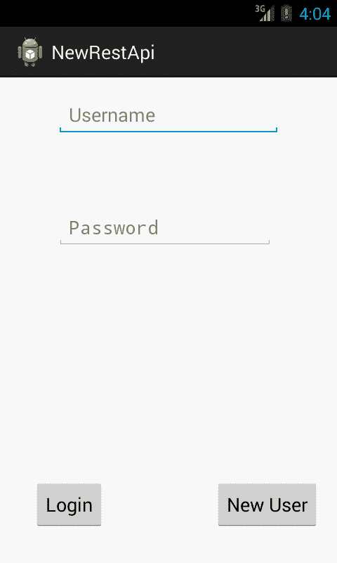
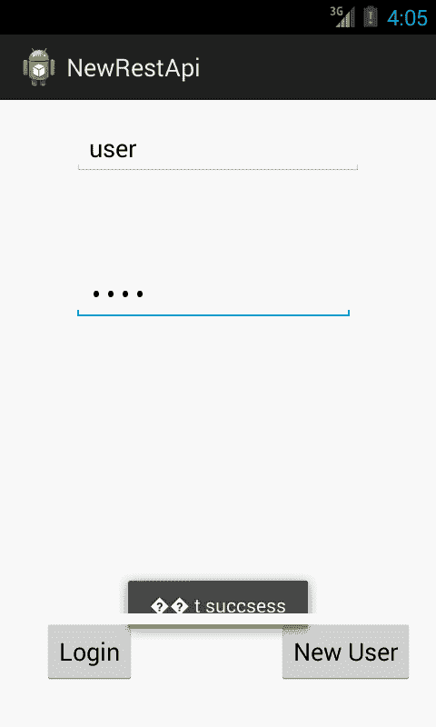

# 安卓网络服务教程

> 原文：<https://www.javatpoint.com/android-web-service>

在 android 中创建 web 服务应用程序并不是一项困难的任务。我们可以很容易地在 android 中创建一个 restful web 服务应用程序，使用 java 开发的其他应用程序来验证信息或将信息保存到外部数据库中，如 oracle、mysql、postgre sql、sql server 等。net、php 等语言。这就是我们要做的。

## 安卓 Restful 网络服务教程

在开发网络服务应用程序之前，您必须具备 SOAP 和 Restful 网络服务的基本知识。这就是为什么，我们将讨论关于网络服务的基本要点，例如什么是网络服务，以及关于 SOAP 和 Restful 网络服务的简要信息。

## 什么是网络服务？

web 服务是在不同类型的应用程序之间交换信息的标准，与语言和平台无关。例如，安卓应用程序可以与 java 或。使用 web 服务的网络应用程序。

## 安卓 Restful 网络服务示例

File: activity_main.xml

```
<RelativeLayout xmlns:android="http://schemas.android.com/apk/res/android"
    xmlns:tools="http://schemas.android.com/tools"
    android:layout_width="match_parent"
    android:layout_height="match_parent"
    android:paddingBottom="@dimen/activity_vertical_margin"
    android:paddingLeft="@dimen/activity_horizontal_margin"
    android:paddingRight="@dimen/activity_horizontal_margin"
    android:paddingTop="@dimen/activity_vertical_margin"
    tools:context=".MainActivity" >

    <EditText
        android:id="@+id/editText1"
        android:layout_width="wrap_content"
        android:layout_height="wrap_content"
        android:layout_alignParentTop="true"
        android:layout_centerHorizontal="true"
        android:hint="Username"
        android:ems="10" >

        <requestFocus />
    </EditText>

    <EditText
        android:id="@+id/editText2"
        android:layout_width="wrap_content"
        android:layout_height="wrap_content"
        android:layout_alignLeft="@+id/editText1"
        android:layout_below="@+id/editText1"
        android:layout_marginTop="67dp"
        android:ems="10"
        android:hint="Password"
        android:inputType="textPassword" />

    <Button
        android:id="@+id/button2"
        android:layout_width="wrap_content"
        android:layout_height="wrap_content"
        android:layout_alignParentBottom="true"
        android:layout_marginBottom="24dp"
        android:layout_toRightOf="@+id/button1"
        android:text="New User" />

    <ProgressBar
        android:id="@+id/progressBar1"
        style="?android:attr/progressBarStyleLarge"
        android:layout_width="wrap_content"
        android:layout_height="wrap_content"
        android:layout_alignLeft="@+id/button1"
        android:layout_below="@+id/editText2"
        android:layout_marginTop="22dp" />

    <Button
        android:id="@+id/button1"
        android:layout_width="wrap_content"
        android:layout_height="wrap_content"
        android:layout_alignLeft="@+id/editText2"
        android:layout_below="@+id/progressBar1"
        android:layout_marginLeft="22dp"
        android:text="Login" />

</RelativeLayout>

```

文件:activity_register_user.xml

```
<RelativeLayout xmlns:android="http://schemas.android.com/apk/res/android"
    android:layout_width="fill_parent"
    android:layout_height="fill_parent" >

    <EditText
        android:id="@+id/editText1"
        android:layout_width="wrap_content"
        android:layout_height="wrap_content"
        android:layout_alignParentTop="true"
        android:layout_centerHorizontal="true"
        android:layout_marginTop="15dp"
        android:ems="10"
        android:hint="Enter UserName" />

    <EditText
        android:id="@+id/editText2"
        android:layout_width="wrap_content"
        android:layout_height="wrap_content"
        android:layout_alignLeft="@+id/editText1"
        android:layout_below="@+id/editText1"
        android:layout_marginTop="50dp"
        android:ems="10"
        android:hint="Enter Password"
        android:inputType="textPassword" />

    <Button
        android:id="@+id/button1"
        android:layout_width="wrap_content"
        android:layout_height="wrap_content"
        android:layout_alignParentBottom="true"
        android:layout_centerHorizontal="true"
        android:text="Resister" />

    <ProgressBar
        android:id="@+id/progressBar1"
        style="?android:attr/progressBarStyleLarge"
        android:layout_width="wrap_content"
        android:layout_height="wrap_content"
        android:layout_alignLeft="@+id/button1"
        android:layout_below="@+id/editText2"
        android:layout_marginTop="87dp" />

</RelativeLayout>

```

* * *

#### 主要活动类

File: MainActivity.java

```
package com.example.newrestapi;

import java.io.BufferedReader;
import java.io.InputStream;
import java.io.InputStreamReader;
import java.util.ArrayList;
import java.util.List;
import org.apache.http.HttpEntity;
import org.apache.http.HttpResponse;
import org.apache.http.NameValuePair;
import org.apache.http.client.HttpClient;
import org.apache.http.client.entity.UrlEncodedFormEntity;
import org.apache.http.client.methods.HttpPost;
import org.apache.http.impl.client.DefaultHttpClient;
import org.apache.http.message.BasicNameValuePair;
import android.os.AsyncTask;
import android.os.Bundle;
import android.app.Activity;
import android.content.Intent;
import android.view.View;
import android.view.View.OnClickListener;
import android.widget.Button;
import android.widget.EditText;
import android.widget.ProgressBar;
import android.widget.Toast;

public class MainActivity extends Activity {
	EditText password,userName;
	Button login,resister;
	ProgressBar progressBar;

	protected void onCreate(Bundle savedInstanceState) {
		super.onCreate(savedInstanceState);
		setContentView(R.layout.activity_main);
		password=(EditText) findViewById(R.id.editText2);
		userName=(EditText) findViewById(R.id.editText1);
		login=(Button) findViewById(R.id.button1);
		resister=(Button) findViewById(R.id.button2);

		//progess_msz.setVisibility(View.GONE);
		progressBar=(ProgressBar) findViewById(R.id.progressBar1);
		progressBar.setVisibility(View.GONE);

		resister.setOnClickListener(new OnClickListener() {

			@Override
			public void onClick(View arg0) {
				// TODO Auto-generated method stub
				Intent  intent=new Intent(MainActivity.this,ResisterUser.class);
				startActivity(intent);
			}
		});
		login.setOnClickListener(new OnClickListener() {

			public void onClick(View v) {
				progressBar.setVisibility(View.VISIBLE);

				String s1=userName.getText().toString();
				String s2=password.getText().toString();
				new ExecuteTask().execute(s1,s2);

			}
		});

	}

	 class ExecuteTask extends AsyncTask<String, Integer, String>
	    {

			@Override
			protected String doInBackground(String... params) {

				String res=PostData(params);

				return res;
			}

			@Override
			protected void onPostExecute(String result) {
			progressBar.setVisibility(View.GONE);
			//progess_msz.setVisibility(View.GONE);
			Toast.makeText(getApplicationContext(), result, 3000).show();
			}

	    }

	public String PostData(String[] valuse) {
		String s="";
    	try
    	{
    	HttpClient httpClient=new DefaultHttpClient();
    	HttpPost httpPost=new HttpPost("http://10.0.0.8:7777/HttpPostServlet/servlet/Login");

    	List<NameValuePair> list=new ArrayList<NameValuePair>();
    	list.add(new BasicNameValuePair("name", valuse[0]));
    	list.add(new BasicNameValuePair("pass",valuse[1]));
    	httpPost.setEntity(new UrlEncodedFormEntity(list));
        HttpResponse httpResponse=	httpClient.execute(httpPost);

        HttpEntity httpEntity=httpResponse.getEntity();
        s= readResponse(httpResponse);

    	}
    	catch(Exception exception) 	{}
		return s;

	}
	public String readResponse(HttpResponse res) {
		InputStream is=null; 
		String return_text="";
		try {
			is=res.getEntity().getContent();
			BufferedReader bufferedReader=new BufferedReader(new InputStreamReader(is));
			String line="";
			StringBuffer sb=new StringBuffer();
			while ((line=bufferedReader.readLine())!=null)
			{
			sb.append(line);
			}
			return_text=sb.toString();
		} catch (Exception e)
		{

		}
		return return_text;

	}

}

```

* * *

#### RegisterUser 类

File: RegisterUser.java

```
package com.example.newrestapi;

import java.util.ArrayList;
import java.util.List;
import org.apache.http.NameValuePair;
import org.apache.http.client.HttpClient;
import org.apache.http.client.entity.UrlEncodedFormEntity;
import org.apache.http.client.methods.HttpPost;
import org.apache.http.impl.client.DefaultHttpClient;
import org.apache.http.message.BasicNameValuePair;
import android.os.AsyncTask;
import android.os.Bundle;
import android.app.Activity;
import android.view.View;
import android.view.View.OnClickListener;
import android.widget.Button;
import android.widget.EditText;
import android.widget.ProgressBar;

public class ResisterUser extends Activity {
	 EditText userName,passwprd;
	   Button resister,login;
	   ProgressBar progressBar;
	    protected void onCreate(Bundle savedInstanceState) {
	        super.onCreate(savedInstanceState);
	        setContentView(R.layout.activity_resister_user);
	        userName=(EditText) findViewById(R.id.editText1);;
	        passwprd=(EditText) findViewById(R.id.editText2);
	        resister=(Button) findViewById(R.id.button1);

	        progressBar=(ProgressBar) findViewById(R.id.progressBar1);
	        progressBar.setVisibility(View.GONE);

	        resister.setOnClickListener(new OnClickListener() {

				@Override
				public void onClick(View v) {

					progressBar.setVisibility(View.VISIBLE);

					String s1=userName.getText().toString();
					String s2=passwprd.getText().toString();
					new ExecuteTask().execute(s1,s2);
				}
			});

	    }

	    class ExecuteTask extends AsyncTask<String, Integer, String>
	    {

			@Override
			protected String doInBackground(String... params) {

				PostData(params);
				return null;
			}

			@Override
			protected void onPostExecute(String result) {
			progressBar.setVisibility(View.GONE);
			}

	    }

	    public void PostData(String[] valuse) {
	    	try
	    	{
	    	HttpClient httpClient=new DefaultHttpClient();
	    	HttpPost httpPost=new HttpPost(
                                  "http://10.0.0.8:7777/HttpPostServlet/servlet/httpPostServlet");
	    	List<NameValuePair> list=new ArrayList<NameValuePair>();
	    	list.add(new BasicNameValuePair("name", valuse[0]));
	    	list.add(new BasicNameValuePair("pass",valuse[1]));
	    	httpPost.setEntity(new UrlEncodedFormEntity(list));
	    	httpClient.execute(httpPost);
	    	}
	    	catch(Exception e)
	    	{
	    		System.out.println(e);
	    	}

		}

	    }

```

* * *

File: AndroidManifest.xml

您需要在 AndroidManifest.xml 文件中提供 INTERNET 权限。

```
<?xml version="1.0" encoding="utf-8"?>
<manifest xmlns:android="http://schemas.android.com/apk/res/android"
    package="com.example.newrestapi"
    android:versionCode="1"
    android:versionName="1.0" >

    <uses-sdk
        android:minSdkVersion="8"
        android:targetSdkVersion="17" />

    <uses-permission android:name="android.permission.INTERNET" />

    <application
        android:allowBackup="true"
        android:icon="@drawable/ic_launcher"
        android:label="@string/app_name"
        android:theme="@style/AppTheme" >
        <activity
            android:name="com.example.newrestapi.MainActivity"
            android:label="@string/app_name" >
            <intent-filter>
                <action android:name="android.intent.action.MAIN" />

                <category android:name="android.intent.category.LAUNCHER" />
            </intent-filter>
        </activity>
        <activity
            android:name="com.example.newrestapi.ResisterUser"
            android:label="@string/title_activity_resister_user" >
        </activity>
    </application>

</manifest>

```

* * *

[download this android example](https://static.javatpoint.com/src/android/NewRestApi.zip)

* * *

#### 输出:

 

* * *

## 使用 oracle 数据库的 Java Servlet 登录和注册示例

在 oracle 数据库中创建具有三列 id、名称和密码的表 javatpoint_user。Id 必须是主键，并通过 SEQUENCE 生成。

```
CREATE TABLE  "JAVATPOINT_USER" 
   (	"ID" NUMBER, 
	"NAME" VARCHAR2(4000), 
	"PASSWORD" VARCHAR2(4000), 
	 CONSTRAINT "JAVATPOINT_USER_PK" PRIMARY KEY ("ID") ENABLE
   )
/

```

新建两个 servlet 类来登录和注册用户。

#### 登录 Servlet 类

File: Login.java

```
package server;

import java.io.IOException;
import java.io.ObjectOutputStream;
import java.sql.Connection;
import java.sql.DriverManager;
import java.sql.PreparedStatement;
import java.sql.ResultSet;
import javax.servlet.ServletException;
import javax.servlet.http.HttpServlet;
import javax.servlet.http.HttpServletRequest;
import javax.servlet.http.HttpServletResponse;

public class Login extends HttpServlet {

	public void doGet(HttpServletRequest request, HttpServletResponse response)
			throws ServletException, IOException {
		 response.setContentType("text/html");  

		    ObjectOutputStream out=new ObjectOutputStream(response.getOutputStream());

		    String n=request.getParameter("name");  
		    String p=request.getParameter("pass");
		    System.out.println(n);
		    System.out.println(p);

		    if(validate(n, p)){  
		       out.writeObject("success");

		    }  
		    else{  
		       out.writeObject("Sorry username or password error");

		    }  

		    out.close();  
		    }  

	public static boolean validate(String name,String pass){  
		boolean status=false;  
		try{  
			Class.forName("oracle.jdbc.driver.OracleDriver");
	    	Connection con=DriverManager.getConnection(
                      "jdbc:oracle:thin:@localhost:1521:xe","system","oracle");

		PreparedStatement ps=con.prepareStatement(  
		"select * from javatpoint_user where name=? and password=?");  
		ps.setString(1,name);  
		ps.setString(2,pass);  

		ResultSet rs=ps.executeQuery();  
		status=rs.next();  

		}catch(Exception e){System.out.println(e);}  
		return status;  
		}  
	public void doPost(HttpServletRequest request,HttpServletResponse response)
    throws ServletException, IOException {
doGet(request, response);

}
}

```

#### httpPostServlet 类

File: httpPostServlet.java

```
package server;

import java.io.IOException;
import java.sql.Connection;
import java.sql.DriverManager;
import java.sql.PreparedStatement;
import javax.servlet.ServletException;
import javax.servlet.http.HttpServlet;
import javax.servlet.http.HttpServletRequest;
import javax.servlet.http.HttpServletResponse;

public class httpPostServlet extends HttpServlet {

	 public void doGet(HttpServletRequest request,HttpServletResponse response)
     throws ServletException, IOException {
 response.setContentType("text/html");
String recived_data="";

 String s1=request.getParameter("name");
 String s2=request.getParameter("pass");
 System.out.println(s1);
 System.out.println(s2);  	

    	try
    	{
    	Class.forName("oracle.jdbc.driver.OracleDriver");
    	Connection con=DriverManager.getConnection(
                       "jdbc:oracle:thin:@localhost:1521:xe","system","oracle");
    	PreparedStatement ps=con.prepareStatement(
                      "insert into javatpoint_user(name,password) values(?,?)");
    	ps.setString(1, s1);
    	ps.setString(2,s2);
    	ps.executeUpdate();
    	con.close();
    	}
    	catch (Exception e) {
    		e.printStackTrace();
		}

} 
public void doPost(HttpServletRequest request,HttpServletResponse response)
     throws ServletException, IOException {
 doGet(request, response);
}

}

```

#### index.jsp

```
<form action="servlet/Login">
Name:<input type="text" name="name"/><br/>
Password:<input type="password" name="pass"/><br/>
<input type="submit" value="login"/>
</form>

```

* * *

[download this android web service example](https://static.javatpoint.com/src/android/NewRestApi.zip)
[download servlet example (developed in eclipse)](https://static.javatpoint.com/src/android/HttpPostServlet1.zip)

* * *