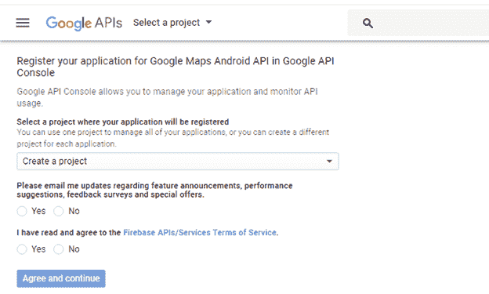

# 安卓谷歌地图

> 原文：<https://www.javatpoint.com/android-google-map>

安卓提供了在我们的应用程序中集成谷歌地图的工具。谷歌地图显示你的当前位置，导航位置方向，搜索位置等。我们也可以根据自己的要求定制谷歌地图。

## 谷歌地图的类型

有四种不同类型的谷歌地图，以及一个可选的完全没有地图。他们每个人在地图上都有不同的视角。这些地图如下:

1.  **Normal:** 这种类型的地图显示典型的道路地图、河流等自然特征以及人类构建的一些特征。
2.  **混合:**这种类型的地图显示带有典型道路地图的卫星照片数据。它还显示道路和要素标签。
3.  **卫星:**卫星类型显示卫星照片数据，但不显示道路和特征标签。
4.  **地形:**此类型显示摄影数据。这包括颜色、轮廓线和标签以及透视阴影。
5.  **无:**此类型显示一个空网格，没有加载切片。

## 不同类型地图的语法

```
googleMap.setMapType(GoogleMap.MAP_TYPE_NORMAL);
googleMap.setMapType(GoogleMap.MAP_TYPE_HYBRID);
googleMap.setMapType(GoogleMap.MAP_TYPE_SATELLITE);
googleMap.setMapType(GoogleMap.MAP_TYPE_TERRAIN);

```

### 谷歌地图的方法

谷歌地图应用编程接口提供了几种方法来帮助定制谷歌地图。这些方法如下:

| 方法 | 描述 |
| 添加圆形(圆形选项) | 这种方法将圆添加到地图中。 |
| addPolygon(多边形选项) | 该方法将多边形添加到地图中。 |
| TileOverlay 选项 | 此方法将平铺覆盖添加到地图中。 |
| 动画相机(cameraupdate update) | 此方法根据动画更新移动地图。 |
| 清除() | 此方法从地图中移除所有内容。 |
| getMyLocation() | 此方法返回当前显示的用户位置。 |
| move camera(camera date update) | 该方法根据更新中定义的说明重新定位摄像机。 |
| setTrafficEnabled(布尔使能) | 此方法可打开或关闭流量层。 |
| 快照(GoogleMap。SnapshotReadyCallback 回调) | 此方法拍摄地图的快照。 |
| 停止动画() | 如果有任何进展，此方法将停止相机动画。 |

### 谷歌地图示例

让我们创建一个谷歌地图集成在我们的应用程序中的例子。为此，我们选择谷歌地图活动。


从 google_map_api.xml 文件中复制 URL，生成 google 地图密钥。


将复制的网址粘贴到浏览器中。它将打开以下页面。



单击创建应用编程接口密钥生成应用编程接口密钥。


点击创建应用编程接口密钥后，它将生成我们的应用编程接口密钥，显示如下屏幕。


在我们的 *google_map_api.xml* 文件中复制这个生成的 API 密钥


### activity_maps.xml

```
<fragment xmlns:android="http://schemas.android.com/apk/res/android"
    xmlns:map="http://schemas.android.com/apk/res-auto"
    xmlns:tools="http://schemas.android.com/tools"
    android:id="@+id/map"
    android:name="com.google.android.gms.maps.SupportMapFragment"
    android:layout_width="match_parent"
    android:layout_height="match_parent"
    tools:context="example.com.mapexample.MapsActivity" />

```

### MapsActivity.java

为了在我们的 MapsActivity.java 类中获得谷歌地图对象，我们需要实现 OnMapReadyCallback 接口并重写 onMapReady()回调方法。

```
package example.com.mapexample;

import android.support.v4.app.FragmentActivity;
import android.os.Bundle;
import com.google.android.gms.maps.CameraUpdateFactory;
import com.google.android.gms.maps.GoogleMap;
import com.google.android.gms.maps.OnMapReadyCallback;
import com.google.android.gms.maps.SupportMapFragment;
import com.google.android.gms.maps.model.LatLng;
import com.google.android.gms.maps.model.MarkerOptions;

public class MapsActivity extends FragmentActivity implements OnMapReadyCallback{

    private GoogleMap mMap;

    @Override
    protected void onCreate(Bundle savedInstanceState) {
        super.onCreate(savedInstanceState);
        setContentView(R.layout.activity_maps);
        // Obtain the SupportMapFragment and get notified when the map is ready to be used.
        SupportMapFragment mapFragment = (SupportMapFragment) getSupportFragmentManager()
                .findFragmentById(R.id.map);
        mapFragment.getMapAsync(this);

    }

    @Override
    public void onMapReady(GoogleMap googleMap) {
        mMap = googleMap;

        // Add a marker in Sydney and move the camera
        LatLng sydney = new LatLng(-34, 151);
        mMap.addMarker(new MarkerOptions().position(sydney).title("Marker in Sydney"));
        mMap.moveCamera(CameraUpdateFactory.newLatLng(sydney));

    }
}

```

### 必需的权限

在 AndroidManifest.xml 文件中添加以下用户权限。

```
<uses-permission android:name="android.permission.ACCESS_FINE_LOCATION" />
<uses-permission android:name="android.permission.ACCESS_COARSE_LOCATION" />
<uses-permission android:name="android.permission.INTERNET" />

```

### AndroidManifest.xml

```
<?xml version="1.0" encoding="utf-8"?>
<manifest xmlns:android="http://schemas.android.com/apk/res/android"
    package="example.com.mapexample">
    <!--
         The ACCESS_COARSE/FINE_LOCATION permissions are not required to use
         Google Maps Android API v2, but you must specify either coarse or fine
         location permissions for the 'MyLocation' functionality. 
    -->
    <uses-permission android:name="android.permission.ACCESS_FINE_LOCATION" />
    <uses-permission android:name="android.permission.ACCESS_COARSE_LOCATION" />
    <uses-permission android:name="android.permission.INTERNET" />

    <application
        android:allowBackup="true"
        android:icon="@mipmap/ic_launcher"
        android:label="@string/app_name"
        android:roundIcon="@mipmap/ic_launcher_round"
        android:supportsRtl="true"
        android:theme="@style/AppTheme">

        <meta-data
            android:name="com.google.android.geo.API_KEY"
            android:value="@string/google_maps_key" />

        <activity
            android:name=".MapsActivity"
            android:label="@string/title_activity_maps">
            <intent-filter>
                <action android:name="android.intent.action.MAIN" />

                <category android:name="android.intent.category.LAUNCHER" />
            </intent-filter>
        </activity>
    </application>

</manifest>

```

### build.gradel

在 *build.gradel* 文件中添加以下依赖项。

```
dependencies {
    implementation fileTree(dir: 'libs', include: ['*.jar'])
    implementation 'com.android.support:appcompat-v7:26.1.0'
    implementation 'com.google.android.gms:play-services-maps:11.8.0'
    testImplementation 'junit:junit:4.12'
    androidTestImplementation 'com.android.support.test:runner:1.0.1'
    androidTestImplementation 'com.android.support.test.espresso:espresso-core:3.0.1'
}

```

输出


* * *