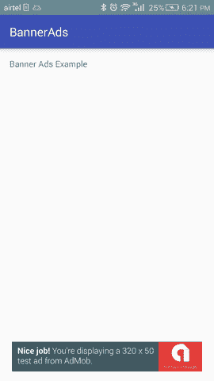

# 安卓横幅广告谷歌广告

> 原文：<https://www.javatpoint.com/android-banner-ads>

让我们创建一个应用程序，在其布局上显示谷歌广告横幅广告。

***文件:build.gradle 文件***

在 build.gradle 文件中添加所需的 google ads 依赖项。

```
compile 'com.google.android.gms:play-services-ads:8.4.0'

```

### 必需的权限

在 AndroidMenifest.xml 文件中添加所需的用户权限

```
<uses-permission android:name="android.permission.INTERNET" />
<uses-permission android:name="android.permission.ACCESS_NETWORK_STATE" />

```

***文件:activity.xml***

在 activity.xml 文件中创建谷歌广告 AdView View。

```
<?xml version="1.0" encoding="utf-8"?>
<RelativeLayout xmlns:android="http://schemas.android.com/apk/res/android"
    xmlns:app="http://schemas.android.com/apk/res-auto"
    xmlns:tools="http://schemas.android.com/tools"
    android:layout_width="match_parent"
    android:layout_height="match_parent"
    android:paddingBottom="@dimen/activity_vertical_margin"
    android:paddingLeft="@dimen/activity_horizontal_margin"
    android:paddingRight="@dimen/activity_horizontal_margin"
    android:paddingTop="@dimen/activity_vertical_margin"
    tools:context="com.example.test.bannerads.MainActivity">

    <TextView
        android:layout_width="wrap_content"
        android:layout_height="wrap_content"
        android:text="Banner Ads Example" />

    <com.google.android.gms.ads.AdView
        android:id="@+id/ad_view"
        android:layout_width="match_parent"
        android:layout_height="wrap_content"
        android:layout_centerHorizontal="true"
        android:layout_alignParentBottom="true"
        app:adSize="BANNER"
        app:adUnitId="@string/banner_ad_unit_id"
        />

</RelativeLayout>

```

***文件:***

```
<resources>
    <string name="app_name">BannerAds</string>
    <string name="banner_ad_unit_id">ca-app-pub-3940256099942544/6300978111</string>
</resources>

```

***文件:MainActivity.java***

```
package com.example.test.bannerads;

import android.support.v7.app.AppCompatActivity;
import android.os.Bundle;

import com.google.android.gms.ads.AdRequest;
import com.google.android.gms.ads.AdView;

public class MainActivity extends AppCompatActivity {
    private AdView adView;
    AdRequest adRequest;
    @Override
    protected void onCreate(Bundle savedInstanceState) {
        super.onCreate(savedInstanceState);
        setContentView(R.layout.activity_main);
        adView = (AdView) findViewById(R.id.ad_view);
        adRequest = new AdRequest.Builder().build();
        adView.loadAd(adRequest);

    }
    @Override
    public void onPause() {
        if (adView != null) {
            adView.pause();
        }
        super.onPause();
    }

    @Override
    public void onResume() {
        super.onResume();
        if (adView != null) {
            adView.resume();
        }
    }

    @Override
    public void onDestroy() {
        if (adView != null) {
            adView.destroy();
        }
        super.onDestroy();
    }
}

```

***文件:AndroidManifest.xml***

```
<?xml version="1.0" encoding="utf-8"?>
<manifest xmlns:android="http://schemas.android.com/apk/res/android"
    package="com.example.test.bannerads">
    <uses-permission android:name="android.permission.INTERNET" />
    <uses-permission android:name="android.permission.ACCESS_NETWORK_STATE" />
    <application
        android:allowBackup="true"
        android:icon="@mipmap/ic_launcher"
        android:label="@string/app_name"
        android:supportsRtl="true"
        android:theme="@style/AppTheme">
        <activity android:name=".MainActivity">
            <intent-filter>
                <action android:name="android.intent.action.MAIN" />

                <category android:name="android.intent.category.LAUNCHER" />
            </intent-filter>
        </activity>
    </application>

</manifest>

```

#### 注意:广告显示在安卓真实设备上，而不是在安卓模拟器中。

输出

