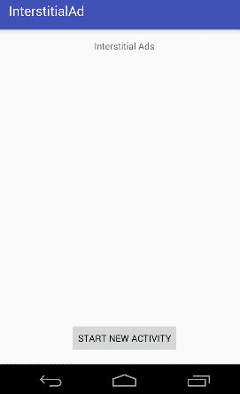

# 安卓间隙广告谷歌广告

> 原文：<https://www.javatpoint.com/android-interstitial-ads>

让我们创建一个应用程序，在其布局上显示谷歌 AdMob 的全屏间隙广告。

***文件:build.gradle 文件***

在 build.gradle 文件中添加所需的 google ads 依赖项。

```
compile 'com.google.android.gms:play-services-ads:8.4.0'

```

### 必需的权限

在 AndroidMenifest.xml 文件中添加所需的用户权限

```
<uses-permission android:name="android.permission.INTERNET" />
<uses-permission android:name="android.permission.ACCESS_NETWORK_STATE" />

```

***文件:activity.xml***

根据所需的设计布局创建一个 activity.xml 文件。

```
<?xml version="1.0" encoding="utf-8"?>
<RelativeLayout xmlns:android="http://schemas.android.com/apk/res/android"
    xmlns:tools="http://schemas.android.com/tools"
    android:layout_width="match_parent"
    android:layout_height="match_parent"
    android:paddingBottom="@dimen/activity_vertical_margin"
    android:paddingLeft="@dimen/activity_horizontal_margin"
    android:paddingRight="@dimen/activity_horizontal_margin"
    android:paddingTop="@dimen/activity_vertical_margin"
    tools:context="com.example.test.interstitialad.MainActivity">

    <TextView
        android:layout_width="wrap_content"
        android:layout_height="wrap_content"
        android:text="Interstitial Ads"
        android:id="@+id/textView"
        android:layout_alignParentTop="true"
        android:layout_centerHorizontal="true" />

    <Button
        android:layout_width="wrap_content"
        android:layout_height="wrap_content"
        android:text="Start New Activity"
        android:id="@+id/button"
        android:layout_alignParentBottom="true"
        android:layout_centerHorizontal="true" />
</RelativeLayout>

```

***文件:MainActivity.java 文件***

```
package com.example.test.interstitialad;

import android.content.Intent;
import android.support.v7.app.AppCompatActivity;
import android.os.Bundle;
import android.view.View;
import android.widget.Button;

public class MainActivity extends AppCompatActivity {
    Button button;
    @Override
    protected void onCreate(Bundle savedInstanceState) {
        super.onCreate(savedInstanceState);
        setContentView(R.layout.activity_main);

        button=(Button)findViewById(R.id.button);
        button.setOnClickListener(new View.OnClickListener() {
            @Override
            public void onClick(View v) {
                   Intent intent = new Intent(MainActivity.this, InterstitialAdsActivity.class);
                  startActivity(intent);

            }
        });
    }
}

```

***文件:***

```
<resources>
    <string name="app_name">InterstitialAd</string>
    <string name="interstitial_full_screen">ca-app-pub-0664570763252260/1769900428</string>
</resources>

```

***文件:活动 _ 间隙 _ads.xml***

创建另一个显示间隙广告的布局活动。

```
<?xml version="1.0" encoding="utf-8"?>
<RelativeLayout xmlns:android="http://schemas.android.com/apk/res/android"
    xmlns:tools="http://schemas.android.com/tools"
    android:layout_width="match_parent"
    android:layout_height="match_parent"
    android:paddingBottom="@dimen/activity_vertical_margin"
    android:paddingLeft="@dimen/activity_horizontal_margin"
    android:paddingRight="@dimen/activity_horizontal_margin"
    android:paddingTop="@dimen/activity_vertical_margin"
    tools:context="com.example.test.interstitialad.InterstitialAdsActivity">

</RelativeLayout>

```

***文件:InterstitialAdsActivity.java***

```
package com.example.test.interstitialad;

import android.support.v7.app.AppCompatActivity;
import android.os.Bundle;

import com.google.android.gms.ads.AdListener;
import com.google.android.gms.ads.AdRequest;
import com.google.android.gms.ads.InterstitialAd;

public class InterstitialAdsActivity extends AppCompatActivity {
    InterstitialAd mInterstitialAd;

    @Override
    protected void onCreate(Bundle savedInstanceState) {
        super.onCreate(savedInstanceState);
        setContentView(R.layout.activity_interstitial_ads);
        mInterstitialAd = new InterstitialAd(this);

        // set the ad unit ID
        mInterstitialAd.setAdUnitId(getString(R.string.interstitial_full_screen));

        AdRequest adRequest = new AdRequest.Builder().build();

        // Load ads into Interstitial Ads
        mInterstitialAd.loadAd(adRequest);

        mInterstitialAd.setAdListener(new AdListener() {
            public void onAdLoaded() {
                showInterstitial();
            }
        });
    }

    private void showInterstitial() {
        if (mInterstitialAd.isLoaded()) {
            mInterstitialAd.show();
        }
    }

}

```

***文件:AndroidManifest.xml***

```
<?xml version="1.0" encoding="utf-8"?>
<manifest xmlns:android="http://schemas.android.com/apk/res/android"
    package="com.example.test.interstitialad">

    <uses-permission android:name="android.permission.INTERNET" />
    <uses-permission android:name="android.permission.ACCESS_NETWORK_STATE" />

    <application
        android:allowBackup="true"
        android:icon="@mipmap/ic_launcher"
        android:label="@string/app_name"
        android:supportsRtl="true"
        android:theme="@style/AppTheme">
        <activity android:name=".MainActivity">
            <intent-filter>
                <action android:name="android.intent.action.MAIN" />

                <category android:name="android.intent.category.LAUNCHER" />
            </intent-filter>
        </activity>
        <activity android:name=".InterstitialAdsActivity"></activity>
    </application>

</manifest>

```

#### 注意:广告显示在安卓真实设备上，而不是在安卓模拟器中。

输出




* * *