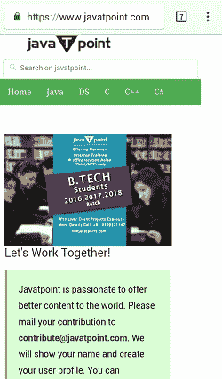
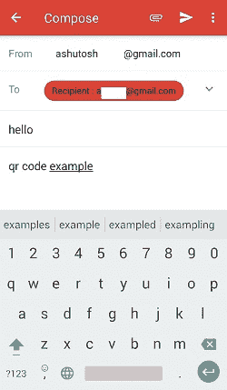

# 安卓二维码/条形码扫描仪

> 原文：<https://www.javatpoint.com/android-qr-code-or-bar-code-scanner>

在安卓应用程序的开发过程中，有时需要提供扫描二维码或条形码的功能。扫描二维码可以通过多种方式编程完成:

*   使用基于网络的应用编程接口解决方案，二维码或条形码上传到服务器，服务器返回结果。
*   使用基于网络的应用程序访问您的相机，扫描二维码或条形码并返回结果。
*   通过集成谷歌游戏服务的移动视觉应用编程接口。

## 安卓二维码扫描仪示例

在这个例子中，我们将扫描网址和电子邮件地址的二维码，并对其采取行动。这里我们将使用 Google Play 服务的**移动视觉 API** 扫描二维码。移动视觉应用编程接口支持以下条形码格式。

*   **1D 条码** : EAN-8、UPC-A、EAN-13、EAN-8、UPC-E、Code-93、Code-128、Code-39、Codabar、ITF。
*   **2D 条码**:二维码，数据矩阵，AZTEC，PDF-417。

创建一个 **activity_main.xml** 并添加以下代码。

### activity_main.xml

```

<?xml version="1.0" encoding="utf-8"?>
<android.support.constraint.ConstraintLayout xmlns:android="http://schemas.android.com/apk/res/android"
    xmlns:app="http://schemas.android.com/apk/res-auto"
    xmlns:tools="http://schemas.android.com/tools"
    android:layout_width="match_parent"
    android:layout_height="match_parent"
    tools:context="example.javatpoint.com.qrcodebarcodescanner.MainActivity">

    <Button
        android:id="@+id/btnScanBarcode"
        android:layout_width="300dp"
        android:layout_height="wrap_content"
        android:layout_centerHorizontal="true"
        android:layout_marginBottom="44dp"
        android:layout_marginEnd="8dp"
        android:layout_marginStart="8dp"
        android:text="@string/scan_barcode"
        app:layout_constraintBottom_toBottomOf="parent"
        app:layout_constraintEnd_toEndOf="parent"
        app:layout_constraintHorizontal_bias="0.676"
        app:layout_constraintStart_toStartOf="parent" />

</android.support.constraint.ConstraintLayout>

```

* * *

创建一个**activity _ scanned _ barcode . XML**布局，并添加以下代码。SurfaceView 小部件用于相机源。

### activity_scanned_barcode.xml

```

<?xml version="1.0" encoding="utf-8"?>
<RelativeLayout xmlns:android="http://schemas.android.com/apk/res/android"
    xmlns:tools="http://schemas.android.com/tools"
    android:layout_width="match_parent"
    android:layout_height="match_parent"
    android:padding="@dimen/activity_horizontal_margin">

    <SurfaceView
        android:id="@+id/surfaceView"
        android:layout_width="match_parent"
        android:layout_height="match_parent"
        android:layout_above="@+id/btnAction"
        android:layout_alignParentLeft="true"
        android:layout_alignParentStart="true"
        android:layout_centerVertical="true" />

    <TextView
        android:id="@+id/txtBarcodeValue"
        android:layout_width="wrap_content"
        android:layout_height="wrap_content"
        android:layout_alignParentTop="true"
        android:layout_marginLeft="@dimen/activity_horizontal_margin"
        android:layout_marginStart="@dimen/activity_horizontal_margin"
        android:text="No Barcode Detected"
        android:textColor="@android:color/white"
        android:textSize="20sp" />

    <Button
        android:id="@+id/btnAction"
        android:layout_width="match_parent"
        android:layout_height="wrap_content"
        android:layout_alignParentBottom="true"
        android:text="ADD CONTENT IN THE MAIL" />
</RelativeLayout>

```

* * *

创建一个 **activity_email.xml** 布局来执行电子邮件操作。

### activity_email.xml

```

<?xml version="1.0" encoding="utf-8"?>
<android.support.constraint.ConstraintLayout xmlns:android="http://schemas.android.com/apk/res/android"
    xmlns:app="http://schemas.android.com/apk/res-auto"
    xmlns:tools="http://schemas.android.com/tools"
    android:layout_width="match_parent"
    android:layout_height="match_parent"
    tools:context="example.javatpoint.com.qrcodebarcodescanner.EmailActivity">

    <Button
        android:id="@+id/btnSendEmail"
        android:layout_width="300dp"
        android:layout_height="wrap_content"
        android:layout_below="@+id/inBody"
        android:layout_centerHorizontal="true"
        android:layout_marginBottom="64dp"
        android:layout_marginEnd="8dp"
        android:layout_marginStart="8dp"
        android:text="@string/send_email"
        app:layout_constraintBottom_toBottomOf="parent"
        app:layout_constraintEnd_toEndOf="parent"
        app:layout_constraintStart_toStartOf="parent" />

    <TextView
        android:id="@+id/txtEmailAddress"
        android:layout_width="match_parent"
        android:layout_height="wrap_content"
        android:layout_alignParentTop="true"
        android:layout_marginBottom="8dp"
        android:layout_marginEnd="8dp"
        android:layout_marginStart="8dp"
        android:layout_marginTop="8dp"
        android:text="Email Address: "
        android:textSize="16dp"
        android:textStyle="bold"
        app:layout_constraintBottom_toTopOf="@+id/inSubject"
        app:layout_constraintEnd_toEndOf="parent"
        app:layout_constraintStart_toStartOf="parent"
        app:layout_constraintTop_toTopOf="parent" />

    <EditText
        android:id="@+id/inSubject"
        android:layout_width="match_parent"
        android:layout_height="wrap_content"
        android:layout_below="@+id/txtEmailAddress"
        android:layout_centerHorizontal="true"
        android:layout_marginEnd="8dp"
        android:layout_marginStart="8dp"
        android:layout_marginTop="88dp"
        android:ems="10"
        android:hint="Subject"
        app:layout_constraintEnd_toEndOf="parent"
        app:layout_constraintStart_toStartOf="parent"
        app:layout_constraintTop_toTopOf="parent" />

    <EditText
        android:id="@+id/inBody"
        android:layout_width="match_parent"
        android:layout_height="wrap_content"
        android:layout_below="@+id/inSubject"
        android:layout_centerHorizontal="true"
        android:layout_marginEnd="8dp"
        android:layout_marginStart="8dp"
        android:layout_marginTop="164dp"
        android:ems="10"
        android:hint="Body"
        app:layout_constraintEnd_toEndOf="parent"
        app:layout_constraintHorizontal_bias="1.0"
        app:layout_constraintStart_toStartOf="parent"
        app:layout_constraintTop_toTopOf="parent" />
</android.support.constraint.ConstraintLayout>

```

* * *

在 **build.gradle** 文件中添加谷歌*移动视觉应用编程接口*。

### build.gradle

```

implementation of 'com.google.android.gms:play-services-vision:11.8.0'

```

* * *

在**MainActivity.java**文件中，添加以下代码。通过点击按钮 btnScanBarcode，它调用*ScannedBarcodeActivity.java*类。

### MainActivity.java

```

package example.javatpoint.com.qrcodebarcodescanner;

import android.content.Intent;
import android.support.v7.app.AppCompatActivity;
import android.os.Bundle;
import android.view.View;
import android.widget.Button;

public class MainActivity extends AppCompatActivity {
    Button  btnScanBarcode;
    @Override
    protected void onCreate(Bundle savedInstanceState) {
        super.onCreate(savedInstanceState);
        setContentView(R.layout.activity_main);
        btnScanBarcode = findViewById(R.id.btnScanBarcode);

        btnScanBarcode.setOnClickListener(new View.OnClickListener() {
            @Override
            public void onClick(View view) {
                startActivity(new Intent(MainActivity.this, ScannedBarcodeActivity.class));
            }
        });
    }
}

```

* * *

在**ScannedBarcodeActivity.java**活动类中，添加以下代码。这门课通过摄像头扫描二维码。在这节课中，我们将生成两个二维码，一个是网页网址，另一个是电子邮件地址。二维码可以从任何二维码生成器网站生成。

### ScannedBarcodeActivity.java

```

package example.javatpoint.com.qrcodebarcodescanner;

import android.Manifest;
import android.content.Intent;
import android.content.pm.PackageManager;
import android.net.Uri;
import android.os.Bundle;
import android.support.v4.app.ActivityCompat;
import android.support.v7.app.AppCompatActivity;
import android.util.SparseArray;
import android.view.SurfaceHolder;
import android.view.SurfaceView;
import android.view.View;
import android.widget.Button;
import android.widget.TextView;
import android.widget.Toast;
import com.google.android.gms.vision.CameraSource;
import com.google.android.gms.vision.Detector;
import com.google.android.gms.vision.barcode.Barcode;
import com.google.android.gms.vision.barcode.BarcodeDetector;
import java.io.IOException;

public class ScannedBarcodeActivity extends AppCompatActivity {

    SurfaceView surfaceView;
    TextView txtBarcodeValue;
    private BarcodeDetector barcodeDetector;
    private CameraSource cameraSource;
    private static final int REQUEST_CAMERA_PERMISSION = 201;
    Button btnAction;
    String intentData = "";
    boolean isEmail = false;

    @Override
    protected void onCreate(Bundle savedInstanceState) {
        super.onCreate(savedInstanceState);
        setContentView(R.layout.activity_scanned_barcode);
        initViews();
    }

    private void initViews() {
        txtBarcodeValue = findViewById(R.id.txtBarcodeValue);
        surfaceView = findViewById(R.id.surfaceView);
        btnAction = findViewById(R.id.btnAction);
        btnAction.setOnClickListener(new View.OnClickListener() {
            @Override
            public void onClick(View v) {
                if (intentData.length() > 0) {
                    if (isEmail)
                        startActivity(new Intent(ScannedBarcodeActivity.this, EmailActivity.class).putExtra("email_address", intentData));
                    else {
                        startActivity(new Intent(Intent.ACTION_VIEW, Uri.parse(intentData)));
                    }
                }
            }
        });
    }

    private void initialiseDetectorsAndSources() {

        Toast.makeText(getApplicationContext(), "Barcode scanner started", Toast.LENGTH_SHORT).show();
        barcodeDetector = new BarcodeDetector.Builder(this)
                .setBarcodeFormats(Barcode.ALL_FORMATS)
                .build();

        cameraSource = new CameraSource.Builder(this, barcodeDetector)
                .setRequestedPreviewSize(1920, 1080)
                .setAutoFocusEnabled(true) //you should add this feature
                .build();

        surfaceView.getHolder().addCallback(new SurfaceHolder.Callback() {
            @Override
            public void surfaceCreated(SurfaceHolder holder) {
                try {
                    if (ActivityCompat.checkSelfPermission(ScannedBarcodeActivity.this, Manifest.permission.CAMERA) == PackageManager.PERMISSION_GRANTED) {
                        cameraSource.start(surfaceView.getHolder());
                    } else {
                        ActivityCompat.requestPermissions(ScannedBarcodeActivity.this, new
                                String[]{Manifest.permission.CAMERA}, REQUEST_CAMERA_PERMISSION);
                    }

                } catch (IOException e) {
                    e.printStackTrace();
                }
            }

            @Override
            public void surfaceChanged(SurfaceHolder holder, int format, int width, int height) {
            }

            @Override
            public void surfaceDestroyed(SurfaceHolder holder) {
                cameraSource.stop();
            }
        });

        barcodeDetector.setProcessor(new Detector.Processor<Barcode>() {
            @Override
            public void release() {
                Toast.makeText(getApplicationContext(), "To prevent memory leaks barcode scanner has been stopped", Toast.LENGTH_SHORT).show();
            }

            @Override
            public void receiveDetections(Detector.Detections<Barcode> detections) {
                final SparseArray<Barcode> barcodes = detections.getDetectedItems();
                if (barcodes.size() != 0) {
                    txtBarcodeValue.post(new Runnable() {
                        @Override
                        public void run() {

                            if (barcodes.valueAt(0).email != null) {
                                txtBarcodeValue.removeCallbacks(null);
                                intentData = barcodes.valueAt(0).email.address;
                                txtBarcodeValue.setText(intentData);
                                isEmail = true;
                                btnAction.setText("ADD CONTENT TO THE MAIL");
                            } else {
                                isEmail = false;
                                btnAction.setText("LAUNCH URL");
                                intentData = barcodes.valueAt(0).displayValue;
                                txtBarcodeValue.setText(intentData);
                            }
                        }
                    });
                }
            }
        });
    }

    @Override
    protected void onPause() {
        super.onPause();
        cameraSource.release();
    }

    @Override
    protected void onResume() {
        super.onResume();
        initialiseDetectorsAndSources();
    }
}

```

* * *

在**EmailActivity.java**类中，添加以下代码。这个类执行向二维码中提到的地址发送电子邮件的任务。

### EmailActivity.java

```

package example.javatpoint.com.qrcodebarcodescanner;

import android.content.Intent;
import android.os.Bundle;
import android.support.v7.app.AppCompatActivity;
import android.view.View;
import android.widget.Button;
import android.widget.EditText;
import android.widget.TextView;

public class EmailActivity extends AppCompatActivity implements View.OnClickListener {

    EditText inSubject, inBody;
    TextView txtEmailAddress;
    Button btnSendEmail;

    @Override
    protected void onCreate(Bundle savedInstanceState) {
        super.onCreate(savedInstanceState);
        setContentView(R.layout.activity_email);
        initViews();
    }

    private void initViews() {
        inSubject = findViewById(R.id.inSubject);
        inBody = findViewById(R.id.inBody);
        txtEmailAddress = findViewById(R.id.txtEmailAddress);
        btnSendEmail = findViewById(R.id.btnSendEmail);

        if (getIntent().getStringExtra("email_address") != null) {
            txtEmailAddress.setText("Recipient : " + getIntent().getStringExtra("email_address"));
        }

        btnSendEmail.setOnClickListener(new View.OnClickListener() {
            @Override
            public void onClick(View v) {
                Intent intent = new Intent(Intent.ACTION_SEND);
                intent.setType("text/plain");
                intent.putExtra(Intent.EXTRA_EMAIL, new String[]{txtEmailAddress.getText().toString()});
                intent.putExtra(Intent.EXTRA_SUBJECT, inSubject.getText().toString().trim());
                intent.putExtra(Intent.EXTRA_TEXT, inBody.getText().toString().trim());

                startActivity(Intent.createChooser(intent, "Send Email"));
            }
        });
    }

    @Override
    public void onClick(View v) {

        switch (v.getId()) {
            case R.id.btnScanBarcode:
                startActivity(new Intent(EmailActivity.this, ScannedBarcodeActivity.class));
                break;
        }
    }
}

```

* * *

在 **AndroidMenifest.xml** 文件中添加以下代码。

### androidmenifest . java

```

<?xml version="1.0" encoding="utf-8"?>
<manifest xmlns:android="http://schemas.android.com/apk/res/android"
    package="example.javatpoint.com.qrcodebarcodescanner">

    <uses-feature
        android:name="android.hardware.camera"
        android:required="true" />

    <uses-permission android:name="android.permission.CAMERA" />
    <uses-feature android:name="android.hardware.camera.autofocus" />
    <uses-permission android:name="android.permission.WRITE_EXTERNAL_STORAGE" />
    <uses-permission android:name="android.permission.INTERNET" />

    <application
        android:allowBackup="true"
        android:icon="@mipmap/ic_launcher"
        android:label="@string/app_name"
        android:roundIcon="@mipmap/ic_launcher_round"
        android:supportsRtl="true"
        android:theme="@style/AppTheme">
        <activity android:name=".MainActivity">
            <intent-filter>
                <action android:name="android.intent.action.MAIN" />

                <category android:name="android.intent.category.LAUNCHER" />
            </intent-filter>
        </activity>

        <activity android:name=".ScannedBarcodeActivity" />
        <activity
            android:name=".EmailActivity"
            android:windowSoftInputMode="adjustPan" />
    </application>

</manifest>

```

**输出:**

      

* * *