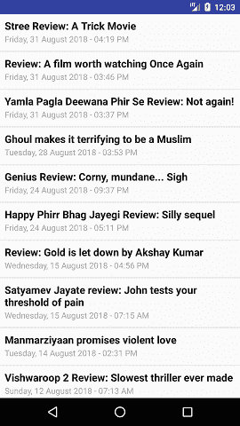

# 安卓 RSS 源阅读器

> 原文：<https://www.javatpoint.com/android-rss-feed-reader>

**RSS** 代表**丰富站点摘要**。它用于阅读博客或网站内容的最新更新。RSS 提要主要用于阅读博客(时事通讯)的摘要。RSS 源的内容以 XML 格式提供。

RSS 阅读器的 XML 格式包含以下标签。

```

<channel>
    <title></title>
    <link></link>
    <description></description>
    <item>
        <title></title>
        <link></link>
        <pubDate></pubDate>
        <description></description>
    </item>
    <item>
    .
    .
    .
    .
    </item>
</channel>

```

在本教程中，我们将使用安卓 RSS 提要阅读器阅读网站(Rediff.com 和 Cinemablend.com)的内容。内容显示在安卓的列表视图中，点击这些项目将加载它们各自的网址。

## 安卓 RSS 源阅读器示例

用下面的代码创建一个活动**MainActivity.java**。点击这个活动的按钮，重定向到 RSSFeedActivity.java 类，加载给定网址的内容。

### activity_main.xml

```

<?xml version="1.0" encoding="utf-8"?>
<RelativeLayout xmlns:android="http://schemas.android.com/apk/res/android"
    android:layout_width="match_parent"
    android:layout_height="match_parent">

    <Button
        android:id="@+id/btnRediff"
        android:layout_width="300dp"
        android:layout_height="wrap_content"
        android:layout_alignParentBottom="true"
        android:layout_centerHorizontal="true"
        android:layout_marginBottom="101dp"
        android:text="REDIFF RSS FEED" />

    <Button
        android:id="@+id/btnCinemaBlend"
        android:layout_width="300dp"
        android:layout_height="wrap_content"
        android:layout_alignLeft="@+id/btnRediff"
        android:layout_alignParentBottom="true"
        android:layout_alignStart="@+id/btnRediff"
        android:layout_marginBottom="28dp"
        android:text="CINEMA BLEND RSS FEED" />
</RelativeLayout>

```

* * *

### MainActivity.java

```

package example.javatpoint.com.androidrssfeed;

import android.support.v7.app.AppCompatActivity;
import android.os.Bundle;
import android.content.Intent;
import android.view.View;
import android.widget.Button;
import java.util.ArrayList;

public class MainActivity extends AppCompatActivity implements View.OnClickListener {

    ArrayList<String> rssLinks = new ArrayList<>();
    @Override
    protected void onCreate(Bundle savedInstanceState) {
        super.onCreate(savedInstanceState);
        setContentView(R.layout.activity_main);

        Button btnRediff = findViewById(R.id.btnRediff);
        Button btnCinemaBlend = findViewById(R.id.btnCinemaBlend);
        btnRediff.setOnClickListener(this);
        btnCinemaBlend.setOnClickListener(this);
        rssLinks.add("http://www.rediff.com/rss/moviesreviewsrss.xml");
        rssLinks.add("http://www.cinemablend.com/rss_review.php");
    }

    @Override
    public void onClick(View view) {
        Intent intent = new Intent(getApplicationContext(), RSSFeedActivity.class);
        switch (view.getId()) {
            case R.id.btnRediff:
                intent.putExtra("rssLink", rssLinks.get(0));
                startActivity(intent);
                break;
            case R.id.btnCinemaBlend:
                intent.putExtra("rssLink", rssLinks.get(1));
                startActivity(intent);
                break;
        }
    }
}

```

* * *

创建一个布局 **rss_item_list_row.xml** ，其中包含在 rss 提要中显示的新闻稿字段(页面网址、标题、发布日期)。

### rss_item_list_row.xml

```

<?xml version="1.0" encoding="utf-8"?>
<RelativeLayout xmlns:android="http://schemas.android.com/apk/res/android"
    android:layout_width="match_parent"
    android:layout_height="match_parent"
    android:padding="8dip">

    <TextView
        android:id="@+id/page_url"
        android:layout_width="fill_parent"
        android:layout_height="wrap_content"
        android:visibility="gone" />

    <TextView
        android:id="@+id/title"
        android:layout_width="fill_parent"
        android:layout_height="wrap_content"
        android:paddingBottom="1dip"
        android:textColor="#212121"
        android:textSize="18sp"
        android:textStyle="bold" />

    <TextView
        android:id="@+id/pub_date"
        android:layout_width="wrap_content"
        android:layout_height="wrap_content"
        android:layout_below="@id/title"
        android:paddingBottom="3dip"
        android:textColor="#9b737775"
        android:textSize="14sp" />

</RelativeLayout>

```

* * *

### RSSItem.java

```

package example.javatpoint.com.androidrssfeed;

public class RSSItem {
    public String title;
    public String link;
    public String description;
    public String pubdate;
    public String guid;

    public RSSItem(String title, String link, String description, String pubdate, String guid) {
        this.title = title;
        this.link = link;
        this.description = description;
        this.pubdate = pubdate;
        this.guid = guid;
    }
}

```

* * *

创建**RSSParser.java**类，在这个类中；我们将使用 DocumentBuilderFactory 类的实例来解析 XML 文档。

### RSSParser.java

```

package example.javatpoint.com.androidrssfeed;

import android.util.Log;
import org.apache.http.HttpEntity;
import org.apache.http.HttpResponse;
import org.apache.http.client.ClientProtocolException;
import org.apache.http.client.methods.HttpGet;
import org.apache.http.impl.client.DefaultHttpClient;
import org.apache.http.util.EntityUtils;
import org.w3c.dom.Document;
import org.w3c.dom.Element;
import org.w3c.dom.Node;
import org.w3c.dom.NodeList;
import org.xml.sax.InputSource;
import org.xml.sax.SAXException;

import java.io.IOException;
import java.io.StringReader;
import java.io.UnsupportedEncodingException;
import java.util.ArrayList;
import java.util.List;

import javax.xml.parsers.DocumentBuilder;
import javax.xml.parsers.DocumentBuilderFactory;
import javax.xml.parsers.ParserConfigurationException;

public class RSSParser {

    // RSS XML document CHANNEL tag
    private static String TAG_CHANNEL = "channel";
    private static String TAG_TITLE = "title";
    private static String TAG_LINK = "link";
    private static String TAG_DESRIPTION = "description";
    private static String TAG_ITEM = "item";
    private static String TAG_PUB_DATE = "pubDate";
    private static String TAG_GUID = "guid";

    public RSSParser() {
    }

    public List<RSSItem> getRSSFeedItems(String rss_url) {
        List<RSSItem> itemsList = new ArrayList<RSSItem>();
        String rss_feed_xml;

        rss_feed_xml = this.getXmlFromUrl(rss_url);
        if (rss_feed_xml != null) {
            try {
                Document doc = this.getDomElement(rss_feed_xml);
                NodeList nodeList = doc.getElementsByTagName(TAG_CHANNEL);
                Element e = (Element) nodeList.item(0);

                NodeList items = e.getElementsByTagName(TAG_ITEM);
                for (int i = 0; i < items.getLength(); i++) {
                    Element e1 = (Element) items.item(i);

                    String title = this.getValue(e1, TAG_TITLE);
                    String link = this.getValue(e1, TAG_LINK);
                    String description = this.getValue(e1, TAG_DESRIPTION);
                    String pubdate = this.getValue(e1, TAG_PUB_DATE);
                    String guid = this.getValue(e1, TAG_GUID);

                    RSSItem rssItem = new RSSItem(title, link, description, pubdate, guid);
                    // adding item to list
                    itemsList.add(rssItem);
                }
            } catch (Exception e) {
                // Check log for errors
                e.printStackTrace();
            }
        }
        return itemsList;
    }

    public String getXmlFromUrl(String url) {
        String xml = null;
        try {
            DefaultHttpClient httpClient = new DefaultHttpClient();
            HttpGet httpGet = new HttpGet(url);
            HttpResponse httpResponse = httpClient.execute(httpGet);
            HttpEntity httpEntity = httpResponse.getEntity();
            xml = EntityUtils.toString(httpEntity);
        } catch (UnsupportedEncodingException e) {
            e.printStackTrace();
        } catch (ClientProtocolException e) {
            e.printStackTrace();
        } catch (IOException e) {
            e.printStackTrace();
        }
        return xml;
    }

    public Document getDomElement(String xml) {
        Document doc = null;
        DocumentBuilderFactory dbf = DocumentBuilderFactory.newInstance();
        try {

            DocumentBuilder db = dbf.newDocumentBuilder();
            InputSource is = new InputSource();
            is.setCharacterStream(new StringReader(xml));
            doc = db.parse(is);
        } catch (ParserConfigurationException e) {
            Log.e("Error: ", e.getMessage());
            return null;
        } catch (SAXException e) {
            Log.e("Error: ", e.getMessage());
            return null;
        } catch (IOException e) {
            Log.e("Error: ", e.getMessage());
            return null;
        }
        return doc;
    }

    public final String getElementValue(Node elem) {
        Node child;
        if (elem != null) {
            if (elem.hasChildNodes()) {
                for (child = elem.getFirstChild(); child != null; child = child
                        .getNextSibling()) {
                    if (child.getNodeType() == Node.TEXT_NODE || (child.getNodeType() == Node.CDATA_SECTION_NODE)) {
                        return child.getNodeValue();
                    }
                }
            }
        }
        return "";
    }

    public String getValue(Element item, String str) {
        NodeList n = item.getElementsByTagName(str);
        return this.getElementValue(n.item(0));
    }
}

```

* * *

现在，用下面的代码创建一个活动**RSSFeedActivity.java**。这个类使用 AsyncTask 类从后台的网址加载 RSS 源的项目。

### activity_rssfeed.xml

```

<?xml version="1.0" encoding="utf-8"?>
<RelativeLayout xmlns:android="http://schemas.android.com/apk/res/android"
    android:layout_width="match_parent"
    android:layout_height="match_parent"
    android:id="@+id/relativeLayout"
    android:orientation="vertical">

    <ListView
        android:id="@android:id/list"
        android:layout_width="match_parent"
        android:layout_height="wrap_content"
        android:dividerHeight="1dp" />
</RelativeLayout>

```

* * *

### RSSFeedActivity.java

```

package example.javatpoint.com.androidrssfeed;

import android.app.ListActivity;
import android.content.Intent;
import android.os.AsyncTask;
import android.os.Bundle;
import android.view.View;
import android.widget.AdapterView;
import android.widget.ListAdapter;
import android.widget.ListView;
import android.widget.ProgressBar;
import android.widget.RelativeLayout;
import android.widget.SimpleAdapter;
import android.widget.TextView;
import android.widget.Toast;

import java.text.ParseException;
import java.text.SimpleDateFormat;
import java.util.ArrayList;
import java.util.Date;
import java.util.HashMap;
import java.util.List;
import java.util.Locale;

public class RSSFeedActivity extends ListActivity {

    private ProgressBar pDialog;
    ArrayList<HashMap<String, String>> rssItemList = new ArrayList<>();
    RSSParser rssParser = new RSSParser();
    List<RSSItem> rssItems = new ArrayList<>();
    private static String TAG_TITLE = "title";
    private static String TAG_LINK = "link";
    private static String TAG_PUB_DATE = "pubDate";

    @Override
    public void onCreate(Bundle savedInstanceState) {
        super.onCreate(savedInstanceState);
        setContentView(R.layout.activity_rssfeed);

        String rss_link = getIntent().getStringExtra("rssLink");
        new LoadRSSFeedItems().execute(rss_link);
        ListView lv = getListView();

        lv.setOnItemClickListener(new AdapterView.OnItemClickListener() {

            public void onItemClick(AdapterView<?> parent, View view,
                                    int position, long id) {
                Intent in = new Intent(getApplicationContext(), WebActivity.class);
                String page_url = ((TextView) view.findViewById(R.id.page_url)).getText().toString().trim();
                in.putExtra("url", page_url);
                startActivity(in);
            }
        });
    }

    public class LoadRSSFeedItems extends AsyncTask<String, String, String> {

        @Override
        protected void onPreExecute() {
            super.onPreExecute();
            pDialog = new ProgressBar(RSSFeedActivity.this, null, android.R.attr.progressBarStyleLarge);
            RelativeLayout relativeLayout = findViewById(R.id.relativeLayout);
            RelativeLayout.LayoutParams layoutParams = new RelativeLayout.LayoutParams(
                    RelativeLayout.LayoutParams.WRAP_CONTENT,
                    RelativeLayout.LayoutParams.WRAP_CONTENT
            );

            layoutParams.addRule(RelativeLayout.CENTER_IN_PARENT);
            pDialog.setLayoutParams(layoutParams);
            pDialog.setVisibility(View.VISIBLE);
            relativeLayout.addView(pDialog);
        }

        @Override
        protected String doInBackground(String... args) {
            // rss link url
            String rss_url = args[0];
            // list of rss items
            rssItems = rssParser.getRSSFeedItems(rss_url);
            // looping through each item
            for (final RSSItem item : rssItems) {
                // creating new HashMap
                if (item.link.toString().equals(""))
                    break;
                HashMap<String, String> map = new HashMap<String, String>();

                // adding each child node to HashMap key => value
                String givenDateString = item.pubdate.trim();
                SimpleDateFormat sdf = new SimpleDateFormat("EEE, d MMM yyyy HH:mm:ss Z");
                try {
                    Date mDate = sdf.parse(givenDateString);
                    SimpleDateFormat sdf2 = new SimpleDateFormat("EEEE, dd MMMM yyyy - hh:mm a", Locale.US);
                    item.pubdate = sdf2.format(mDate);

                } catch (ParseException e) {
                    e.printStackTrace();

                }

                map.put(TAG_TITLE, item.title);
                map.put(TAG_LINK, item.link);
                map.put(TAG_PUB_DATE, item.pubdate);
                // adding HashList to ArrayList
                rssItemList.add(map);
            }

            // updating UI from Background Thread
            runOnUiThread(new Runnable() {
                public void run() {
                    ListAdapter adapter = new SimpleAdapter(
                            RSSFeedActivity.this,
                            rssItemList, R.layout.rss_item_list_row,
                            new String[]{TAG_LINK, TAG_TITLE, TAG_PUB_DATE},
                            new int[]{R.id.page_url, R.id.title, R.id.pub_date});

                    // updating listview
                    setListAdapter(adapter);
                }
            });
            return null;
        }

        protected void onPostExecute(String args) {
            pDialog.setVisibility(View.GONE); 
        }
    }
}

```

* * *

创建一个包含网络视图的活动**WebActivity.java**，加载上一个活动中点击的链接的内容。

### activity_web.xml

```

<?xml version="1.0" encoding="utf-8"?>
<RelativeLayout xmlns:android="http://schemas.android.com/apk/res/android"
    android:layout_width="match_parent"
    android:id="@+id/relativeLayout"
    android:layout_height="match_parent">

    <android.support.v4.widget.NestedScrollView
        android:layout_width="match_parent"
        android:layout_height="match_parent">

        <WebView
            android:id="@+id/webView"
            android:layout_width="match_parent"
            android:layout_height="match_parent" />

    </android.support.v4.widget.NestedScrollView>
</RelativeLayout>

```

* * *

### WebActivity.java

```

package example.javatpoint.com.androidrssfeed;

import android.content.Context;
import android.content.Intent;
import android.graphics.Bitmap;
import android.os.Bundle;
import android.support.v7.app.AppCompatActivity;
import android.text.TextUtils;
import android.webkit.WebChromeClient;
import android.webkit.WebResourceError;
import android.webkit.WebResourceRequest;
import android.webkit.WebView;
import android.webkit.WebViewClient;
import android.widget.Toast;

public class WebActivity extends AppCompatActivity {

    WebView webView;
    String url;

    @Override
    public void onCreate(Bundle savedInstanceState) {
        super.onCreate(savedInstanceState);
        setContentView(R.layout.activity_web);
        Intent in = getIntent();
        url = in.getStringExtra("url");
        if (TextUtils.isEmpty(url)) {
            Toast.makeText(getApplicationContext(), "URL not found", Toast.LENGTH_SHORT).show();
            finish();
        }
        webView = findViewById(R.id.webView);
        initWebView();
        webView.loadUrl(url);
    }

    private void initWebView() {
        webView.setWebChromeClient(new MyWebChromeClient(this));
        webView.clearCache(true);
        webView.getSettings().setJavaScriptEnabled(true);
        webView.setHorizontalScrollBarEnabled(false);
        webView.setWebViewClient(new WebViewClient() {
            @Override
            public void onPageStarted(WebView view, String url, Bitmap favicon) {
                super.onPageStarted(view, url, favicon);
            }
            @Override
            public boolean shouldOverrideUrlLoading(WebView view, String url) {
                webView.loadUrl(url);
                return true;
            }
            @Override
            public void onPageFinished(WebView view, String url) {
                super.onPageFinished(view, url);
            }
            @Override
            public void onReceivedError(WebView view, WebResourceRequest request, WebResourceError error) {
                super.onReceivedError(view, request, error);
                invalidateOptionsMenu();
            }
        });
        webView.clearCache(true);
        webView.clearHistory();
        webView.getSettings().setJavaScriptEnabled(true);
        webView.setHorizontalScrollBarEnabled(false);
    }

    private class MyWebChromeClient extends WebChromeClient {
        Context context;
        public MyWebChromeClient(Context context) {
            super();
            this.context = context;
        }
    }
}

```

* * *

### 需要权限

在 **AndroidMenifest.xml** 文件中添加互联网权限。

```

<uses-permission android:name="android.permission.INTERNET" />

```

**输出:**

  

* * *