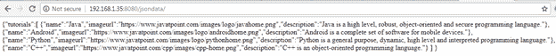
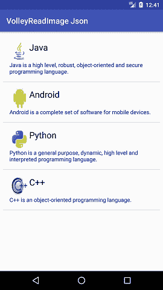

# 截击库从网址获取 JSON 数据

> 原文：<https://www.javatpoint.com/volley-library-fetching-json-data-from-url>

在本教程中，我们将使用凌空库从网址中获取 JSON 数据。凌空是一个 *HTTP* 库，它为我们的应用程序的网络连接提供了便利。

使用凌空库的优势如下:

*   更舒适、更快速的请求管理。
*   它提供了高效的网络管理。

## 安卓截击从网址获取 JSON 数据示例

在这个例子中，我们将使用凌空库从网址加载 JSON 数据。JSON 数据包含教程的字符串**“名称”**、字符串**“imageurl”**和字符串**“描述”**。从网址获取数据后，它们显示在列表视图中。您可以在[https://www.javatpoint.com/android-json-parsing-tutorial](https://www.javatpoint.com/android-json-parsing-tutorial)查阅更多关于 JSON 解析的教程。

让我们创建一个包含以下信息的 JSON 数据。

网址处的 JSON 数据(提供您的信息网址)= http://192 . 168 . 1 . 35:8080/JSON data/

```

{
"tutorials":[
{
"name":"Java",
"imageurl":"https://www.javatpoint.com/images/logo/javahome.png",
"description":"Java is a high level, robust, object-oriented and secure programming language."
},
{
"name":"Android",
"imageurl":"https://www.javatpoint.com/images/logo/androidhome.png",
"description":"Android is a complete set of software for mobile devices."
},
{
"name":"Python",
"imageurl":"https://www.javatpoint.com/images/logo/pythonhome.png",
"description":"Python is a general purpose, dynamic, high level and interpreted programming language."
},
{
"name":"C++",
"imageurl":"https://www.javatpoint.com/cpp/images/cpp-home.png",
"description":"C++ is an object-oriented programming language."
}
]
}

```

JSON 数据如下所示:



* * *

在布局中创建一个 **activity_main.xml** ，并添加以下代码。

### activity_main.xml

```

<?xml version="1.0" encoding="utf-8"?>
<android.support.constraint.ConstraintLayout xmlns:android="http://schemas.android.com/apk/res/android"
    xmlns:app="http://schemas.android.com/apk/res-auto"
    xmlns:tools="http://schemas.android.com/tools"
    android:layout_width="match_parent"
    android:layout_height="match_parent"
    tools:context="example.javatpoint.com.volleyreadimagejson.MainActivity">

    <ListView
        android:id="@+id/listView"
        android:layout_width="match_parent"
        android:layout_height="match_parent"
        android:layout_marginBottom="8dp"
        android:layout_marginEnd="8dp"
        android:layout_marginStart="8dp"
        android:layout_marginTop="8dp"
        app:layout_constraintBottom_toBottomOf="parent"
        app:layout_constraintEnd_toEndOf="parent"
        app:layout_constraintStart_toStartOf="parent"
        app:layout_constraintTop_toTopOf="parent" />

    <ProgressBar
        android:id="@+id/progressBar"
        android:layout_width="wrap_content"
        android:layout_height="wrap_content"
        android:layout_centerHorizontal="true"
        android:layout_centerVertical="true"
        android:layout_marginBottom="292dp"
        android:layout_marginEnd="8dp"
        android:layout_marginStart="8dp"
        android:layout_marginTop="8dp"
        android:visibility="gone"
        app:layout_constraintBottom_toBottomOf="parent"
        app:layout_constraintEnd_toEndOf="parent"
        app:layout_constraintStart_toStartOf="parent"
        app:layout_constraintTop_toTopOf="parent" />

</android.support.constraint.ConstraintLayout>

```

* * *

现在，在布局目录中创建一个包含列表视图行项目的 **list_item.xml** 文件。其中包含一个用于图像显示的图像视图和两个用于文本显示的文本视图。

### list_item.xml

```

<?xml version="1.0" encoding="utf-8"?>
<LinearLayout xmlns:android="http://schemas.android.com/apk/res/android"
    android:layout_width="match_parent"
    android:layout_height="match_parent"
    android:padding="16dp"
    android:orientation="vertical">
    <LinearLayout
        android:layout_width="match_parent"
        android:layout_height="match_parent"
        android:orientation="horizontal">
        <ImageView
            android:id="@+id/imageView"
            android:layout_width="50dp"
            android:layout_height="50dp"
            android:src="@drawable/placeholder"
            android:contentDescription="image view" />
        <TextView
            android:id="@+id/textViewName"
            android:layout_width="match_parent"
            android:layout_height="wrap_content"
            android:text="title"
            android:textAppearance="@style/Base.TextAppearance.AppCompat.Large" />
    </LinearLayout>

    <TextView
        android:id="@+id/textViewImageUrl"
        android:layout_width="match_parent"
        android:layout_height="wrap_content"
        android:text="url"
        android:autoLink="web"
        android:textColor="#08308e" />

</LinearLayout>

```

* * *

创建一个名为**Tutorial.java**的数据模型类，信息字符串“名称”，字符串“imageurl”和字符串“描述”。

### 教程. java

```

package example.javatpoint.com.volleyreadimagejson;

public class Tutorial {
    String name, imageUrl, description;

    public Tutorial(String name, String imageUrl, String description) {
        this.name = name;
        this.imageUrl = imageUrl;
        this.description = description;
    }
    public String getName() {
        return name;
    }
    public String getImageUrl() {
        return imageUrl;
    }
    public String getDescription() {
        return description;
    }
}

```

* * *

创建一个名为**MyAdapter.java**的自定义适配器类，并扩展*数组适配器*来处理自定义列表视图。在这个类中，我们称一个匿名类为新的*图像下载任务*。执行(imageUrl)从 Url 下载图像。

### MyAdapter.java

```

package example.javatpoint.com.volleyreadimagejson;

import android.app.ProgressDialog;
import android.content.Context;
import android.graphics.Bitmap;
import android.view.LayoutInflater;
import android.view.View;
import android.view.ViewGroup;
import android.widget.ArrayAdapter;
import android.widget.ImageView;
import android.widget.TextView;
import java.util.List;

public class MyAdapter extends ArrayAdapter {
    //the tutorial list that will be displayed
    private List <tutorial>tutorialList;
    private Bitmap bitmap;
    private Context mCtx;
    //here we are getting the tutoriallist and context
    //so while creating the object of this adapter class we need to give tutoriallist and context
    public MyAdapter(List <tutorial>tutorialList, Context mCtx) {
        super(mCtx, R.layout.list_item, tutorialList);
        this.tutorialList = tutorialList;
        this.mCtx = mCtx;
    }

    //this method will return the list item
    @Override
    public View getView(int position, View convertView, ViewGroup parent) {
        //getting the layoutinflater
        ViewHolder holder;
        LayoutInflater inflater = LayoutInflater.from(mCtx);
        convertView = inflater.inflate(R.layout.list_item, null, true);
        holder = new ViewHolder();
        //getting text views
        holder.textViewName = convertView.findViewById(R.id.textViewName);
        holder.textDescription = convertView.findViewById(R.id.textViewImageUrl);
        holder.imageView = convertView.findViewById(R.id.imageView);

        convertView.setTag(holder);
        //Getting the tutorial for the specified position
        Tutorial tutorial = tutorialList.get(position);
        String imageUrl = tutorial.getImageUrl();
        String tutorialDescription = tutorial.getDescription();
        String tutorialTitle = tutorial.getName();

        holder.textViewName.setText(tutorialTitle);
        holder.textDescription.setText(tutorialDescription);

        if (holder.imageView != null) {
            /*-------------fatching image------------*/;
            new ImageDownloaderTask(holder.imageView).execute(imageUrl);
        }
        holder.imageView.setImageBitmap(bitmap);
        return convertView;
    }
    static class ViewHolder {
        TextView textViewName;
        TextView textDescription;
        ImageView imageView;
    }
}</tutorial></tutorial> 
```

* * *

在 **build.gradle** 文件中添加以下库文件。

### build.gradle

```

android {
	useLibrary 'org.apache.http.legacy'
}

dependencies {
compile 'com.android.volley:volley:1.0.0'
compile 'org.apache.httpcomponents:httpcore:4.4.1'
compile 'org.apache.httpcomponents:httpclient:4.5'
}

```

* * *

创建一个匿名类**ImageDownloaderTask.java**，它扩展了一个匿名类< >。这个类在执行 doInbackground()方法时从 URL 下载(或获取)图像，并将结果(位图)返回到 onPostExecute()。在 onPostExecute()方法中，位图被设置为 ImageView。

### 图像下载器任务.java

```

package example.javatpoint.com.volleyreadimagejson;

import java.io.InputStream;
import java.lang.ref.WeakReference;
import java.net.HttpURLConnection;
import java.net.URL;
import org.apache.http.HttpStatus;
import android.graphics.Bitmap;
import android.graphics.BitmapFactory;
import android.graphics.drawable.Drawable;
import android.os.AsyncTask;
import android.util.Log;
import android.widget.ImageView;

public class ImageDownloaderTask extends AsyncTask {

    private final WeakReference <imageview>imageViewReference;
    public ImageDownloaderTask(ImageView imageView) {
        imageViewReference = new WeakReference<imageview>(imageView);
    }
    @Override
    protected Bitmap doInBackground(String... params) {
        return downloadBitmap(params[0]);
    }
    @Override
    protected void onPostExecute(Bitmap bitmap) {
        if (isCancelled()) {
            bitmap = null;
        }
        if (imageViewReference != null) {
            ImageView imageView = imageViewReference.get();
            if (imageView != null) {
                if (bitmap != null) {
                    imageView.setImageBitmap(bitmap);
                } else {
                    Drawable placeholder = imageView.getContext().getResources().getDrawable(R.drawable.placeholder);
                    imageView.setImageDrawable(placeholder);
                }
            }
        }
    }

    private Bitmap downloadBitmap(String imageUrl) {
        HttpURLConnection urlConnection = null;
        try {
            URL uri = new URL(imageUrl);
            urlConnection = (HttpURLConnection) uri.openConnection();

            int statusCode = urlConnection.getResponseCode();
            if (statusCode != HttpStatus.SC_OK) {
                return null;
            }
            InputStream inputStream = urlConnection.getInputStream();
            if (inputStream != null) {
                Bitmap bitmap = BitmapFactory.decodeStream(inputStream);
                return bitmap;
            }
        }
        catch (Exception e) {
            urlConnection.disconnect();
            Log.w("ImageDownloader", "Error downloading image from " + imageUrl);
        }
        finally {
            if (urlConnection != null) {
                urlConnection.disconnect();
            }
        }
        return null;
    }
}</imageview></imageview> 
```

* * *

在**MainActivity.java**类中，我们使用凌空从网址中获取并解析 JSON 数据。

### MainActivity.java

```

package example.javatpoint.com.volleyreadimagejson;

import android.support.v7.app.AppCompatActivity;
import android.os.Bundle;
import android.view.View;
import android.widget.ListView;
import android.widget.ProgressBar;
import android.widget.Toast;
import com.android.volley.Request;
import com.android.volley.RequestQueue;
import com.android.volley.Response;
import com.android.volley.VolleyError;
import com.android.volley.toolbox.StringRequest;
import com.android.volley.toolbox.Volley;
import org.json.JSONArray;
import org.json.JSONException;
import org.json.JSONObject;
import java.util.ArrayList;
import java.util.List;

public class MainActivity extends AppCompatActivity {

    ListView listView;
    private static final String JSON_URL = "http://192.168.1.35:8080/jsondata/";
    //the tutorial list where we will store all the tutorial objects after parsing json
    List tutorialList;

    @Override
    protected void onCreate(Bundle savedInstanceState) {
        super.onCreate(savedInstanceState);
        setContentView(R.layout.activity_main);

        listView = (ListView) findViewById(R.id.listView);
        tutorialList = new ArrayList<>();
        //this method will fetch and parse the data
        loadTutorialList();
    }

    private void loadTutorialList() {
        //getting the progressbar
        final ProgressBar progressBar = (ProgressBar) findViewById(R.id.progressBar);
        progressBar.setVisibility(View.VISIBLE);

        //creating a string request to send request to the url
        StringRequest stringRequest = new StringRequest(Request.Method.GET, JSON_URL,
                new Response.Listener<string>() {
                    @Override
                    public void onResponse(String response) {
                        //hiding the progressbar after completion
                        progressBar.setVisibility(View.INVISIBLE);

                        try {
                            //getting the whole json object from the response
                            JSONObject obj = new JSONObject(response);

                            //we have the array named tutorial inside the object
                            //so here we are getting that json array
                            JSONArray tutorialsArray = obj.getJSONArray("tutorials");

                            //now looping through all the elements of the json array
                            for (int i = 0; i < tutorialsArray.length(); i++) {
                                //getting the json object of the particular index inside the array
                                JSONObject tutorialsObject = tutorialsArray.getJSONObject(i);

                                //creating a tutorial object and giving them the values from json object
                                Tutorial tutorial = new Tutorial(tutorialsObject.getString("name"), tutorialsObject.getString("imageurl"),tutorialsObject.getString("description"));

                                //adding the tutorial to tutoriallist
                                tutorialList.add(tutorial);
                            }

                            //creating custom adapter object
                            MyAdapter adapter = new MyAdapter(tutorialList, getApplicationContext());

                            //adding the adapter to listview
                            listView.setAdapter(adapter);

                        } catch (JSONException e) {
                            e.printStackTrace();
                        }
                    }
                },
                new Response.ErrorListener() {
                    @Override
                    public void onErrorResponse(VolleyError error) {
                        //displaying the error in toast if occur
                        Toast.makeText(getApplicationContext(), error.getMessage(), Toast.LENGTH_SHORT).show();
                    }
                });

        //creating a request queue
        RequestQueue requestQueue = Volley.newRequestQueue(this);

        //adding the string request to request queue
        requestQueue.add(stringRequest);
    }
}</string> 
```

在 AndroidManifest.xml 中添加互联网权限

* * *

### AndroidManifest.xml

```

<uses-permission android:name="android.permission.INTERNET" />

```

**输出:**

