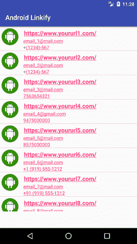

# 安卓链接示例

> 原文：<https://www.javatpoint.com/android-linkify-example>

**链接**类用于从*文本视图*或 Spannable 创建链接。它基于文本值和正则表达式的模式匹配，将文本和正则表达式转换为可点击的链接。Linkify 类通过使用模式为网址、电子邮件地址、电话号码和地图地址创建链接。

安卓可点击链接可以通过两种不同的方式创建:

1.使用布局(。xml)文件:它使用具有指定类型的 autoLink 属性。

```

<TextView
     android:id="@+id/url"
            android:autoLink="web"/>

```

2.使用 Java 类:它对指定类型的 Linkify 类使用 addlLinks()方法。

```

TextView webURL = new TextView(this);
webURL.setText("https://www.yoururl1.com/");
Linkify.addLinks(webURL , Linkify.WEB_URLS);

```

## 安卓链接示例

在这个例子中，我们将为网址、电子邮件地址和电话号码创建链接。在布局目录中创建一个 **activity_main.xml** 文件，并添加以下代码。

### activity_main.xml

```

<?xml version="1.0" encoding="utf-8"?>
<RelativeLayout xmlns:android="http://schemas.android.com/apk/res/android"
    xmlns:app="http://schemas.android.com/apk/res-auto"
    xmlns:tools="http://schemas.android.com/tools"
    android:layout_width="match_parent"
    android:layout_height="match_parent"
    tools:context="example.javatpoint.com.androidlinkify.MainActivity">

    <ListView
        android:id="@+id/list"
        android:layout_width="match_parent"
        android:layout_height="wrap_content"
        android:layout_marginBottom="50dp">
    </ListView>
</RelativeLayout>

```

* * *

创建自定义布局 **myList.xml** 文件，并添加以下代码。在这个布局中，我们将**自动链接**属性用于网页、电子邮件和电话属性。

### mylist.xml 文件

```

<?xml version="1.0" encoding="utf-8"?>
<LinearLayout xmlns:android="http://schemas.android.com/apk/res/android"
    android:layout_width="match_parent"
    android:layout_height="match_parent"
    android:orientation="horizontal" >

    <ImageView
        android:id="@+id/icon"
        android:layout_width="60dp"
        android:layout_height="60dp"
        android:padding="5dp" />

    <LinearLayout android:layout_width="wrap_content"
        android:layout_height="wrap_content"
        android:orientation="vertical">

        <TextView
            android:id="@+id/url"
            android:layout_width="wrap_content"
            android:layout_height="wrap_content"
            android:text="Medium Text"
            android:autoLink="web"
            android:textStyle="bold"
            android:textAppearance="?android:attr/textAppearanceMedium"
            android:layout_marginLeft="10dp"
            android:layout_marginTop="5dp"
            android:padding="2dp"
            android:textColor="#4d4d4d" />
        <TextView
            android:id="@+id/email"
            android:layout_width="wrap_content"
            android:layout_height="wrap_content"
            android:text="TextView"
            android:autoLink="email"
            android:layout_marginLeft="10dp"/>
        <TextView
            android:id="@+id/phonenumber"
            android:layout_width="wrap_content"
            android:layout_height="wrap_content"
            android:text="TextView"
            android:autoLink="phone"
            android:layout_marginLeft="10dp"/>
    </LinearLayout>
</LinearLayout>

```

* * *

创建一个适配器类**MyListActivity.java**并用下面的代码扩展 ArrayAdapter < >。

### mylistactivity . java

```

package example.javatpoint.com.androidlinkify;

import android.app.Activity;
import android.text.util.Linkify;
import android.view.LayoutInflater;
import android.view.View;
import android.view.ViewGroup;
import android.widget.ArrayAdapter;
import android.widget.ImageView;
import android.widget.TextView;

public class MyListAdapter extends ArrayAdapter<String> {

    private final Activity context;
    private final String[] url;
    private final String[] email;
    private final String[] phonenumber;
    private final Integer[] imgid;

    public MyListAdapter(Activity context, String[] url,String[] email,String[] phonenumber, Integer[] imgid) {
        super(context, R.layout.mylist, url);
        // TODO Auto-generated constructor stub
        this.context=context;
        this.url=url;
        this.email=email;
        this.phonenumber=phonenumber;
        this.imgid=imgid;

    }

    public View getView(int position, View view, ViewGroup parent) {
        LayoutInflater inflater=context.getLayoutInflater();
        View rowView=inflater.inflate(R.layout.mylist, null,true);

        TextView titleText = (TextView) rowView.findViewById(R.id.url);
        TextView subtitleText = (TextView) rowView.findViewById(R.id.email);
        TextView phonenumberText = (TextView) rowView.findViewById(R.id.phonenumber);
        ImageView imageView = (ImageView) rowView.findViewById(R.id.icon);
        imageView.setImageResource(imgid[position]);

        titleText.setText(url[position]);
        subtitleText.setText(email[position]);
        phonenumberText.setText(phonenumber[position]);
        Linkify.addLinks(phonenumberText,Linkify.PHONE_NUMBERS);

        return rowView;
    };

}

```

* * *

最后，在**MainActivity.java**类中，将适配器实例设置为 ListView。

### MianActivity.java

```

package example.javatpoint.com.androidlinkify;

import android.support.v7.app.AppCompatActivity;
import android.os.Bundle;
import android.widget.ListView;

public class MainActivity extends AppCompatActivity {
    ListView list;

    String[] urls ={
            "https://www.yoururl1.com/","https://www.yoururl2.com/",
            "https://www.yoururl3.com/","https://www.yoururl4.com/",
            "https://www.yoururl5.com/","https://www.yoururl6.com/",
            "https://www.yoururl7.com/","https://www.yoururl8.com/",
            "https://www.yoururl9.com/","https://www.yoururl19.com/",
    };

    String[] emails ={
            "email_1@mail.com","email_2@mail.com",
            "email_3@mail.com","email_4@gmail.com",
            "email_5@mail.com","email_6@mail.com",
            "email_7@mail.com","email_8@mail.com",
            "email_9@gmail.com","email_10@mail.com"
    };

    String[] phoneNumber ={
            "+(1234)-567","+(1234)-567",
            "7563654321","9475000000","8575000000",
            "+1 (919) 555-1212","+91 (919) 555-1212",
            "6463654321","5475000000","8575000000",
    };

    Integer[] imgid={
            R.drawable.image_1,R.drawable.image_2,
            R.drawable.image_3,R.drawable.image_4,
            R.drawable.image_5, R.drawable.image_6,
            R.drawable.image_7,R.drawable.image_8,
            R.drawable.image_9,R.drawable.image_10,
    };
    @Override
    protected void onCreate(Bundle savedInstanceState) {
        super.onCreate(savedInstanceState);
        setContentView(R.layout.activity_main);

        MyListAdapter adapter=new MyListAdapter(this, urls, emails,phoneNumber,imgid);
        list= findViewById(R.id.list);
        list.setAdapter(adapter);
    }
}

```

**输出:**

  

* * *