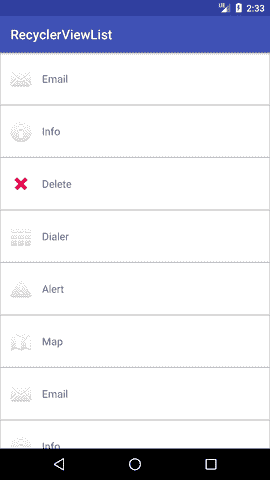
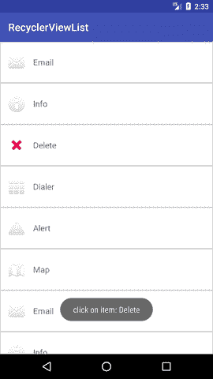

# 安卓回收列表示例

> 原文：<https://www.javatpoint.com/android-recyclerview-list-example>

**回收视图**类扩展了*视图组*类，实现了*滚动视图*界面。在*棉花糖*中介绍。它是 ListView 的高级版本，具有改进的性能和其他优势。RecyclerView 主要用于设计用户界面，对 android 应用程序的列表和网格进行细粒度控制。

在本教程中，我们将使用**recycle view**创建一个包含 ImageView(用于图标)和 TextView(用于描述)的项目列表，并对其列表中的项目执行点击监听器。

## 带有列表示例的安卓回收视图

创建一个 Android 项目，在 build.gradle 文件中添加 recycle view 支持库**com . Android . support:recycle view-v 7:23 . 1 . 0**或以上版本。

在布局目录的 **activity_main.xml** 文件中，添加 RecyclerView 小部件。

### activity_main.xml

```

<?xml version="1.0" encoding="utf-8"?>
<android.support.v7.widget.RecyclerView
        xmlns:android="http://schemas.android.com/apk/res/android"
        xmlns:tools="http://schemas.android.com/tools"
        android:layout_width="match_parent"
        android:layout_height="match_parent"
        android:scrollbars="vertical"
        android:id="@+id/recyclerView"
        tools:context="example.javatpoint.com.recyclerviewlist.MainActivity">

</android.support.v7.widget.RecyclerView>

```

* * *

在 values 目录中创建一个 **dimens.xml** 文件，并添加以下代码。

### dimens.xml 文件

```

<?xml version="1.0" encoding="utf-8"?>
<resources>
    <dimen name="activity_horizontal_margin">16dp</dimen>
    <dimen name="activity_vertical_margin">16dp</dimen>
    <dimen name="ic_clear_margin">56dp</dimen>
</resources>

```

* * *

使用以下代码创建自定义布局 **list_item.xml** 文件。

### list_item.xml

```

<?xml version="1.0" encoding="utf-8"?>
<RelativeLayout xmlns:android="http://schemas.android.com/apk/res/android"
    android:id="@+id/relativeLayout"
    android:layout_width="match_parent"
    android:layout_height="?android:attr/listPreferredItemHeightLarge"
    android:background="@drawable/border">

    <ImageView
        android:id="@+id/imageView"
        android:layout_width="wrap_content"
        android:layout_height="wrap_content"
        android:layout_centerVertical="true"
        android:layout_alignParentStart="true"
        android:layout_alignParentLeft="true"
        android:layout_marginStart="@dimen/activity_horizontal_margin"
        android:layout_marginEnd="@dimen/activity_horizontal_margin"
        android:contentDescription="Icon" />

    <TextView
        android:id="@+id/textView"
        android:layout_width="wrap_content"
        android:layout_height="match_parent"
        android:layout_toEndOf="@id/imageView"
        android:layout_toRightOf="@id/imageView"
        android:gravity="center_vertical"
        android:textSize="16sp"/>

</RelativeLayout>

```

* * *

在可绘制目录中创建一个 **border.xml** 文件，用于装饰 RecyclerView 项目的边框。

### border.xml

```

<?xml version="1.0" encoding="utf-8"?>
<shape xmlns:android="http://schemas.android.com/apk/res/android"
    android:shape="rectangle">
    <solid android:color="#FFFFFF" />
    <stroke
        android:width="1dp"
        android:color="#CCCCCC" />
</shape>

```

* * *

用下面的代码创建一个**MyListData.java**类。此类用作(POJO)类，用于设置项目的属性。

### 错误数据. java

```

package example.javatpoint.com.recyclerviewlist;
public class MyListData{
    private String description;
    private int imgId;
    public MyListData(String description, int imgId) {
        this.description = description;
        this.imgId = imgId;
    }
    public String getDescription() {
        return description;
    }
    public void setDescription(String description) {
        this.description = description;
    }
    public int getImgId() {
        return imgId;
    }
    public void setImgId(int imgId) {
        this.imgId = imgId;
    }
}

```

* * *

创建一个**MyListAdapter.java**类，并添加以下代码。这个类扩展了*回收视图。适配器*类并重写其未实现的方法。onCreateViewHolder()方法扩展了*列表项。在 onBindViewHolder()方法中，每个数据项都被设置为每行。*

### MyListAdapter.java

```

package example.javatpoint.com.recyclerviewlist;

import android.support.v7.widget.RecyclerView;
import android.view.LayoutInflater;
import android.view.View;
import android.view.ViewGroup;
import android.widget.ImageView;
import android.widget.RelativeLayout;
import android.widget.TextView;
import android.widget.Toast;

public class MyListAdapter extends RecyclerView.Adapter{
    private MyListData[] listdata;

   // RecyclerView recyclerView;
    public MyListAdapter(MyListData[] listdata) {
        this.listdata = listdata;
    }
    @Override
    public ViewHolder onCreateViewHolder(ViewGroup parent, int viewType) {
        LayoutInflater layoutInflater = LayoutInflater.from(parent.getContext());
        View listItem= layoutInflater.inflate(R.layout.list_item, parent, false);
        ViewHolder viewHolder = new ViewHolder(listItem);
        return viewHolder;
    }

    @Override
    public void onBindViewHolder(ViewHolder holder, int position) {
        final MyListData myListData = listdata[position];
        holder.textView.setText(listdata[position].getDescription());
        holder.imageView.setImageResource(listdata[position].getImgId());
        holder.relativeLayout.setOnClickListener(new View.OnClickListener() {
            @Override
            public void onClick(View view) {
                Toast.makeText(view.getContext(),"click on item: "+myListData.getDescription(),Toast.LENGTH_LONG).show();
            }
        });
    }

    @Override
    public int getItemCount() {
        return listdata.length;
    }

    public static class ViewHolder extends RecyclerView.ViewHolder {
        public ImageView imageView;
        public TextView textView;
        public RelativeLayout relativeLayout;
        public ViewHolder(View itemView) {
            super(itemView);
            this.imageView = (ImageView) itemView.findViewById(R.id.imageView);
            this.textView = (TextView) itemView.findViewById(R.id.textView);
            relativeLayout = (RelativeLayout)itemView.findViewById(R.id.relativeLayout);
        }
    }
} 
```

* * *

最后，在**MainActivity.java**类中，添加以下代码。此类为 MyListData 类创建项目数组，并将适配器类设置为 RecyclerView。

### MainActivity.java

```

package example.javatpoint.com.recyclerviewlist;

import android.support.v7.app.AppCompatActivity;
import android.os.Bundle;
import android.support.v7.widget.LinearLayoutManager;
import android.support.v7.widget.RecyclerView;

public class MainActivity extends AppCompatActivity {

    @Override
    protected void onCreate(Bundle savedInstanceState) {
        super.onCreate(savedInstanceState);
        setContentView(R.layout.activity_main);
        MyListData[] myListData = new MyListData[] {
                new MyListData("Email", android.R.drawable.ic_dialog_email),
                new MyListData("Info", android.R.drawable.ic_dialog_info),
                new MyListData("Delete", android.R.drawable.ic_delete),
                new MyListData("Dialer", android.R.drawable.ic_dialog_dialer),
                new MyListData("Alert", android.R.drawable.ic_dialog_alert),
                new MyListData("Map", android.R.drawable.ic_dialog_map),
                new MyListData("Email", android.R.drawable.ic_dialog_email),
                new MyListData("Info", android.R.drawable.ic_dialog_info),
                new MyListData("Delete", android.R.drawable.ic_delete),
                new MyListData("Dialer", android.R.drawable.ic_dialog_dialer),
                new MyListData("Alert", android.R.drawable.ic_dialog_alert),
                new MyListData("Map", android.R.drawable.ic_dialog_map),
        };

        RecyclerView recyclerView = (RecyclerView) findViewById(R.id.recyclerView);
        MyListAdapter adapter = new MyListAdapter(myListData);
        recyclerView.setHasFixedSize(true);
        recyclerView.setLayoutManager(new LinearLayoutManager(this));
        recyclerView.setAdapter(adapter);
    }
}

```

**输出:**

 

* * *